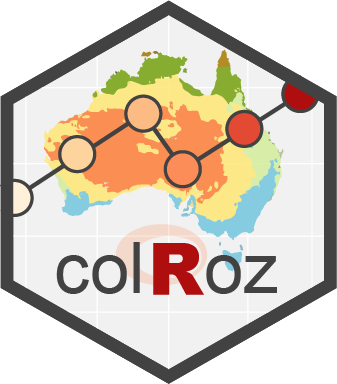

```{r setup, echo=FALSE}
 # htmltools::img(src=knitr::image_uri("images/colRoz_logo_v2.png"), style = "position:absolute; top:0; right:0", height=50)

knitr::opts_chunk$set(
  collapse = TRUE,
  comment = NA,
  echo = TRUE
)
library(colRoz)
```

`colRoz` is a themed colour palette package by Jacinta Kong & Nicholas Wu.  
The palettes are based on the colour schemes of Australia.

`colRoz` can:

* Generate a palette of discrete colours of a specified number
* Generate a gradient continuous colours of a specified number

For this, there are three functions described below. Before that, let’s set up this introduction.

***

# Installation

```
devtools::install_github("jacintak/colRoz")
```

`colRoz` works with base `R` and `ggplot2` because it is a palette generator and doesn’t have a built in `ggplot` palette function.

***

# 1. List of palettes

The `oz_palettes` function contains the list of palettes available. Individual palettes are gouped by theme in a list. The `oz_palettes` variable is a list of these collated lists.

```{r pal}
names(oz_palettes) # See all palette themes
names(oz_palettes$lizards) # See all lizard palettes
```

We can call a specific list using subsetting rules for lists.

```{r subset-pal}
oz_palettes[["warramaba"]][["whitei"]] # Subset the palette for Warramaba whitei, format: [[theme list]][[palette list]]
oz_palettes$warramaba$whitei # does the same as above but using list names
```

## Understanding the structure of the palette

Lists within lists may seem daunting but you’d rarely need to access the palettes individually. It is also easy enough to add your own palettes if you are comfortable with manually editing package functions in R.

We are happy to accept community contributions. Adding pre-chosen hex codes is easy to do. It may take longer to make a palette if we need to chose hex colours from an image.

The general structure for a set of palettes is:

```
palette <- list(
pal1 = rbind(c(<hex codes>), c(<order of discrete colours>))
)
```

Two things to note:

* The hex codes are stored as a vector in the first row of the list
* The second row of the list is a vector of the order colours are used when plotting discrete colours

***

# 2. Defining and using a palette

The palettes in this package are set as above. The main function is the palette generator. It acts as a housekeeping function to allow R to interpret the desired palette for plotting. The behaviour of this function depends on whether a discrete or continuous palette is desired and the number of colours requested.

If a discrete palette of 3 colours is desired, then the function will chose the subset of 3 colours to be included from the full option of colours in a palette. The chosen order of these colours is hard coded in the list of palette.

> *Note* there is no need to tell `colRoz` what theme the palette you want is in. Type in the palette name and `colRoz` will search the entire `oz_palette` list

```{r discrete}
pal <- colRoz_pal(name = "ngadju", n = 3, type = "discrete")
# a palette of only 3 colours

library(ggplot2)
ggplot(iris, aes(Petal.Width, Petal.Length , colour=Species)) +
geom_point() +
scale_colour_manual(values = pal) +
theme_classic()
```

If a continuous palette is desired, then the function will use the function `colorRampPalette` in the `grDevices` package (included in `R`) to generate a gradient of colours between the first and last colour in the desired palette.

`"continuous"` palettes are generated by default if the type argument is left blank. In `ggplot2`, use the function `scale_colour_gradientn` to set the continuous scale.

```{r cont}
pal <- colRoz_pal(name = "ngadju", n = 50, type = "continuous")

ggplot(iris, aes(Petal.Width, Sepal.Length , colour=Petal.Length)) +
geom_point() +
scale_colour_gradientn(colours = pal) +
theme_classic()
```
***

# 3. Visualise a palette

The function to plot the palette is only for graphing. Information is taken about the number of colours to plot from the desired palette and the palette is plotted. The name of the palette is shown.

```{r print}
print_palette(colRoz_pal("c.decresii"))# if empty, all colours are shown
print_palette(colRoz_pal("c.decresii", type = "discrete", n = 4))
print_palette(colRoz_pal("c.decresii", type = "continuous", n = 30))
```

***

# Palettes

`colRoz` has a number of palettes sorted by categories:

* Birds
* Fish
* Frogs
* Inverts
* Landscapes
* Lizards
* Mammals
* Plants
* Snakes
* *Warramaba* grasshoppers

***

# Palette by categories {.tabset}

## Birds

```{r birds}
names(oz_palettes$birds)
```
{height=200} Black-throated finch. Australia’s 2019 Bird of the Year!  

Azure kingfisher photo by Brenton von Takach  
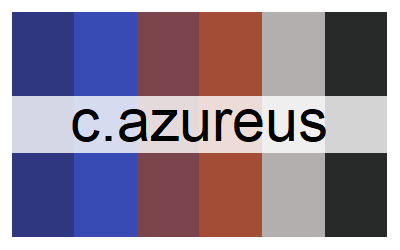{height=200}
{height=200} 

Superb fairywren photo by Jessica McLachlan  
{height=200}
{height=200} 

Emu  
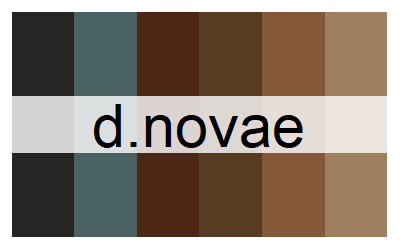{height=200}
{height=200} 

***

## Fish

```{r fish}
names(oz_palettes$fish)
```

Picasso triggerfish photo by Brenton von Takach. Also called humuhumunukunukuapuaa in Hawaiian (see also the Octonauts episode)  
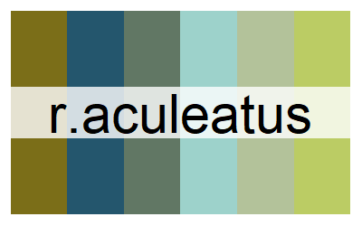{height=200}
{height=200}  

***

## Frogs

```{r frogs}
names(oz_palettes$frogs)
```

There are no frog palettes yet! Send us some and have your name here.

***

## Inverts

```{r inverts}
names(oz_palettes$inverts)
```

Mitchell’s diurnal cockroach photo by Craig White  
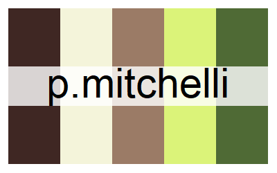{height=200}
{height=200} 

Chameleon grasshopper photo by Kate Umbers  
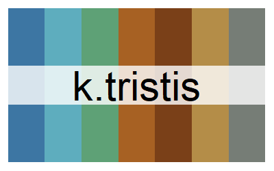{height=200}
{height=200} 

Gaudy acacia grasshopper  
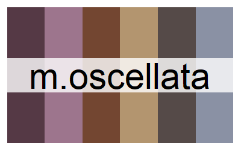{height=200}
{height=200} 

Giant green slant-face  
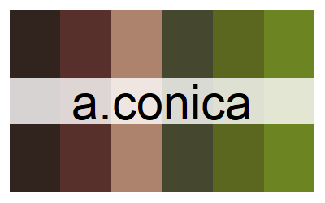{height=200}
{height=200} 

Matchstick grasshopper, VIC. See [Vandiemenella grasshoppers](https://jacintakongresearch.wordpress.com/matchstick-grasshoppers/vandiemenella-grasshoppers/)  
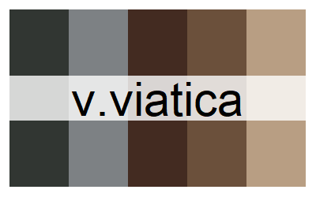{height=200}
{height=200} 

Short-tailed nudibranch, Port Philip Bay, VIC  
{height=200}
{height=200} 

Tortoise beetle  
{height=200}
{height=200} 

Two-spots tiger moth  
{height=200}
{height=200} 

Bluebottle. Undescribed species  
{height=200}
{height=200} 

Green grocer cicada  
{height=200}
{height=200} 

Key’s matchstick grasshopper. See more info about [*K. scurra*](https://camelunimelb.wordpress.com/2019/09/17/a-grave-situation-for-keys-matchstick-grasshopper/)  
{height=200}
{height=200} 

Sea cucumber, intertidal VIC  
{height=200}
{height=200} 

Biscuit star, Port Phillip Bay, VIC  
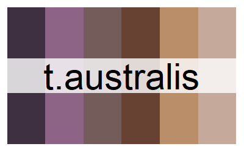{height=200}
{height=200}

***

## Landscapes

```{r landscapes}
names(oz_palettes$landscapes)
```


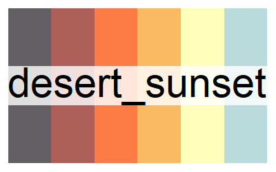{height=200}
{height=200} 

{height=200}
{height=200} 

Photo from Jordan Iles  
{height=200}
{height=200}

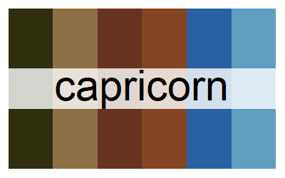{height=200}
{height=200} 

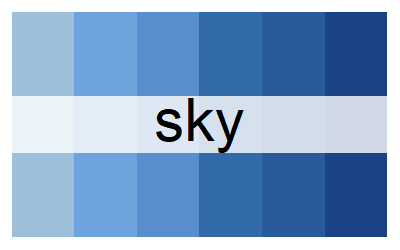{height=200}  
{height=200}  
{height=200}  
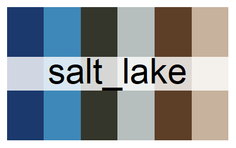{height=200}  
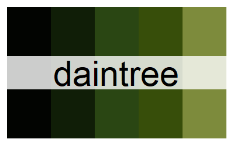{height=200}  
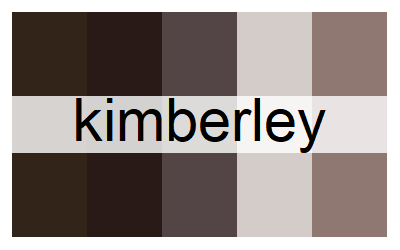{height=200}  
{height=200}  
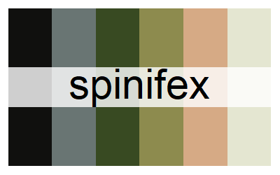{height=200}  

***

## Lizards

```{r lizards}
names(oz_palettes$lizards)
```

Tawny dragon  
{height=200}
{height=200} 

Blue Mountains water skink  
{height=200}
{height=200} 

Thorny devil  
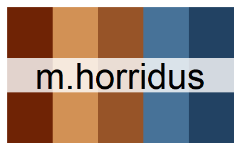{height=200} 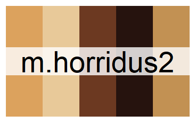{height=200}  
{height=200} 

Blotched blue-tongued skink  
{height=200}
{height=200} 

South-western spiny tailed gecko  
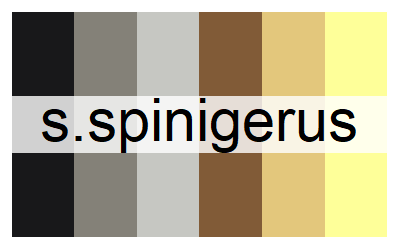{height=200}
{height=200} 

King’s skink  
{height=200}
{height=200} 

Three-lined knobtail gecko  
{height=200}
{height=200} 

{height=200} Frilled-neck lizard  

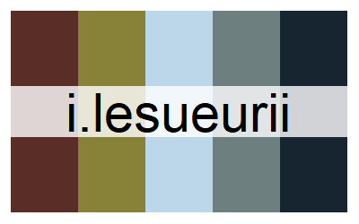{height=200} Eastern water dragon  

{height=200} Boyd’s forest dragon  

{height=200} Spiny-tailed monitor  

{height=200} Pilbara rock monitor  

***

## Mammals

```{r mammals}
names(oz_palettes$mammals)
```

Sugar glider  
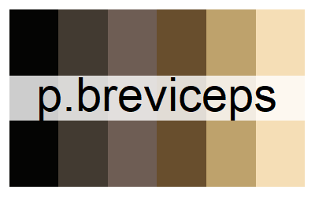{height=200}
{height=200}  

Thylacine (*T. cynocephalus*)  
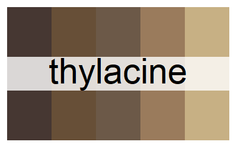{height=200}
{height=200}  

***

## Plants

```{r plants}
names(oz_palettes$plants)
```

Blue lily photo by Emma Dalziell  
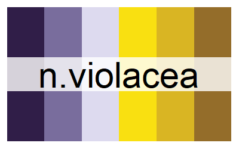{height=200}
{height=200}  

*Xanthorrhoea* grasstree photo by Sarah Mulhall  
{height=200}
{height=200}  

***

## Snakes

```{r snakes}
names(oz_palettes$snakes)
```

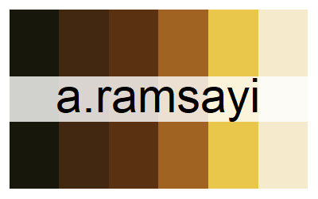{height=200} Woma python

***

## *Warramaba* grasshoppers

These are palettes based on the colours of matchstick grasshoppers in the genus Warramaba.
You can read more about matchstick grasshoppers on [Jacinta’s website](https://jacintakongresearch.wordpress.com/matchstick-grasshoppers/warramaba/).  
There are other matchstick grasshopper palettes in the `inverts` palette.

```{r warramaba}
names(oz_palettes$warramaba)
```

{height=200}
{height=200}  

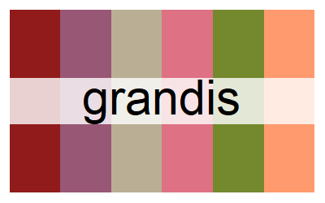{height=200}
{height=200}  

{height=200}
{height=200}  

{height=200}
{height=200}  

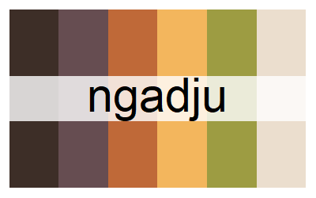{height=200}
{height=200}  

{height=200}
{height=200}  

***

