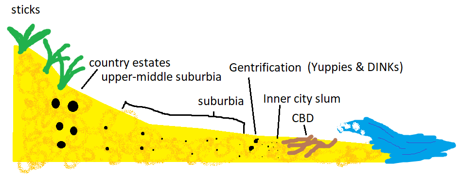

Where do animals live and why? These are some of the ecological questions I am interested in. Sure, we can talk about patterns of abundance in a population in terms of abiotic or biotic factors. But what if there's more to animals than that?

What if a young animal is concerned not just about eating, being eaten and living to reproduce but also with their finances, housing, commute and social mobility?

I present to you the socio-economic theory of animal abundance using the Australian ghost crab (*Ocypode cordimana*) as an example.

***

# Ghost crabs

[Ghost crabs](https://en.wikipedia.org/wiki/Ghost_crab) are a common intertidal species in tropical beaches. Forget beach front digs with a sea view. They literally have digs on the beach that are distributed from the low tide mark to the high dunes. What's more, *Ocypode cordimana* live on K'garri (Fraser Island), Australia so they have prime access to the largest sand island in the world. The size of their burrows are indicative of the size of the home owner. Larger holes and thus larger crabs are found further up the dune from the shore.

A schematic of a ghost crab. Not to scale.

***

# The socio-economic theory of ghost crab abundance

Ghost crabs are nocturnal (hence, ghosty not because they are terrible friends - or are they?). At night they head down to the low tide line and forage among the detritus. This is the Central Business District (CBD) where crabs do their biz and partay. Ghost crabs need to commute every day and like all reasonable beings, they want to avoid the rush hour traffic.

Crabs could minimise their commute and live close to the CBD. But living here is dangerous. The sand is fine - poor digging quality so only small houses can be built. The close proximity to the CBD and the ocean means it gets inundated at high tide. The only crabs that can live here are small, young crabs (including grad students) who can only afford to live in these inner city slums and dream of living further away from the gangland crime.

In more recent times the inner city has been undergoing gentrification. Young working professional crabs (Yuppies) and two crab social groups with double incomes and no kids (DINKs) have been attracted by the convenience of the commute and distance to local amenities. These crabs are larger than the typical inner city crab and have the income to create quality residences and think the incoming tide adds character and charm to their property. And they enjoy a good flat white with their avo on toast. You'll often find them scurrying about to their hairdresser appointments for their frothy bubble beards (plaid not included).

The socio-economic theory of ghost crab abundance on K'garri

Beyond the inner city transition zone lies the urban sprawl known as suburbia. Where the hopes and dreams of the young go to die and are replaced with a well manicured lawn. Here, the sand is not as wet and one could afford to build a large home. The commute to the CBD is a little longer than the inner city but there's the best of both worlds as access to the world class foredunes is equidistant away. Perfect for the weekend escape from the mediocrity.

Finally, at the base of the dunes are the largest houses. The coarse sand and the roots of the foredune vegetation permit the largest burrows worthy of the largest and wealthiest crabs. Their commute is the longest but they don't care about that. Their position on the dune slope gives them the greatest vistas of the population and they live on the urban-rural fringe with easy access to green, xerophytic spaces.

And that is the socio-economic theory of ghost crab abundance.

***

Happy April Fools. I initially wrote this during my undergrad ecology field trip to K'garri many years ago. Thanks to Prof. Gimmie Walter for listening to my idea.