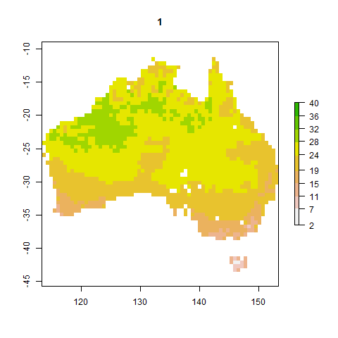
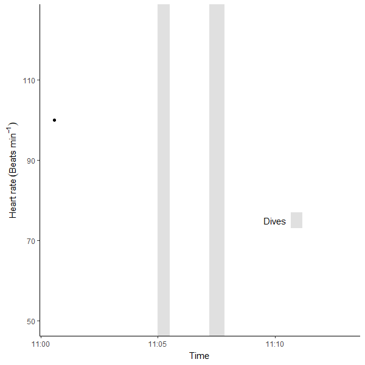

I love gifs.  
<p align="center">

</p>

Gifs are great for showing how data changes over time or just for putting something engaging in a presentation. When I was working on modelling insect phenology I wanted to create a gif of how insects hatch throughout the year across Australia for my presentations. Making gifs in R has improved a little since then so here's a quick guide to making gifs. I won't cover interactive plots (e.g. `plotly`).

***

# Looping through images

Basically this involves making lots of png images then looping through them. The package is `animation` which depends on ImageMagick so you will need to install ImageMagick first. I've found it handy for sequentially showings layers of a raster (e.g. where each layer is data over time).

Make sure to install legacy functions when installing ImageMagick (e.g. convert). You may need to tell R where to find ImageMagick using `ani.options(convert = 'C:/ImageMagick-7.0.9-Q16/convert.exe')` for where ever ImageMagick was installed.

Let's pretend we have a raster of soil temperature for one day where each layer (n = 24) is an hour of a day (`soil_temp`), like a raster from [microclimOz](https://onlinelibrary.wiley.com/doi/10.1111/aec.12689).

We need to create our loop, then we can use `animation::saveGIF` to save our image.

```
library(animation)
library(raster)
pal <- terrain.colors(10, rev = TRUE)
bre <- round(seq(min(minValue(soil_temp))-1,max(maxValue(soil_temp))+1,length.out=10))
saveGIF({
for(i in 1:24){plot(soil_temp[[i]], main = i, col = pal, breaks = bre)}
}, movie.name = "soil_temp.gif", clean=T, convert = "convert")
```



To make sure the colour scale is consistent throughout the loop:

 * I've defined a fixed colour scale (`pal`) using the base palette `terrain.colours` and reversed the scale so that higher temperatures are green. Note that the terrain colour palette isn't great for colour blindness.
 * I've created my own colour scale (`bre`) by manually defining the breaks in the colour scale based on the minimum and maximum temperatures in the entire raster dataset. Plus some wiggle room on either side.
 
If I didn't manually define the colour scale, then each image in the gif will use its own automatically generated scale and the colours will be inconsistent.

Note the use of curly brackets to call an independent line of `R` code within code (the loop within `saveGIF`).

The benefit of `animation` is that it works with any type of image in R and is basically a wrapper for ImageMagick, unlike `gganimate`. You could also use ImageMagick in the command line.

***

# Gradually showing data

This is easily done using `ggplot2` and `gganimate`. ImageMagick isn't needed (a different engine is used) but this method is limited to `ggplot` objects.

I have some [heart rate data demonstrating the mammalian diving reflex](https://jacintakongresearch.wordpress.com/2020/10/17/measuring-the-mammalian-diving-reflex-with-apple-watch/) that I will use as an example. I imported the data from my Apple Watch into R that you can read about at the link. Then, I made a gif for my lectures using `gganimate`:

```
library(gganimate) # loading just gganimate will also load ggplot2 for you
library(tidyverse)

hr_plot <- heart_rate %>%
          filter(time > "2020-10-17 11:00:34" & time < "2020-10-17 11:13:00") %>% 
  ggplot(aes(time, value)) +
  # Dive 1
  annotate("rect", fill = "lightgrey", alpha = 0.7, 
           xmin = as.POSIXct("2020-10-17 11:05:00"), xmax = as.POSIXct("2020-10-17 11:05:30"),
           ymin = -Inf, ymax = Inf) +
  # Dive 2
  annotate("rect", fill = "lightgrey", alpha = 0.7, 
           xmin = as.POSIXct("2020-10-17 11:07:12"), xmax = as.POSIXct("2020-10-17 11:07:50"),
           ymin = -Inf, ymax = Inf) +
  geom_point(aes(group = seq_along(time))) +
  geom_line() +
  annotate("text", label = "Dives", x = as.POSIXct("2020-10-17 11:10"), y = 75) +
  annotate("rect", fill = "lightgrey", alpha = 0.7, 
           xmin = as.POSIXct("2020-10-17 11:10:40"), xmax = as.POSIXct("2020-10-17 11:11:10"),
           ymin = 73, ymax = 77) +
  theme_classic() +
  labs(x = "Time", y = expression("Heart rate "("Beats min"^-1))) +
  scale_x_datetime() + # time is already a POSIXct format
  ylim(c(50, 125)) +
  transition_reveal(time) +
  enter_fade()

animate(plot = hr_plot,
  nframes = 100,
  fps = 10,
  end_pause = 10,
  height = 600, width =600, res = 100)
```

I've split this into two parts. Lets break this down:

  1. Make the heart rate graph (`hr_plot`). My heart rate data is saved in a variable called `heart_rate`.
      a. I have trimmed the data (`dplyr::filter`) then plotted heart rate over time (lines and points).
      b. I have annotated the graph with grey rectangles (`annotate("rect")`) to indicate diving periods.
      c. I created a legend using `annotate` for text and another little grey rectangle. 
      d. Used `expression` for scientific notation in my axis labels.
      e. Formatted the x axis as a date time axis (`scale_x_datetime`). Not critical here.
      f. `transition_reveal` and `enter_fade` are `gganimate` functions that describe how the data is revealed. Here I'm saying reveal along the x axis. This may take some time to render when you call the plot.
  2. `animate` is the main function to create the animation.
      * I defined the number of frames, the speed (frames per second), how long to pause the gif at the last frame, and the dimensions.
      * Use `anim_save` to save your gif.
      

Here's proof I am a mammal:
<p align="center">

</p>

There are other types of transitions included in `gganimate`. There is a handy [cheatsheet](https://www.rstudio.com/resources/cheatsheets/) too.

***

Happy animating!  
<p align="center">

</p>