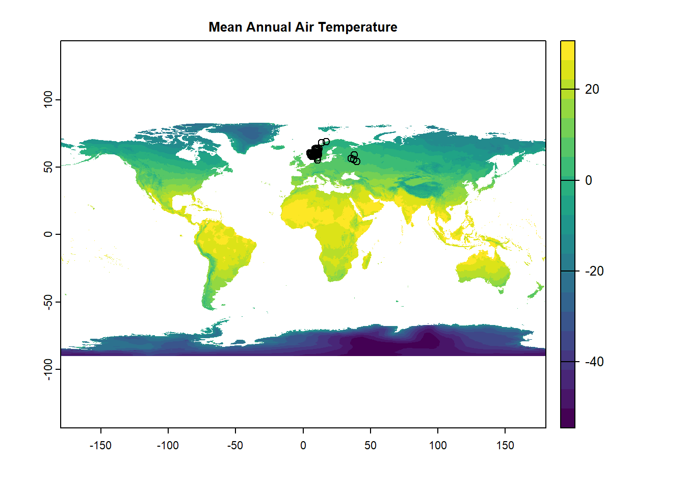

# Spatial analysis in R has changed

There has been a major revamp of spatial analysis packages for R. You may find your old spatial analysis code does not work with the most recent packages. I resisted for as long as I could but alas I had to update my code with the shiny new thing.

This is an updated version of my previous [blog post](/post/spatial-data/) documenting a basic workflow to query an online database of species occurrences, download rasters of climate data and extract information from the raster based on coordinates. There major change to this workflow is the package `terra` which replaces `raster`. This change has two implications for our code:

 1. To get WorldClim data you need to use the package `geodata`. There are a couple of geographic datasets available, like elevation and landcover, but currently only one version of WorldClim is supported (v2.1 at the time of writing, v0.5-3).
 2. We don't need other spatial analysis packages like `sp` or `sf` for the raster manipulations we want to do. You may for more complex spatial analysis.

***

# The workflow

Load the two pacakges we need.

```
library(terra) # Rasters!
library(rgbif) # Query GBIF
library(tidyverse) # For data processing
```

## Getting GBIF data

We need some species occurrence points. We can get the first 100 records from GBIF for the European House Sparrow. The code is the same as the other post, so for variety here I've written it as a tidyverse pipe rather than base.

```
bird_points <- name_suggest(q ="Passer domesticus", rank='species')$data$key[1] %>% 
    # Get unique key then search GBIF
    occ_search(taxonKey = ., limit = 100) %>%
    # Discard the metadata
    pluck('data') %>% 
    # Remove missing latitudes
    drop_na(decimalLatitude)
```

## WorldClim data

The function `geodata::worldclim_global` will get the environmental variables you want at the desired resolution. To get a single raster for global annual air temperature, we can start with the mean monthly air temperature at 10 minutes of a degree. We can then get the mean of these 12 raster layers to get annual temperature. Temperature does not appear to be multiplied by 10. 

```
annual_temp <- geodata::worldclim_global(var = 'tavg', res = '10', path = '~')
annual_temp <- mean(annual_temp) # get mean annual temperature

# Plot our raster with the GBIF records
plot(annual_temp,
     main = 'Mean Annual Air Temperature',
     col = viridis::viridis(n = 20))
points(bird_points$decimalLongitude, bird_points$decimalLatitude)
```
<p align="center">

</p>

## Extracting temperature for each coordinate

Here's where it really changes with `terra`. We no longer need to use `sp::SpatialPoints` with `terra::extract`. `terra` will accept a **matrix** of longitudes and latitudes, among other formats. Remember longitude first! `terra` has its own `SpatVector` to replace `SpatialPoints`.

If you like using pipes, then it's simple to use `terra::extract` with `dplyr::mutate` within a pipe. We can do a more complex manipulation before extracting. Say we only want the temperature at the maximum and minimum latitudes:

```
bird_points %>% 
  # Longitude first!
  select(decimalLongitude, decimalLatitude) %>% 
  # Keep the minimum and maximum latitudes
  slice(which.min(decimalLatitude),
        which.max(decimalLatitude)) %>% 
  # Extract temperature at each point
  mutate(temperature = terra::extract(annual_temp, as.matrix(.))$mean)
```
```
# # A tibble: 2 × 3
##   decimalLongitude decimalLatitude temperature
##              <dbl>           <dbl>       <dbl>
## 1             39.8            54.1        5.49
## 2             17.1            68.8        3.09
```

And that gives us the maximum and minimum temperatures for the minimum and maximum latitudes of the first 100 records of the European House Sparrow on GBIF.