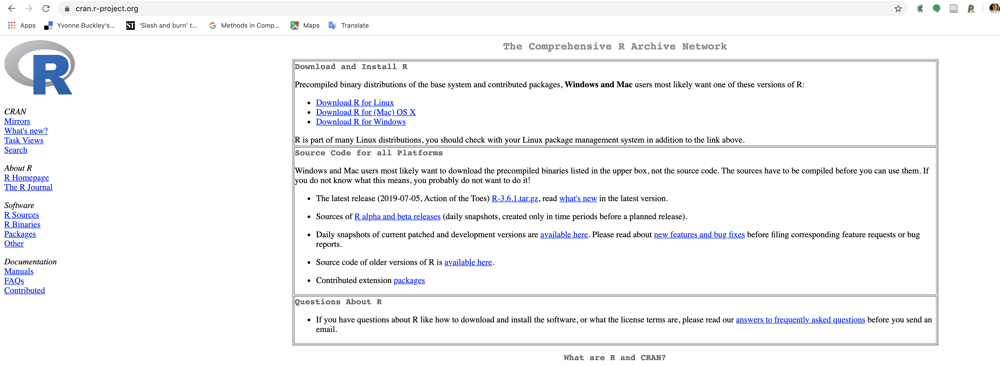
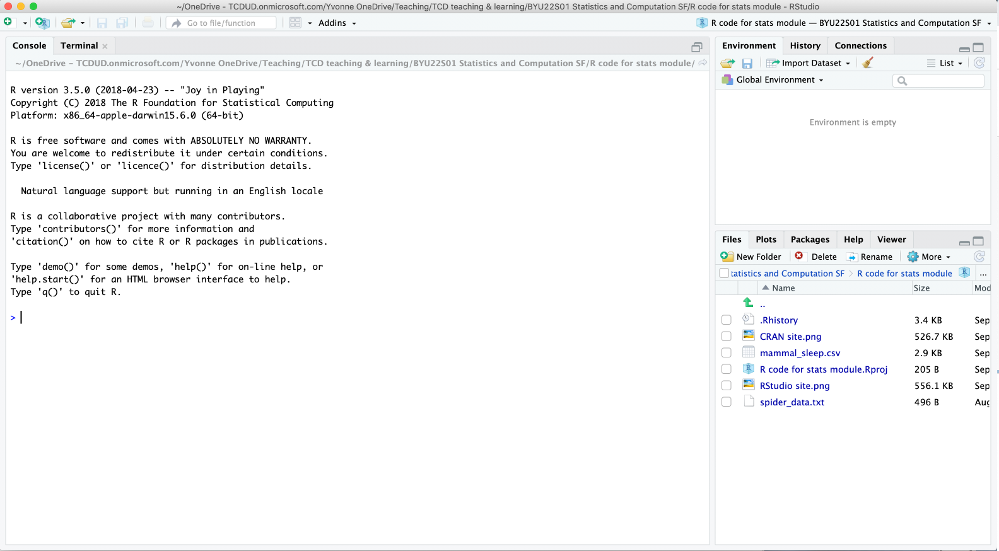
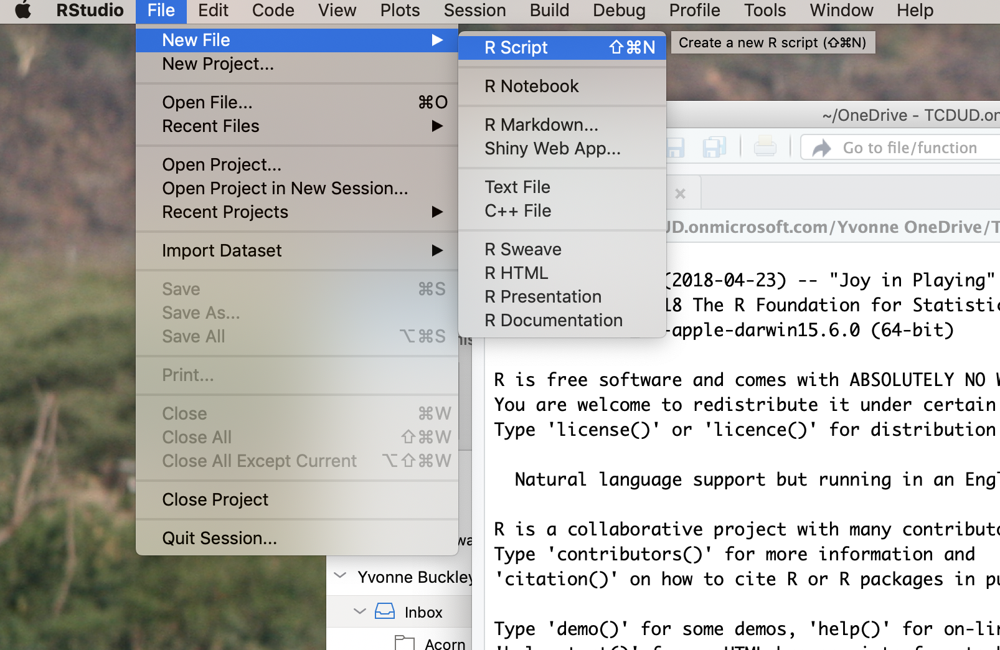
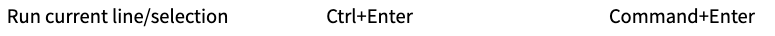
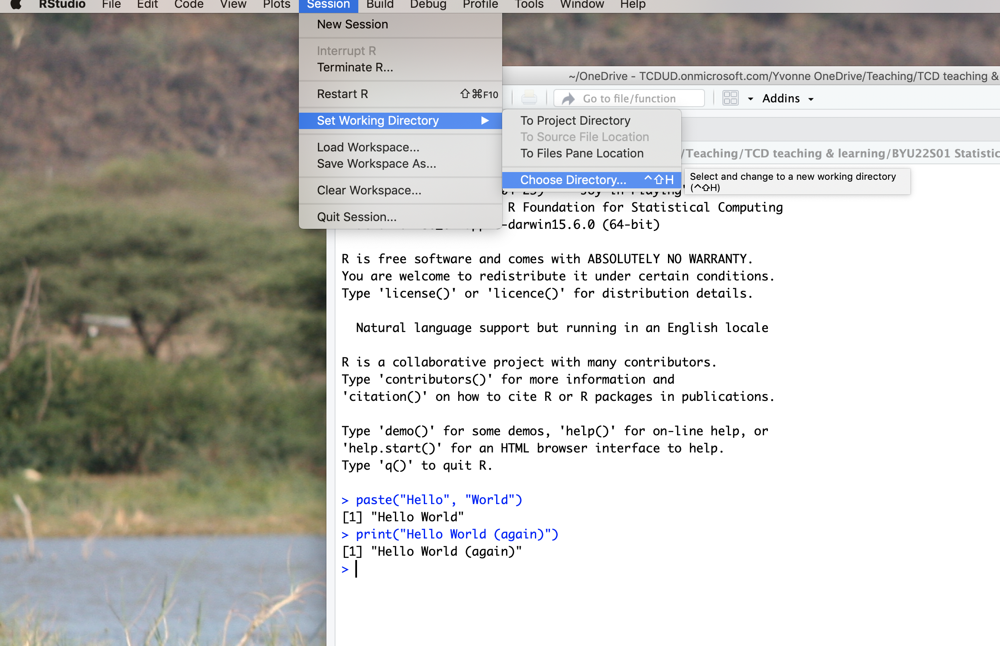
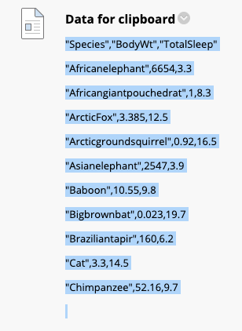

```{r setup, include=FALSE}
knitr::opts_chunk$set(echo = TRUE)
knitr::opts_chunk$set(comment=NA, collapse = TRUE)
```

# Welcome to Statistics and Computation for Biologists

Training to become a scientist can be broken down into two parts. First, there is content to learn - these are technical details or "how to" which come from textbooks, lectures or resources on the Internet.  

Second, is learning how to define problems and how to solve them. You will see this in action throughout your degree. For example, is your R code not working? Work out why, what's wrong and what to change to make it work.    

In this module we aim to give you the tools and knowledge to solve your own data science problems. These skills will be important in your later studies or even your career. 


## Structure of drop ins

* There is no fixed structure for drop ins. Ask us to clarify, explain, show, trouble-shoot etc. but it is up to you do direct your own learning under supervision in these sessions
* Not obligatory – there to help you either get up to speed with material already covered or if we have the time and capacity to take you beyond what you have covered, if you would like to be challenged
* Respect our facility to teach and your colleagues’ capacity to learn by not distracting
* No additional assessable material will be introduced in Drop-ins – their function is to consolidate your learning

***

## Today's drop in

This worksheet is a HTML file - you can save it to your computer like any file and open it using a web browser like Firefox or Chrome.  
There are two aims for this drop in worksheet:  
  
> 1. To make sure you are prepared for the practicals which start next week. We want to make sure the practical will run as smoothly as possible as it may not be easy to problem solve issues remotely - worst case scenario you will have to fix it yourself.   
  
> 2. Introduce fundamental concepts in computing and using R that you will need in this module - you can refer back to this in the future

We will be covering the following checklist:

* Do you know how to navigate computer directories and addresses to find files or folders?
* Do you have R and RStudio installed on your computer?
* Is R up to date? (version 4.0 or above)
* Do you know how to set up scripts and directories in RStudio?
* Do you know how to import and export data into R in various formats?

If you've answered no to any of the above questions, then continue on. Some of you may already have R and RStudio installed from previous modules - that's great! Check that your version and packages are all up to date (Under the Packages tab, click Update). Even so, you can work through this document if you want to check everything works or you need a refresher. 

There are some test-yourself questions in each section.

***

# 1. Why programming and computing?

We care about teaching you programming and computing skills because they are important skills in the current workforce and are not to be taken for granted. Programming is not just code, it's a way of thinking and requires problem solving skills that are applicable to other scenarios. You can apply these skills to a range of problems or examples beyond what we will cover in this module. We will be using R which is classified as a high-level programming language - it's not the same thing as learning how to use Excel. 

Learning programming is like learning a language - there is grammar and syntax and it takes time and effort to learn and to practice. Don't expect to pick it up like memorising content from a lecture - take it in small steps.

## Basic computing terms

We don't always formally learn computing terminology even if we've always been using computers. Here are some general computing concepts we will be using and that we expect you to be familiar with: 

### Drives, Folders & Files

In computer science, most commercial operating software are organised in to **drives**, **directories**, **folders** & **files**. Using Windows as example:
C:/ is a drive (a hard drive). Within the drive, information is sorted in folders (e.g. Documents). Within folders are groups of files which contain information (e.g. my_document.doc). Here, ".doc" is the file extension that tells the computer what kind of file it is and what program to use to read the information (a Word document). Folders within folders are sometimes called sub-folders.

Commercial computers tend to have only one drive but you can have as many folders and files as you want. For example:

```
C: (the hard drive)
  -> my documents (within drive C)
      -> file A (within my documents)
      -> folder 1 (within my documents)
          -> folder 2 (within folder 1)
              -> file B (within folder 2)
```

### Directories 

Directories are the cataloguing system describing where files and folders are stored; also called addresses. Directories take the form of an address like "C:/documents/folder/file" which tells a program to look in this location. The concept of folders and files comes from the days before computers where information was written on paper and stored in filing cabinets. Directories are not case sensitive.

> We recommend that you organise your files in a structured way. For example, have a folder for the module and sub-folders for each of the practicals:    
> Documents (folder) -> Biostats (folder) -> Practical 1 (folder) -> Script (file)  
> We don't recommend using a automatically selected "downloads" folder or your "desktop" because these are not permanent file locations and can be hard to find files later. 

Notice that the components of the address is separated using a forward slash `/`. R can understand `/` but does not understand back slash `\` because back slashes have a specific meaning in programming. When typing addresses, make sure you use the correct slash.

We navigate through our computer's directories using Explorer in Windows or Finder in MacOS. You can see the address of a directory in the address bar. We will learn how to use directories in RStudio.

**Question.** Click `code` to show the answer.   
What is the file extension in the following address? `C:/users/admin/monday/dropin/worksheet.pdf`
```{r class.source = 'fold-hide', eval = FALSE}
.pdf which stands for portable document format
```

***

## Why R?

R is just one of *many* high-level programming languages used professionally (e.g. C++, Java, Python) but R is specially designed for doing statistics and data handling. Hence R is widely taught in statistic classes. There are other statistics programs but these are normally "point-and-click" programs where you click a button and magic happens. 

R is an open source software and it is *transparent*, meaning you can *see* how your data is being manipulated. Transparency allows us to check whether the statistics is done correctly and is easier to see how statistical theory is being applied. R is also *reproducible* because R allows you to document your code in *scripts* that you can give another person to replicate your analysis.

The traditional option to learning statistics is to learn these calculations by hand and use pre-calculated statistical reference tables but we would only expect that for very simple examples and doing calculations by hand is an arduous task for realistic biological problems. 

***

## Why RStudio?

R and RStudio are different software. R is a computer programming language and statistical environment. RStudio is a user interface which has some useful features that makes using R easier. It is possible to use R by itself (you can try it) but RStudio makes everything a lot easier by providing some organisation. You cannot use RStudio without R. An analogy is that R is the engine of a car and RStudio is the steering wheel - you control the wheel but the engine is what makes the car go forward. 

***

# 2. Installing R and RStudio {.tabset}

You will need to install R AND RStudio **in that order**. You only need to open RStudio when you want to use R - RStudio will open R for you in the background.  



> Here's a video about installing R https://vimeo.com/203516510 and RStudio https://vimeo.com/203516968

You can follow the instructions below or try the interactive tutorial at https://learnr-examples.shinyapps.io/ex-setup-r/#section-welcome

Here are the instructions for various operating software (click the relevant tab):

## Windows

For R:

1. Go to https://cran.r-project.org/bin/windows/base/
2. Click "Download R" in the blue box. The version number is not important.
3. Save the file, open it and follow the instructions. You can leave everything as the default option. Make sure you've installed the program somewhere sensible like the Programs folder in the C:/ drive.
4. Open it and check it installed properly

For RStudio:

1. Go to https://rstudio.com/products/rstudio/download/
2. Click download for **RStudio Desktop Open Source Licence**. The FREE option.
3. Install the program somewhere sensible
4. Open it and check it installed properly

***

## Mac

For R:

1. Go to https://cran.r-project.org/
2. Click "Download R for (Mac) OS X"
3. Save the latest release file (e.g. R-4.0.2.pkg), open it and follow the instructions. You can leave everything as the default option. Make sure you've installed the program somewhere sensible.
4. Open it and check it installed properly

For RStudio:

1. Go to https://rstudio.com/products/rstudio/download/
2. Click download for **RStudio Desktop Open Source Licence**. The FREE option.
3. Install the program somewhere sensible
4. Open it and check it installed properly

***

## Linux

For R:

1. Go to https://cran.r-project.org/
2. Click "Download R for Linux"
3. Click your version of Linux
4. Copy and paste the relevant installation code
4. Open R and check it installed properly

For RStudio:

1. Go to https://rstudio.com/products/rstudio/download/
2. Click download for **RStudio Desktop Open Source Licence**. The FREE option.
3. Run the relevant code
4. Open it and check it installed properly

See https://linuxconfig.org/rstudio-on-ubuntu-18-04-bionic-beaver-linux for a guide

***

## Chromebook

There are a few options:

* The easiest option is to run Linux on your computer, then you can install R and RStudio. Try the instructions on https://blog.sellorm.com/2018/12/20/installing-r-and-rstudio-on-a-chromebook/ or https://github.com/jennybc/operation-chromebook#links-re-r-and-rstudio 
* Use RStudio Server
* Use RStudio Cloud https://rstudio.cloud/ (in beta so it may not work)

Sorry chromebook users, if your chromebook version is very old then it may not be possible to install R.

***

**Question.** Click `code` to show the answer.   
What do you think happens if you open RStudio without downloading R first?
```{r class.source = 'fold-hide', eval = FALSE}
RStudio won't work because it is looking for a program called R that doesn't exist
```

***

# 3. Opening R and RStudio for the first time

If you open R itself you'll see that it's pretty bare bones. Most annoyingly you have to remember what information is stored in its memory. RStudio is a intermediate program that acts as a mediator between you and R:  
user -> input -> RStudio -> R -> RStudio -> output -> user  

If you open RStudio you'll see several windows that organise how information is passed to R and how output from R is presented:

```{r image3, echo=FALSE, fig.cap="", out.width = '100%'}

```

* Left: The big window is the **console**. This is the interface with R and is the same as using R on its own. (don't worry about "terminal")
* Top right: This window has three tabs: "environment" - shows you what information is stored in R's memory, "history" - shows your code history & "connections" - don't worry about this one.
* Bottom right: This has several tabs. The most important being "files" - showing you where RStudio is looking at on your computer & "plot" - shows you any plots you make in R.

You can customise the layout and colour scheme of RStudio in Options.  
There are other user interfaces for R but RStudio has a lot of support and is commonly used.

> We expect you to be familiar with the RStudio layout. There are a number of shortcuts and hotkeys as well. There are only minor differences between Windows and Mac shortcuts (e.g. using Cmd instead of Ctrl)

***

## Updating R and base packages

The last major update to R was version 4.0. If you have an older version we recommending updating R because many fundamental aspects of the language were changed and are not backwards compatible. You will see which R version is used in the information in the Console when you open RStudio. If your version is older than 4.0, install the latest version as above.  

R is a statistical environment that consist of **packages**. Packages are a set of **functions** that does something to input depending on the underlying code. All your packages are stored in your **library**. When you download R it comes with a basic set of packages as default which works straight out of the box. This is called **base R**.  

Once you've installed R you should check all your **packages** are up to date as well. You can update your packages by clicking the Update button under the Packages tab.  

***

## Creating a script

The greatest advantage of RStudio is that it allows you to write **scripts**. These are files ending in `.R` that are created and opened by RStudio. R itself cannot open, read or create scripts. Scripts are text documents of code that you can save on your computer and open later. They provide a guide to what you want to enter to R and saves you from **having to type out code over and over again**. Before RStudio, we had to save our code in notepad or similar then copy and paste it into R (believe me it was a pain). Now we can do the same but in one click. Importantly, scripts allow **reproducibility** and helps with problem solving.  


You can create a new script under File -> New file -> Script (Ctrl+Shift+N) or click the white square with a green and white plus sign in the top left corner.  
Save it and give it an informative name (e.g. "Dropin1.R")

```{r image5, echo=FALSE, fig.cap="", out.width = '100%'}

```

Let's add some code to this script by going through the basics of R! Copy and paste code from below into your script. 

> **Run code from your script rather than directly from the console**.

A script is a record of what you've done and it makes it easy to spot any mistakes you might have made (transparency & reproducibility). Put your cursor on the line you want to run then press Ctrl+Enter or click Run. You can run multiple lines by highlighting the relevant lines. You can run the entire script from beginning to end using the shortcut Ctrl+Alt+R.

```{r run, echo=FALSE, fig.cap="", out.width = '100%'}

```

***

## Setting up packages

To use a package in R, you need to **call** it from R's library using the function `library()`. A package we will see later in the module is `MASS` which contains datasets you can use at home to practice the statistical tests covered in the lectures.

Type `library(MASS)` into your script then press Enter. You have just **run** your first line of code. R will load the package `MASS` in the background. You can check this in RStudio under the Packages tab where there will now be a tick in the box next to `MASS`.

Run `data()` or `data(package = .packages(all.available = TRUE))` to see the list of available built-in datasets. Some of these will be relevant to biological sciences, others are more general (e.g. the starwars dataset of Star Wars characters comes with the package `tidyverse`). Entering the name of a dataset will display the entire dataset. Try calling one of the `MASS` datasets, like `Rabbit`. You can see the descriptions of each dataset by calling `help(<dataset name>)`, e.g. `help(Rabbit)` will tell you it describes the blood pressure of rabbits before and after a drug treatment.

## Installing packages

We can customise and expand the functionality of R by installing more packages, which are made by people and distributed freely. You can download packages from an online repository using the function `install.packages("<insert name of package>")`. 

For example, I wrote this document in RStudio using an additional package called `rmarkdown` which lets me make HTML, word or PDF files of text, code and figures or tables. We will tell you if you need to install a package but where possible we will be sticking to base R.

But we should check that your packages folder is set up properly - especially if you use Windows 10 and sync with OneDrive. Packages should ideally be downloaded to your local computer and not saved on the cloud (e.g. through OneDrive). The constant syncing slows down communication and creates issues between the cloud and R and RStudio. You can see where your packages are saved using `.libPaths()` in your console - meaning Library Paths, the address of your package libraries. 

There should be two addresses:

 * One in your Program Files or wherever your computer installed R. E.g. `"C:/Program Files/R/R-4.1.1/library"` - this is where all the base R packages are installed (the default packages that come with R)
 * One somewhere else on your computer - this is your personal library. When you install new packages from the Internet, they will be saved here. 
     * If the second address is on your local computer (e.g. Documents) and not in the cloud then you don't have to do anything. E.g. `"C:/Users/XXXX/Documents/R/win-library/4.1"` is fine
     * If the address has OneDrive in the address, then we need to fix that - follow the steps below. E.g.  `"C:/Users/XXXX/OneDrive/Documents/R/win-library/4.1"` is problematic

**To change the address of your personal library in Windows 10**

 1. Create an empty folder in your Documents folder called `R`. Make sure it is not syncing with the cloud. E.g. with the address `C:\Users\XXXX\Documents\R`
 2. Click Start (Windows icon). Type in "environmental variables" [without quotations], you should see "Edit environment variables for your account" in the search results - click that
 3. Under User variables (the top window) click New
 4. In the Variable name field type `R_LIBS_USER` - exactly like that in all caps
 5. In the Variable value field enter the address of the package folder (where you made it in step 1) - make sure to use backslash `\` not forward slash `/`. E.g. `C:\Users\XXXX\Documents\R`
 6. Click OK twice to exit
 7. Type `.libPaths()` in R to check that your personal library folder is now listed in `R`

***

# 4. R structure & terminology

At it's most basic R is a fancy calculator. 

## Variables

Information is stored in R's memory as **variables**. These can be **numbers** (e.g. 1, 2, 3) or **strings** (called characters, e.g. `"hello"`). Strings are identified by quotation marks (`"` or `'`). RStudio helpfully colour codes these different types. You can also change the colour scheme of RStudio. 

```
2+2
```

If it works you should see the answer: 4

*Make sure to remember to press enter. Entering in the code doesn't execute it.*   

Usually information is **assigned a name** which we use to call later. This information is now a **named variable**. We assign information to a variable using a left pointing arrow `<-`:
```
a <- 2+2 # assign 2+2 to the variable called a
```
Now the named variable a is stored in R's short-term memory (called RAM - random access memory - in computing terms; also a good album by Daft Punk). This is different to long-term memory like files saved on your computer. When you close R, RAM is cleared - like your browser history when you use private mode!  

If you enter `a` in the console it will give you the answer to `2+2` that we told it. Under the "Environment" tab, it should list `a`. 

> **Names are case sensitive and can be a combination of (most) symbols, letters and numbers (but no spaces).**  

Variables help with simplifying our code by calling from memory. If we have another variable `b` we can add `a` and `b`.
```
b <- 10
a + b
```
What is the answer to the above code? **Click code to show the answer**  
```{r, class.source = 'fold-hide', eval = FALSE}
14
```


We can assign strings to variables too.
```
c <- "hello"
c
```

**Variables should be informative and meaningful**  

Calculations of variables don't work on strings. You can't add strings together. Trying `c + a` should give an error.  

## Arrays

Variables can store multiple pieces of information in an **array**. Strings and numbers cannot be mixed in the same array - they must all be the same type of data. `c` stands for concatenate (meaning link together) with your data within brackets separated by commas (spaces are optional but makes it easier to read code). We can use `class()` to see what type of variable our data are: "character" for strings, "numeric" for numbers. 

```
string_array <- c("red", "blue", "green")
string_array
class(string_array)

number_array <- c(1, 2, 3)
number_array
class(number_array)

class(c("red", 1, "green", 4)) # mixing strings and numbers will default to character
```

If you manipulate the number array it will apply the calculation to all numbers. 
`*` is multiply. `/` is divide:
```
number_array * 2
number_array / 10
```

You can add arrays together as long as they have the same **length** (number of data). `length()` tells you how many observations are in the variable. `seq()` is a function to generate a sequence of numbers - here 3 evenly spaced numbers between 10 and 20:
```
length(number_array)
number_array2 <- seq(10, 20, length.out = 3)
number_array2

number_array + number_array2
```

## Data frames

Often data is stored in multiple arrays which we can combine together to form **columns** and **rows**. This becomes a **data frame**. The columns have **names** or column headers that you can check or assign names using `names()`.

```
our_data <- data.frame(colo = string_array, numbr = number_array2)
our_data
names(our_data) # original headers
names(our_data) <- c("colour", "number") # give new names
names(our_data) # updated headers
```

We can view some meta-information of our data in a few ways:
```
ncol(our_data) # the number of columns
nrow(our_data) # the number of rows
class(our_data) # type of variable
```


Now that there's a mix of numbers and strings we cannot manipulate our data frame as a whole. Instead we need to specify which variable we want within the data frame. We use `$` to specify which column to look at by its column name:
```
our_data$number
our_data$number * 2
```

The dollar sign introduces a fundamental syntax in R for extracting information:

`data_frame_name$variable_name`  

The bit before the $ is the name of the data frame stored in R's memory.  
The bit after the $ is the name of the variable within the data frame that we want.  

> Using `$` is really important to understand because it is how we tell R what information we want from it's memory. We will see this again and again and is one of the most common coding mistakes if your code doesn't work. e.g. misspelled variable names or data frame names.

We can also specify a single cell in our data frame by referring to the column and row number in square brackets. **R checks rows first then columns**:
```
our_data
our_data[1,2] # First row, second column
our_data[2,1] # Second row, first column
```

Omitting a number shows all values in the row or column.
```
our_data[,2] # second column - same as our_data$number
our_data[2,] # Second row
```

## Other data manipulation
R also has a few built in functions for various calculations. Here are some examples:
```
log10(our_data$number) # log10 transformation
log(our_data$number) # natural log transformation
exp(our_data$number) # exponential
10^(our_data$number) # Power of 10
mean(our_data$number) # calculate the mean
```
## Rounding

The function to round numbers by decimal places in R is `round(x, digits = <decimal places>)` where `x` is your number of interest. The function to round to significant digits is `signif(x, digits = <significant places>)`.

Although we are usually taught to round up a value ending in `.5` to the nearest whole number, the standard in many computers is to round to the nearest **even number**. 

For example, `24.25` will be rounded by R to `24.2` instead of `24.3` when rounding to 1 decimal place. Try it - `round(24.25, 1)`, whereas `round(24.35, 1)` will round to `24.4`.

## Factors

Sometime we need our character strings to represent categorical groups. That's where **factors** come in. They are a special data class of variable consisting of groups with sub-categories (called **levels**). We can turn character strings into factors and vice versa by using `as.character()` or `as.factor()` and saving the output as a new variable. Let's turn our string array into a factor:

```
string_factor <- as.factor(string_array)
# Now we can see it is a factor and our colours have become levels (the sub-categories).
class(string_factor)
levels(string_factor) # Note levels are in alphabetical order by default
string_factor <- as.character(string_factor)
class(string_factor) # Now it's back to a character
```

Factors are important, particularly when doing statistical hypothesis testing because it dictates the *order* in which R handles the data, otherwise R will default to ordering in alphabetical order.

So to summarise:

| Type of data          | Example              | R class            |
|-----------------------|----------------------|--------------------|
| numeric               | 1,2,3                | numeric (num)      |
| strings               | "I", "like", "R"     | character (chr)    |
| categorical (ordinal or nominal) | "group A", "group B" | factor with levels |

We can reorder the levels of a factor:

```
string_factor <- factor(string_array, levels = c("green", "blue", "red"))
string_factor # Now you see that green is the first level
string_factor <- relevel(string_factor, "red")
string_factor # Relevel shifts the order of factors to make the specified one first - now red is first
```
We can be more specific about the order too. Above those were nominal categories but we can also use ordinal categories by including `ordered = TRUE`.

```
ordinal_factor <- factor(c("low", "med", "high"), ordered = TRUE, levels = c("low", "med", "high"))
ordinal_factor
```
R will treat these ordered factor levels differently to unordered factor levels but the difference is not important for what we will do in this module and unordered factors levels in the order we want will be fine.

***

## Commenting

The `#` (hash/pound) sign indicates comments. Anything after this symbol is not run in R. Commenting is for writing notes or telling the user what is going on - see examples in this document. This becomes really important if you are sharing your code with someone else, including your future self.

```
# this is a comment
```

***

> You will be working with all these types of data and ways of manupipulating data in R in the practicals and for your assessment

**Question.** Click `code` to show the answer.  
What does `#` mean in R code?
```{r, class.source = 'fold-hide', eval = FALSE}
# creates a comment to accompany code. Any text after # is not executed (run)
```

**Question.** Click `code` to show the answer.  
What is the function to load a package at the start of a script?
```{r, class.source = 'fold-hide', eval = FALSE}
library() is the function to load a package
```

**Question.** Click `code` to show the answer.  
What is the output if you ran the following lines of code?
```
cat <- 10
dog <- 20
cat + dog
```
```{r, class.source = 'fold-hide', eval = FALSE}
30
```

***

# 5. Working directories in R

Remember directories? Typing out whole addresses starting from the hard drive is annoying. There is a short cut if we use **working directories**. Working directories are default directories that programs will look in first. We can then use directory addresses that are *relative* to this default address which shortens addresses.

For example, following this directory structure: 
```
C:
  -> documents
      -> file A 
      -> folder 1 
          -> folder 2 
              -> file B
```
If the default directory is C:/, then the address for file B is `C:/documents/folder1/folder2/fileB`.  
But if we set folder 1 as the working directory `C:/documents/folder1/`, then we can use the relative address for the file: `folder2/fileB`. This way we don't have to type `C:/documents/folder1/` every time.

Navigating through directories using addresses can be confusing. Another useful command is `..` which tells the address to go *up* a directory. For example, if folder 2 was the working directory `C:/documents/folder1/folder2` and we wanted to access file A, then we need to tell the computer to go up two directories. The relative address for the file is: `../../fileA` which means that the computer is now looking in the `documents` folder. In contrast, the relative address for file B is even shorter, `fileB`, since folder 2 is already the working directory.

RStudio has a default working directory.  
You can see which working directory is the default directory in RStudio on the "Files" tab. You can also check what working directory R is using by typing `getwd()` (GET Working Directory). When you run code directly from the Console, it will use the RStudio working directory. The working directory of a script by default is the directory the script is saved in - this may be different to the default working directory in the Files tab. *This may be one reason RStudio cannot find a file even with a "correct" relative address*.

## Changing working directories

You can change the default RStudio directory under Tools -> Global Options but on a daily basis, changing the directory temporarily under Session -> Set working directory is more useful.  

> You will need to know how to change working directories and tell R where to find files through relative addresses because that is how we **import** and **export** data to and from R.

```{r image4, echo=FALSE, fig.cap="", out.width = '100%'}

```

The R function to do the same thing is `setwd()` (SET Working Directory). e.g. `setwd(<insert directory address here>)`. It is good practice to keep similar files in the same folder. Otherwise you will need to specify the full address when you call a file that exists in another folder and it can get confusing if your files are all over the place.  


> Think of directories and addresses like postal addresses - if your address is incorrect the postman (R) wouldn't know where to go to pick up your parcel (file). If R cannot find a file, check the address or the working directory is correct

***

**Question.** Click `code` to show the answer.  
What is the working directory in computing?
```{r, class.source = 'fold-hide', eval = FALSE}
Working directories are the location (folder) on your computer that the program is looking in by default. All file address are relative to the working directory
```


**Question.** Click `code` to show the answer.  
What is the difference between the function `getwd()` and `setwd()`?
```{r, class.source = 'fold-hide', eval = FALSE}
getwd() tells you what R thinks the working directory is, setwd() tells R what you want the working directory to be
```

***

# 6. Loading data {.tabset}

To use data stored in other files, the data must be **loaded** or **read** into R. Imported data **must** be assigned a name (using `<-`) or it won't be saved to R's memory. The `read` functions are a set of base R function that import data based on how data is saved in the file. In this module we will focus on two types of storing data: tab delimated & comma separated values.

1. In tab deliminated data, values are separated by tabs. e.g. 1 2 3 4 5 6 (separated by 1 space). The `read` function is `read.delim()` for deliminated.
2. In comma separated values data (CSV), values are separated by commas. e.g. 1,2,3,4,5. The `read` function is `read.csv()` for CSV.

Files names or directories are designated as character strings (`""`). `read.table()` also works for tables. See `help("read.table")` for the general inputs. 

The `read` functions have two important settings to be aware of:

* `header`: Use `header = FALSE` (default) if your data doesn't have headers, `header = TRUE` to force R to recognise headers - usually the first row of data.
* `sep`: Tells R to recognise how individual observations are separated (hence sep). `sep = ""` or `sep = " "` if it's tab separated data (with white spaces between data - `""` is a general indicator for any whitespace, `" "` is specifically 1 space) or `sep = ","` for comma separated values. If the data didn't import properly it could be because the wrong read function or the wrong separator was used - try another one. Most of the time the default will be fine, which means you do not have to manually specify these settings.

Sometimes strings are loaded as factors instead of characters or vice versa. Sometimes the columns are not recognised because the separator character is incorrect. There are always simple solutions to these problems (e.g. a small typo) and you should be able to fix them.

Now let's practice two ways of importing data using `read` functions: from a file and from the clipboard. The relevant files are available on Blackboard.

> Remember to set your working directory to tell R where to look for files. Otherwise R will look in the default directory and won't be able to find the file. Alternatively, if you are using the full address, make sure you are using the correct address of the file when importing data.


## .txt

Text files (.txt) tend to be delimited, meaning information is separated by a space of fixed width. This is loaded using `read.delim()`. Try loading the file "small_sleep.txt" to an R element called `small_sleep`:

```
small_sleep <- read.delim("small_sleep.txt") # load the data - note the use of <- to assign a name
small_sleep # show the data
```

***

## .csv

If data is separated by a comma, it's called a comma separated value file (.csv). Note that .txt files can also be comma separated. The function to read csv is `read.csv()`. Try loading the file "mammal_sleep.csv" to an R element called `mammal_sleep`:

```{r, echo=TRUE }
mammal_sleep <- read.csv("mammal_sleep.csv")
```

Data collected in Excel can be saved as a .csv file using the Save As option. CSV is preferred in many instances over the default Excel file type because it is less prone to error. This is what we will mostly be using.

***

## Clipboard

The Clipboard is where your computer saves information that you've copied using  ctrl/cmd + c.  
For quick and dirty data entry, or for copying code from the Internet, you can load data from the clipboard after highlighting data and copying it. You cannot paste data directly into R. But it is always better to save a data file as a .csv file and importing into R so you always have a copy of the raw data you used.

```{r clip, echo=FALSE, fig.cap="", out.width = '100%'}

```

For PC: 
```
myclip_data <- read.delim("clipboard") # also works with read.csv
```

For Mac: 
```
myclip_data <- read.delim(pipe("pbpaste")) # also works with read.csv
```

Web browsers might display tabbed whitespace differently so try a different separator depending on what web browser you are using (see above). If all else fails, copy the data into Excel and save the file (problem solving!).  
Practice copying this data into a data frame called `mammal_clip` in R from the Clipboard using the `read.delim` function:

```{r copy, echo=FALSE}
knitr::kable(head(mammal_sleep[,1:3]))
```

***

# 7. Checking the data

> **Always** check that your data loaded properly. We expect you to be able to load data from file or from clipboard during practicals and assessment.

Sometimes strings are loaded as factors instead of characters or vice versa. Sometimes the columns are not recognised because the separator character is incorrect. Sometimes R confuses the column names as the first line of data. All of theses are common and basic mistakes with easy fixes you should be able to deal with


## Data structure

`str()` is a handy function for checking the structure of your dataset. Let's check the mammal sleep dataset.

```{r}
str(mammal_sleep)
```

* The first line tells us that `mammal_sleep` is a data frame. Which is how R stores observations in rows and columns. Other types are lists and matrices. It also tells us there are 62 observations - meaning the number of rows of data - and 11 variables - meaning the number of columns
* In the first column of `str()`, are the names of the columns of the dataset listed with an `$` are . So the first column is called `Species`
* The second column shows what *type* of variable the data are: character (`chr`) for letters, numeric (`num`) for continuous numbers and integer (`int`) for discrete numbers. Another type you will encounter are `Factors` and `levels`  - these are categorical variables.
* The third column shows the first couple of observations in each column

## Viewing data

The function `head()` shows the top few rows of data. It shows 6 rows by default but you can set the number of rows to show.

You can also see the entire dataset using `View()` (note the capital V) but this will be clunky for very large datasets.

```
head(mammal_sleep, n = 10) # View the first 10 rows (6 is default, can be changed)
View(mammal_sleep)
```

## Summarising data

`summary()` shows some summary statistics for the specific variable. You can check these with individually calculated values. e.g. `mean(mammal_sleep$BodyWt)`.

```
summary(mammal_sleep) # for all columns
summary(mammal_sleep$BodyWt) # summary statistics for body weight
```

## Missing data

Missing data is denoted in R as `NA`. We can see in the `str()` output for `mammal_sleep` that there are some missing values. How you deal with missing data depends on how you are handling or analysing the data.

***

**Question.** Click `code` to show the answer.  
Why would this function to copy data into R from the clipboard not work in Mac (assuming the data has already been copied)?  
`read.delim(pipe("pbpaste"))`
```{r class.source = 'fold-hide', eval = FALSE}
The data has not been assigned a variable name thus is not saved to the computer memory so you cannot use the data. i.e. data <- read.delim(pipe("pbpaste")) so the information is saved as a variable called data
```

**Question.** Click `code` to show the answer.  
What summary statistic do you think `1st Qu` and `3rd Qu` refer to in `summary()`?
```{r, class.source = 'fold-hide', eval = FALSE}
1st and 3rd Quantiles
```


***

# 8. Exporting data

To export, data needs to be **written** to file. You can export data as .txt or .csv easily using the `write` functions `write.table()` or `write.csv()`. csv can be opened by excel. The function needs to know the name of the data frame you want to export and where to save the file. The export address needs a file name and the relevant file extension (.csv or .txt):

```
write.csv(data frame name, "<insert destination folder>/file name.csv")
```

**Question.** Click `code` to show the answer.  
What is the complete function to write the `mammal_clip` dataset as a csv?
```{r, class.source = 'fold-hide', eval = FALSE}
write.csv(mammal_clip, "folder/file.csv")
```

Now practice exporting your imported data.

***

# 9. Plotting 

The base R function to make a plot is `plot(y axis ~ x axis, data = data frame)`. You can customise all components of the graph - try looking up how to change the point style by typing `??pch` in console and there are lots of resources online.

```{r, fig.cap = "Relationship between the total hours of sleep and life span in mammals"}
plot(TotalSleep ~ LifeSpan, mammal_sleep)
```

If you want a challenge, try replicating this figure using the `mammal_sleep` dataset:

```{r, fig.cap = "Relationship between log10(body weight) and life span in mammals", echo = FALSE}
plot(log10(BodyWt) ~ LifeSpan, mammal_sleep, xlab = "Life Span (years)", ylab = "Log10 Body Weight (kg)", pch = 20, col = "blue")
```

You need to:

* log10 transform body weight
* change the x axis labels
* change the y axis labels
* change the point style
* change the point colour

This figure is a step more suitable for scientific reports than the first one because it has more informative axis labels. 

## Exporting a figure

You can copy a figure to clipboard or save the image from RStudio from the Export menu in the Plots window. 

To export an image using R code you need to tell R to expect a plot, plot the graph, then tell R that you've finished plotting - e.g. for a jpeg:

```
jpeg("plot.jpeg") # Tell R you want to save a jpeg and where
plot(TotalSleep ~ LifeSpan, mammal_sleep) # plot a graph
dev.off() # Tell R you've finished making the figure and to export the plot
```

***

>That's the basics of R relvant to this module. We will be using these concepts throughout the practicals and the assessment so it's really important you can do these skills independently and confidently. You can refer back to this worksheet as a reference.

You should now have an R script with these basic functions saved somewhere safe on your computer.

***

# Problem solving

Problem solving is an important skill. If your code is not working then it's likely that you've made an error somewhere - and that's OK! It's all part of learning how to program and there's no shame in not getting it right the first time. The first thing is to retrace your steps and identify whether you've missed a step or misspelled something.

Learning to problem solve independently is not something you learn by reading or something you can be taught. It is a skill you have to learn by *doing*, which means having a go yourself before seeking help from others. Make a habit of asking for help as your last option because for the assessment you will need to use R and troubleshoot independently. 

If you can't identify the problem, then you need to be able to describe your problem to another person. The other person needs enough information and context to understand what you hope to achieve and what you've done so far to suggest a solution. Sometimes the solution isn't immediately obvious so it may require some trial and error - and that's all part of the process too! It's really hard to fix someone's coding problem without context.

Talking through your problem is called rubber ducking in computer science - talking through your thought process to a rubber duck may help you realise the solution.

## Tips

* Coding is like learning a language. There is grammar, syntax and terminology to learn. 
* The secret to being a coding whiz is practice, practice, practice. Try using R at every opportunity. If you don't use it, you lose it.
* It's OK to google everything. No matter how many years you've been using R you will forget something basic. We don't expect you to remember everything by rote.
* A lot of programming is logic. If you can't describe what you want to achieve in words, then you can't code it. Sometimes the solution means changing your way of thinking about a problem.
* A lot of errors come from spelling or syntax mistakes. It doesn't mean you don't know it, check your code carefully for typos. Missing brackets or quotation marks are common mistakes. Or not setting your working directory properly, or looking in the wrong directory. Or not using the correct variable names.
* Often, copying and pasting your error message into google comes up with the solution
* Trial and error is a big part of programming. If it doesn't work the first time, tweak it and try it again. Getting a function to work might be as simple as adding or removing one of the defined parameters.  

## Finding help

All R code comes with help files. You can access them from the "Help" tab in RStudio. If you want help on a specific function, then you can type in `help(<insert function name here>)`. If you don't know your exact query, you can search using `??<insert term here>` - e.g. `??mean`.  

The Internet is really really great for R help. Websites like StackExchange are help forums for programming. Most likely your question has already been answered on StackExchange. The trick is knowing what to type into Google.  


***

# Final checklist

* Do you know how to navigate computer directories and addresses to find files or folders?
* Do you have R and RStudio installed on your computer?
* Is R up to date? (version 4.0 or above)
* Do you know how to set up scripts and directories in RStudio?
* Do you know how to import and export data into R in various formats?
