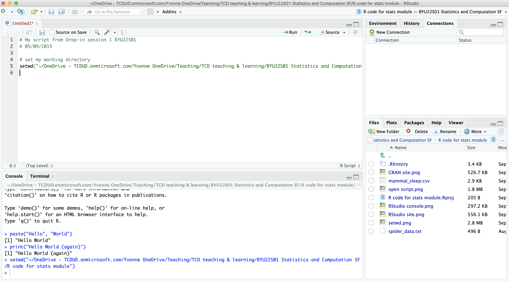

```{r setup, include=FALSE}
knitr::opts_chunk$set(echo = TRUE, comment=NA, collapse = TRUE)
```

Have a look at this checklist:

<div class="panel panel-primary">
<div class="panel-heading">
<h3 class="panel-title">Fundamental skills checklist</h3>
</div>
<div class="panel-body">
* Do you know how to navigate computer directories and get addresses of files or folders?
* Do you have R and RStudio installed and up to date on your computer?
* Do you know what an R package is and how to install them?
* Do you know how to set up working directories and use scripts in RStudio?
</div>
</div>

If you've answered no to any of the above questions, then continue on. Some of you may already have R and RStudio installed from previous modules - that's great! Make sure everything is up to date. You can refer back to this document in the future.

******

# 1. Why programming and computing?

We care about teaching you programming and computing skills because they are important skills in the current workforce and are not to be taken for granted. Programming is not just code, it's a way of thinking and requires problem solving skills that are applicable to other scenarios. You can apply these skills to a range of problems or examples beyond what we will cover in this module.

<div class="panel panel-success">
  <div class="panel-heading">
  <h3 class="panel-title">Best Practice</h3>
  </div>
  <div class="panel-body">
Learning programming is like learning a language - there is grammar and syntax. It takes time and effort to learn and to practice. Don't expect to pick it up immediately - take it in small steps and practice as much as you can.
  </div>
  </div>

## Basic computing terms

We don't always formally learn computing terminology even if we've always been using computers. Here are some general computing concepts we will be using and that we expect you to be familiar with: 

### Drives, Folders & Files

In computer science, most commercial operating software are organised in to **drives**, **directories**, **folders** & **files**. 

Using Windows as example (Macs are similar):
C:/ is a drive (a hard drive). Within the drive, information is sorted in folders (e.g. Documents). Within folders are lists of files which contain information (e.g. my_document.doc). Here, ".doc" is the file extension that tells the computer what kind of file it is and what program to use to read the information (a Word document). Folders within folders are sometimes called sub-folders.

Basic commercial computers tend to have only one drive but you can have as many drives, folders and files as you want. For example:

```
C: (the hard drive)
  -> my documents (within drive C)
      -> file A (within my documents)
      -> folder 1 (within my documents)
          -> folder 2 (within folder 1)
              -> file B (within folder 2)
```

### Directories 

Directories are the cataloguing system describing where files and folders are stored; also called **addresses**. Directories take the form of an address like "C:/documents/folder/file" which tells a program to look in this location. 

The concept of folders and files comes from the days before computers where information was written on paper and stored in filing cabinets. Directories are not case sensitive. Case sensitivity means a computer reads capitalised letters (ABC) differently to lowercase letters (abc).

<div class="panel panel-success">
  <div class="panel-heading">
  <h3 class="panel-title">Best Practice</h3>
  </div>
  <div class="panel-body">
  * We recommend that you organise your files in a structured way. This will make importing data into R easier. For example, have a folder for the module and sub-folders for each of the practicals:    
  Documents (folder) -> Biostats (folder) -> Practical 1 (folder) -> Script (file)  
  * We don't recommend using a automatically selected "downloads" folder or your "desktop" because these are not permanent file locations and it can be hard to find files in a messy folder. 
  </div>
  </div>

Notice that the components of the address is separated using a forward slash `/`. R can understand `/` but does not understand back slash `\` because back slashes have a specific meaning in programming. When typing addresses, make sure you use the correct slash.

<div class="panel panel-danger">
<div class="panel-heading">
<h3 class="panel-title">Danger!</h3>
</div>
<div class="panel-body">
Computers are only as smart as the humans that use them.

If your code is not working there is most likely a spelling mistake or a typographic error. These human errors are easy to miss but equally easy to fix!

There is a difference between `"`straight`"` or "curly", 'single' or "double" quotation marks! R does not recognise curly quotation marks so beware when pasting code from elsewhere.
</div>
</div>

We navigate through our computer's directories using Explorer in Windows or Finder in MacOS. You can see the address of a directory in the address bar. We will learn how to use directories in RStudio.

<div class="panel panel-primary">
<div class="panel-heading">
<h3 class="panel-title">Expectations</h3>
</div>
<div class="panel-body">
We expect you to be able to manage your own computer organisation. E.g. know how to open a file, save files in a specific file type and know where you saved files!

We will ask you to load data from files using addresses so knowing where you saved the file is essential.
</div>
</div>

***

## Why R?

R is just one of *many* high-level programming languages used professionally (e.g. C++, Java, Python) but R is specially designed for doing statistics and handling data. Hence R is widely taught in statistic classes. 

> Knowing R is not the same skill as knowing Excel.   
> R is far more powerful for doing data science.

R is an open source software and it is **transparent**, meaning you can *see* how your data is being manipulated. Transparency allows us to check whether the statistics is done correctly and is easier to see how statistical theory is being applied. This is not always possible to see in commercial statistical software or Excel.

R is also **reproducible** because R allows you to document your code in **scripts** that you can give another person to replicate your analysis.

The traditional option to learning statistics is to do these calculations by hand with pre-calculated statistical reference tables but doing calculations by hand is an arduous task for realistic biological problems. 

<div class="panel panel-success">
  <div class="panel-heading">
  <h3 class="panel-title">Best Practice</h3>
  </div>
  <div class="panel-body">
One way to practice R is to use it preferentially whenever you can, even in other modules. For example, use R to make graphs for your assignments instead of Excel. Or to calculate simple statistics. 
  </div>
  </div>
  
Beyond what we will cover in this module, R can be used to write documents (like this one), interactive apps, websites, or presentations. The possibilities are endless.

***

## Why RStudio?

R and RStudio are different software. R is a computer programming language and statistical environment. RStudio is a user interface which has some useful features that makes using R easier. There are other user interfaces for R but RStudio has lots of support.

RStudio acts as a mediator between you and R:  
user -> input -> RStudio -> R -> RStudio -> output -> user  

It is possible to use R by itself (you may prefer it) but RStudio makes everything a lot easier by providing some organisation and allows you to write **scripts**.

***

# 2. Installing R and RStudio {.tabset}

<div class="panel panel-danger">
<div class="panel-heading">
<h3 class="panel-title">Danger!</h3>
</div>
<div class="panel-body">
You need to install R then RStudio **in that order**! RStudio cannot work without R but R can work without RStudio.

An analogy: R is the engine of a car and RStudio is the steering wheel - you control the wheel but the engine is what makes the car go forward. 
</div>
</div>


If you prefer instructional videos, here's a video about installing R https://vimeo.com/203516510 and RStudio https://vimeo.com/203516968

Here are the instructions for various operating software:

## Windows

For R:

1. Go to https://cran.r-project.org/bin/windows/base/
2. Click "Download R" in the blue box for the latest version.
3. Save the file, open it and follow the instructions. You can leave everything as the default option. Make sure you've installed the program somewhere sensible like the Programs folder in the C:/ drive.
4. Open it and check it installed properly

For RStudio:

1. Go to https://rstudio.com/products/rstudio/download/
2. Click download for **RStudio Desktop Open Source Licence**. The FREE option.
3. Install the program somewhere sensible
4. Open it and check it installed properly

***

## Mac

For R:

1. Go to https://cran.r-project.org/
2. Click "Download R for (Mac) OS X"
3. Save the latest release file (e.g. R-4.0.2.pkg), open it and follow the instructions. You can leave everything as the default option. Make sure you've installed the program somewhere sensible.
4. Open it and check it installed properly

For RStudio:

1. Go to https://rstudio.com/products/rstudio/download/
2. Click download for **RStudio Desktop Open Source Licence**. The FREE option.
3. Install the program somewhere sensible
4. Open it and check it installed properly

***

## Linux

For R:

1. Go to https://cran.r-project.org/
2. Click "Download R for Linux"
3. Click your version of Linux
4. Copy and paste the relevant installation code
4. Open R and check it installed properly

For RStudio:

1. Go to https://rstudio.com/products/rstudio/download/
2. Click download for **RStudio Desktop Open Source Licence**. The FREE option.
3. Run the relevant code
4. Open it and check it installed properly

See https://linuxconfig.org/rstudio-on-ubuntu-18-04-bionic-beaver-linux for a guide

***

## Chromebook

There are a few options:

* The easiest option is to run Linux on your computer, then you can install R and RStudio. Try the instructions on https://blog.sellorm.com/2018/12/20/installing-r-and-rstudio-on-a-chromebook/ or https://github.com/jennybc/operation-chromebook#links-re-r-and-rstudio 
* Use RStudio Server
* Use RStudio Cloud https://rstudio.cloud/ (in beta so it may not work)

Sorry chromebook users, if your chromebook version is very old then it may not be possible to install R.

***

# 3. Opening RStudio for the first time

If you open RStudio you'll see several windows that organise how information is passed to R and how output from R is presented:


* Left: The big window is the **Console**. This is the interface with R and is the same as using R on its own. (don't worry about "Terminal")
* Top right: This window has three tabs: "Environment" - shows you what information is stored in R's memory, "History" - shows your code history & "Connections" - don't worry about this one, it's for connection to database servers.
* Bottom right: This has several tabs. The most important being "Files" - showing you where RStudio is looking at on your computer & "Plots" - shows you any plots you make in R.

When you open a **Script**, it will appear as a panel in the top left.

<div class="panel panel-primary">
<div class="panel-heading">
<h3 class="panel-title">Expectations</h3>
</div>
<div class="panel-body">
We expect you to be familiar with the RStudio layout and using R within it.  
</div>
</div>

You can customise the layout, colour scheme, font and font size of RStudio in Options.  
Shortcuts and hotkeys will make your life easier. You can see a list of them under Help. There are only minor differences between Windows and Mac shortcuts (e.g. using Cmd instead of Ctrl).

***

# 4. R structure and terminology

There are a number of terms you'll come across when using R. Here are some basic ones:

R is a statistical environment that consist of **packages**. Packages are sets of **functions** that do something to input depending on the instructions described in the function. All your packages are stored in your **library** (a folder on your computer). When you download R it comes with a basic set of packages as default (**base packages**). Some of these **base packages** are loaded every time you open R.  

> R is CaSe SenSitiVe. Meaning that `library()` is different to `Library()`.

<div class="panel panel-success">
  <div class="panel-heading">
  <h3 class="panel-title">Best Practice</h3>
  </div>
  <div class="panel-body">
Keep your R, RStudio and packages up to date. These things are continuously updated by the community. You can update your packages by clicking the Update button under the Packages tab.
  </div>
  </div>
  
***

## Installing more packages

We can customise and expand the functionality of R by installing more packages, which are made by the community and distributed freely. The function to download packages from the Internet is:  

```
install.packages("<insert name of package>") # installs a package
```

For example, `install.packages("learnr")`. Note how non-curly quotation marks are used. Some packages have more functions to do more advanced computing, some contain datasets you can practice with.

### The packages folder (your library)

Additional packages are saved to a folder on your computer. We should check that your packages folder is set up properly - especially if you use Windows 10 and sync with OneDrive. 

**This is not a problem for Mac users or Windows users that are not logged in to a Microsoft account (check it anyway, in case).**

Packages should ideally be downloaded to your local computer and not saved on the cloud (e.g. through OneDrive). 

The constant syncing slows down communication and creates issues between the cloud and R and RStudio. You can see where your packages are saved using `.libPaths()` in your console - meaning Library Paths, the address of your package libraries. 

There should be two addresses:

 * One in your Program Files or wherever your computer installed R. E.g. `"C:/Program Files/R/R-4.1.1/library"` - this is where all the base R packages are installed (the default packages that come with R)
 * One somewhere else on your computer - this is your personal library. When you install new packages from the Internet, they will be saved here. 
     * If the second address is on your local computer (e.g. Documents) and not in the cloud then you don't have to do anything. E.g. `"C:/Users/XXXX/Documents/R/win-library/4.1"` is fine
     * If the address has OneDrive in the address, then we need to fix that - follow the steps below. E.g.  `"C:/Users/XXXX/OneDrive/Documents/R/win-library/4.1"` is problematic

**To change the address of your personal library in Windows 10**

 1. Create an empty folder in your Documents folder called `R`. Make sure it is not syncing with the cloud. E.g. with the address `C:\Users\XXXX\Documents\R`
 2. Click Start (Windows icon). Type in "environmental variables" [without quotations], you should see "Edit environment variables for your account" in the search results - click that
 3. Under User variables (the top window) click New
 4. In the Variable name field type `R_LIBS_USER` - exactly like that in all caps
 5. In the Variable value field enter the address of the package folder (where you made it in step 1) - make sure to use backslash `\` not forward slash `/`. E.g. `C:\Users\XXXX\Documents\R`
 6. Click OK twice to exit
 7. Type `.libPaths()` in R to check that your personal library folder is now listed in `R`
 
Changing default settings in the Control Panel is pretty advanced computing - we don't expect you to know this. Don't be afraid to ask for help.

***

# 5. My first script

The greatest advantage of RStudio is that it allows you to write **scripts**. These are files ending in `.R` that are created and opened by RStudio. R itself cannot open, read or create scripts.

Scripts are text documents of code that you can save on your computer and open later. Scripts are instructions to give to R, but can also serve as a record of what you've done (**transparency** & **reproducibility**). 

Before RStudio, we had to save our code in notepad or similar then copy and paste it into R (believe me it was a pain). Now we can do the same but in one click. 

<div class="panel panel-success">
  <div class="panel-heading">
  <h3 class="panel-title">Best Practice</h3>
  </div>
  <div class="panel-body">
   We **strongly recommend** running code from your script rather than directly from the console because a script will be easier to proof-read and troubleshoot. 
   
  Scripts provide a guide to what you want to enter to R and saves you from having to type out code over and over again.
  </div>
  </div>
  
You can create a new script under File -> New file -> Script (Ctrl+Shift+N) or click the white square with a green and white plus sign in the top left corner.  


<div class="panel panel-primary">
<div class="panel-heading">
<h3 class="panel-title">Activity</h3>
</div>
<div class="panel-body">
Open your first script. Save it with a meaningful name. 

The numbers along the left hand side of the script refer to **line numbers**. It helps when referring to a specific function or code snippet to others.

Let's add your first functions to your R script!
</div>
</div>


-----

## Loading packages

One of the first things you may need in an R script is to load the packages you will use. 
Some base R packages are automatically loaded.

To use a package in R, you need to **call** it from R's library. The function to load a package is:

```
library(<insert name of package>) # loads a package
```

A package we will see later in the module is `MASS` which contains datasets you can use at home to practice the statistical tests covered in the lectures. `MASS` is a base R package but is not automatically loaded.

Running `data()` or `data(package = .packages(all.available = TRUE))` will show the list of available built-in datasets. Some of these will be relevant to biological sciences, others are more general.

Once a package is loaded, entering the name of a dataset will display the entire dataset. 

<div class="panel panel-primary">
<div class="panel-heading">
<h3 class="panel-title">Activity</h3>
</div>
<div class="panel-body">
Type `library(MASS)` into your script.

 * Put your cursor on the line you want to run then press Ctrl+Enter or click Run
 * You can run multiple lines by highlighting the relevant lines 
 * You do not need to highlight a single line to run it
 * You can run the entire script from beginning to end using the shortcut Ctrl+Alt+R


***

Run the `library(MASS)` code. You have just **run** your first **line of code**. 
</div>
</div>

R will load the package `MASS` in the background. You can check this in RStudio under the Packages tab where there will now be a tick in the box next to `MASS`.

Try calling one of the `MASS` datasets, like `Rabbit`, to view the entire dataset. To call a dataset, type in the name and run the code.

You can see the descriptions of each dataset by calling `help(<dataset name>)`, e.g. `help(Rabbit)` will tell you it describes the blood pressure of rabbits before and after a drug treatment.

<div class="panel panel-primary">
<div class="panel-heading">
<h3 class="panel-title">Activity</h3>
</div>
<div class="panel-body">
We will use the package `learnr` later in the module. 

This code will install the package but there is *one mistake* - fix the mistake and install the package: `install.packages(learnr)`

Install any other packages you are asked to. If it worked you should see something under the Tutorial tab (next to Files, Plots etc.) in RStudio. 

When you've installed the package, modify your code to install the package `remotes`. You now should have installed two packages.
</div>
</div>


***

## Commenting

The `#` (hash/pound) sign indicates comments. Anything after this symbol is not run in R. Commenting is for writing notes or telling the user what is going on.

```
# this is a comment
```

<div class="panel panel-success">
  <div class="panel-heading">
  <h3 class="panel-title">Best Practice</h3>
  </div>
  <div class="panel-body">
Comment often and in detail. Someone should be able to understand what you did and why. Including your future self.
  </div>
  </div>

<div class="panel panel-primary">
<div class="panel-heading">
<h3 class="panel-title">Activity</h3>
</div>
<div class="panel-body">
Add at least one comment to your R script describing what your script is doing.
</div>
</div>

***

# 6. Working directories in R

Remember directories? Typing out whole addresses starting from the hard drive is annoying. There is a short cut if we use **working directories**. 

The working directory in R is the default directory R will look in first. We can then use directory addresses that are **relative** to this default address to call files.

For example, following this directory structure: 
```
C:
  -> documents
      -> file A 
      -> folder 1 
          -> folder 2 
              -> file B
```
If the default directory is C:/, then the address for file B is `C:/documents/folder1/folder2/fileB`.  
But if we set folder 1 as the working directory `C:/documents/folder1/`, then we can use the relative address for the file: `folder2/fileB`. This way we don't have to type `C:/documents/folder1/` every time.

Navigating through directories using addresses can be confusing.  
Another useful command is `..` which tells the address to go *up* a directory. For example, if folder 2 was the working directory `C:/documents/folder1/folder2` and we wanted to access file A, then we need to tell the computer to go up two directories. The relative address for the file is: `../../fileA` which means that the computer is now looking in the `documents` folder. In contrast, the relative address for file B is even shorter, `fileB`, since folder 2 is already the working directory.

RStudio has a default working directory.  
You can see which working directory is the default directory in RStudio on the "Files" tab. The code to see the working directory in R is:

```
getwd() # GET Working Directory. There is nothing in the brackets
```

<div class="panel panel-danger">
<div class="panel-heading">
<h3 class="panel-title">Danger!</h3>
</div>
<div class="panel-body">

When you run code directly from the Console, it will use the RStudio working directory. The working directory of a script by default is the directory the script is saved in - this may be different to the default working directory in the Files tab.  

**This may be one reason RStudio cannot find a file even with a "correct" relative address and why it's important to know which working directory your computer is using**.

Carefully check that the file address is correct! And that you know where the file is on your computer!

You may need to change the working directory.
</div>
</div>

***

## Changing working directories

You can change the default RStudio directory under Tools -> Global Options but on a daily basis, changing the directory temporarily under Session -> Set working directory is more useful.  


The R function to change your working directory is:

```
setwd("<insert directory address here>") # SET Working Directory
```

For example, `setwd("~/")` will change your working directory to your default directory (called Root in computing terms). It is good practice to keep similar files in the same folder. Otherwise you will need to specify the full address when you call a file that exists in another folder and it can get confusing if your files are all over the place.



<div class="panel panel-primary">
<div class="panel-heading">
<h3 class="panel-title">Expectations</h3>
</div>
<div class="panel-body">
We expect you to know how to change working directories and tell R where to find files through relative addresses because that is how we **import** and **export** data to and from R.  
Think of directories and addresses like postal addresses - if your address is incorrect the postman (R) wouldn't know where to go to pick up your parcel (file).  
If R cannot find a file, check the address or the working directory is correct.
</div>
</div>

***

# Rubber ducks

Problem solving is an important skill. If your code is not working then it's likely that you've made an error somewhere - and that's OK! It's all part of learning how to program and there's no shame in not getting it right the first time. The first thing is to retrace your steps and identify whether you've missed a step or misspelled something.

Learning to problem solve independently is not something you learn by reading or something you can be taught. It is a skill you have to learn by *doing*, which means having a go yourself before seeking help from others. Make a habit of asking for help as your last option because for the assessment you will need to use R and troubleshoot independently. 

If you can't identify the problem, then you need to be able to describe your problem to another person. The other person needs enough information and context to understand what you hope to achieve and what you've done so far to suggest a solution. Sometimes the solution isn't immediately obvious so it may require some trial and error - and that's all part of the process too! It's really hard to fix someone's coding problem without context.

Talking through your problem is called rubber ducking in computer science - talking through your thought process to a rubber duck may help you realise the solution.

<div class="panel panel-primary">
<div class="panel-heading">
<h3 class="panel-title">Expectations</h3>
</div>
<div class="panel-body">
We expect you to be able to troubleshoot common programming problems on your own. Working things out yourself is also an essential skill, generally.

99% of all errors are incorrect addresses (working directory not set properly), missing characters, wrong quotation marks, or missing a step in the instructions. Typographic errors and spelling mistakes will be the first things we will check.

We don't want you to treat R and coding as a black box (i.e. something you don't understand how it works). Don't expect to be given code that works, that defeats the point of learning programming -- We want you to be able to write your own code and do data analysis in R independently by the end of this module for any scenario.
</div>
</div>

## Finding help

All R code comes with help files. You can access them from the "Help" tab in RStudio. If you want help on a specific function, then you can type in `help(<insert function name here>)`. If you don't know your exact query, you can search using `??<insert term here>` - e.g. `??mean`.  

The Internet is also great for R help. Websites like StackExchange are help forums for programming. Most likely your question has already been answered on StackExchange. The trick is knowing what to type into Google - meaning you need to know what outcome you want.  

***

# Final checklist

You should now have R and RStudio installed on your computer, installed some packages and updated your R settings if needed. 

You are now ready for the rest of the module.

* Do you know how to navigate computer directories and addresses to find files or folders?
* Do you know how to set up scripts and directories in RStudio?

We've introduced some basic computing concepts: scripts, directories and commenting.

We've also introduced some fundamental R functions. You will need these in the future:

  * `install.packages`
  * `library`
  * `getwd`
  * `setwd`
