# Assumptions


## Overall lecture aims

* Identify the structure of general linear models
* Describe how linear models are parametrized
* Understand how to use linear models
* Understand how to interpret and evaluate linear models

### By the end of this lecture you should:
 
* Know how the coefficient of determination is calculated and its interpretation
* Understand the assumptions of linear regression
* Be able to evaluate the appropriateness of a linear model to data based on residual plots
* Be able to identify generalised linear models appropriate for data 
* Create residual plots in R

***

## By now you should be comfortable with building and interpreting basic linear models in R 

> but how do we know whether our model is a "good" one?

We need to evaluate our model. There are a few things we should consider:

1. How much variation in the data is explained by the model?
2. Are linear models appropriate for our hypotheses?

***

## What does a linear model tell us?

1. What will a new value of Y be, given a new value of X?
2. Does the population slope $\beta_1$ differ to 0?
3. **How much variation in Y can be explained its linear relationship with X?**
  * Coefficient of determination ($R^2$)
  * Partitioning variance (F ratio)
  
## How much variation in Y can be explained its linear relationship with X?

$$ \frac{Var_{\text{explained by the line}}}{Var_{\text{not explained by the line}}} = Ratio$$
Interpreting ratios:  
Ratio > 1 = Line explains more than residual  
Ratio ≤ 1 = Line explains very little (null hypothesis)  

> We need to know the total amount of variation and all possible sources of variation (like the F-ratio & ANOVA)

### What is or isn't explained by the line?

#### Isn't: Sum of Squares of the Error (SSY)

The bit not explained by the null (total variation in the data). Remember, the null is $\bar{y}$ = the mean of Y.

$$SSY = y_i - \bar{y}$$

<div class="figure" style="text-align: center">

<p class="caption">(\#fig:SSY)Black line is the mean of Y. Blue lines are the difference between the mean and a single observation = SSY</p>
</div>

#### Isn't: Sum of Squares of the Residual (SSE)
The bit not explained by the line

$$SSE = y_i - \hat{y_i}$$

<div class="figure" style="text-align: center">

<p class="caption">(\#fig:SSE)Residuals (blue lines) are the difference between the data point and the predicted line (black line)</p>
</div>


#### Isn't: Sum of Squares of the Regression (SSR)
How well the line estimates the mean of Y

$$SSR = \hat{y_i} - \bar{y}$$

<div class="figure" style="text-align: center">

<p class="caption">(\#fig:SSR)Residuals (blue lines) are the difference between the null hypothesis (mean of observations, dashed lines) and the predicted line (black line)</p>
</div>


> Notice that since SSY is all variation in the data:  
> SSY = SSE + SSR

## So which bits do we use to evaluate model "fit"?

$$ \frac{Var_{\text{explained by the line}}}{Var_{\text{not explained by the line}}} = Ratio$$
We want the number above the line (nominator) to be larger than the number below the line (denominator), otherwise we cannot be confident that our results are different to randomly generated numbers.

Interpreting ratios:  
Ratio > 1 = Line explains more than residual  
Ratio ≤ 1 = Line explains very little (null hypothesis)  

In other words, we want to know how much varaition is captured by the model relative to the total variation in our data.

What is the error that tells us how much varaition the line is (H1) explaining relative to our null hypothesis (H0)? 

```{.r .fold-hide}
SSR - Sum of squares of the regression.
```

What is the error that tells us the total variation in our data?

```{.r .fold-hide}
SSY - Sum of squares of the error. Sometimes called SST - total sum of squares
```

So we can evaluate how much varaition the model explains by:

$$\frac{SSR}{SSY} = R^2$$

Why can't we use SSE as the denominator?

```{.r .fold-hide}
SSE depends on the total variation of Y. We could have more variation simply by having more data but the ratio values are the same. So using sum of squares does not tell us about how much variation is explained by our model in a way that is unbiased. 
```

## Coefficient of determination $R^2$

> This is the proportion of variation that your model (your line) explains

1 = no deviance from line (good)  
0 = strong deviance from line (not good)  

It is related to correlation coefficients (r). Basically, $R^2 = r^2$

<div class="figure" style="text-align: center">
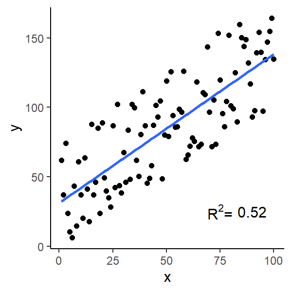
<p class="caption">(\#fig:fit)Which fits better?</p>
</div>

R will calculate $R^2$ for you. Going back the tree height and girth example, the $R^2$ is 0.27 (Multiple R-squared).


```

Call:
lm(formula = Height ~ Girth, data = trees)

Residuals:
     Min       1Q   Median       3Q      Max 
-12.5816  -2.7686   0.3163   2.4728   9.9456 

Coefficients:
            Estimate Std. Error t value Pr(>|t|)    
(Intercept)  62.0313     4.3833  14.152 1.49e-14 ***
Girth         1.0544     0.3222   3.272  0.00276 ** 
---
Signif. codes:  0 '***' 0.001 '**' 0.01 '*' 0.05 '.' 0.1 ' ' 1

Residual standard error: 5.538 on 29 degrees of freedom
Multiple R-squared:  0.2697,	Adjusted R-squared:  0.2445 
F-statistic: 10.71 on 1 and 29 DF,  p-value: 0.002758
```

> Conclusion: the model (your fitted line) explains 27 % of total variation in data

*But...*

* Biological data is messy, thus low $R^2$ may be biologically acceptable
* Low $R^2$ does not always mean a bad model
* Consider multiple regression to explain more variance
    * but adding more parameters is not always better. Why?


*** 

## But there are other things to check that are more important!

> We make assumptions of the error structure in linear regression ($\varepsilon$)

Remember:  
$$Y_i = \beta_0 + \beta_1 \times X_i + \varepsilon_i$$

* Does not change our estimates of $\beta_0$ or $\beta_1$
* Affects our confidence intervals of the estimate and thus hypothesis testing
* Because $\varepsilon_i$ is random, our assumptions also apply to the response variable $y_i$

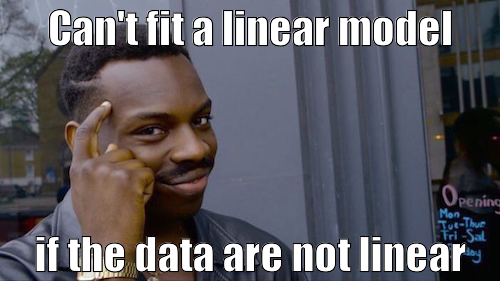
<center> Did you know you could make memes in R? </center>  

***

## Assumptions of linear regression

Linear models assume that the relationship between the response and predictor is *linear*. In addition to this main condition, there are 4 assumptions of linear regression:

1. Normality
2. Homogeneity of Variance
3. Independence
4. Fixed X

>**ALWAYS** check these assumptions every time you fit a model. No exceptions! No excuses!

### Residual plots

In R, we can evaluate models from **residual plots**:

```
Model <- lm(Y ~ X, data) # build a model
plot(Model) # show residual plots
```
There are 4 plots called. In order:

1. Residuals vs fitted values
    * bits left over vs what the model predicted
2. Standardised residual quantile-quantile plot
    * what is the spread of the residuals?
3. Scale-Location
   * like plot 1 but shown differently
4. Residuals vs Leverage
   * are there any influential data points?
    

### Mammal brain and body size

Let's look at these assumptions in detail using the relationship between brain mass and body mass for different mammals. The dataset is called `mammals` in the  `MASS` package.  
<div class="figure" style="text-align: center">
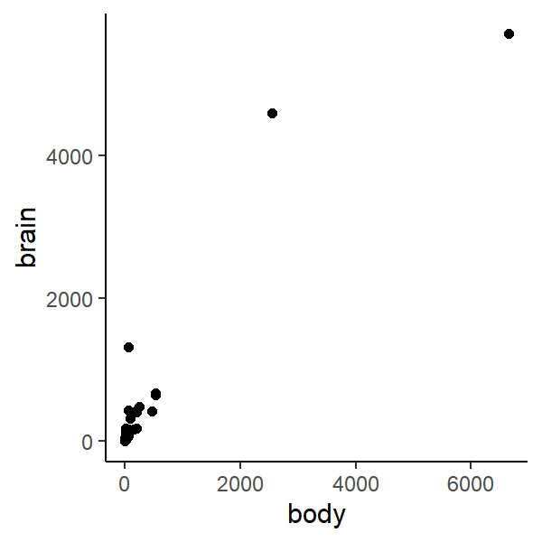
<p class="caption">(\#fig:mammal-brains)The relationship between mammal body size and brain size</p>
</div>


## 1. Normality

> Population Y values and error terms ($\varepsilon_i$) are normally distributed for each level of the predictor variable ($x_i$)
  
The distribution of the response variable, Y, should be normally distributed (not skewed). We can graphically check this using a histogram of brain size.

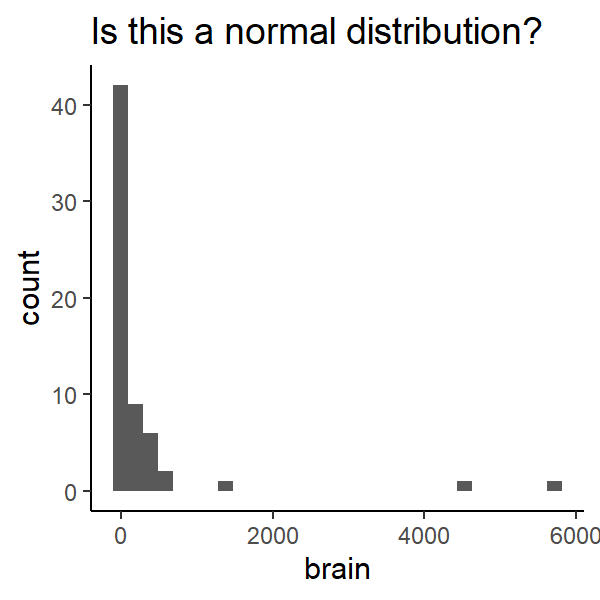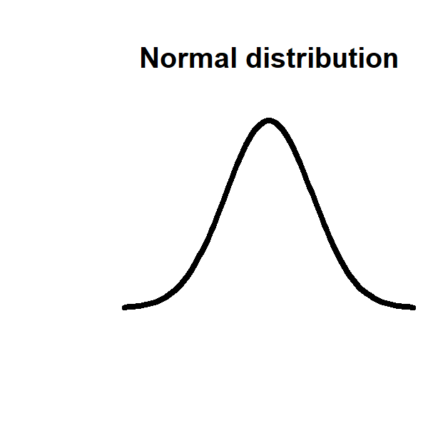


### Quantile-Quantile plots

* We can also visualise the spread of data with a quantile-quantile plot. Quantile-Quantile (Q-Q) plots are useful alternatives to visualising distributions to density plots or histograms. They are easier to assess distribution and normality with than histograms.
* The linear line is the expected relationship following a normal distribution.
    * Do our points follow the line?
    * What does it mean when the points don't follow the line?

#### Q-Q plot of single variables

We can see whether a single variable has a normal distribution - specifically that the distribution is symmetrical or not skewed.

```
qqnorm(chickwts$weight) ## the weight of chicks fed different diets (built in dataset)
```

Here, the quantiles of our observations are plotted against the theoretical quantiles if our observations followed a normal distribution.  
**Question** - What would you expect to see if our observations followed a normal distribution?


We can add a reference line to the above to help us evaluate how linear the Q-Q plot is. We can make the line red and thicker for fun.
```
qqnorm(chickwts$weight) ## the weight of chicks fed different diets (built in dataset)
qqline(chickwts$weight, col = "red", lwd = 2)
```
Do the observations follow a normal distribution?  

Compare the above with the histogram and density plots
```
plot(density(chickwts$weight), col = "purple") ## density plot, purple for fun
hist(chickwts$weight, col = "yellow") ## histogram, yellow for fun
```
Would you also conclude that the distribution of chick weights is normal?  

For comparison look at the Q-Q plots of a gamma distribution (distinctly not normal)
```
qqnorm(rgamma(100, 3, 5))
qqline(rgamma(100, 3, 5)) ## You should be able to see the skewness in the data. Compare with hist()
```

#### What happens with data that is not continuous? 

Q-Q plots also work with visualising data that is not continuous.
```
qqnorm(Loblolly$age) ## the ages of pine trees, can also try rbinom(100, 10, 0.5)
qqline(Loblolly$age)
```

**Question** - What is the main difference between the Q-Q plots of the continuous and discrete data?

Why do you think that is?  
You can also see it using `hist()`

#### Q-Q plots of residuals for assessing normality
Q-Q plots permit comparison of two probability distributions when one distribution is the expected and the other is the observed distribution, then we can evaluate how well our observations follow our expected distribution. Using Q-Q plots we can assess skewness or identify outliers or influential points.

Q-Q plots are automatically generated when calling plot on a linear model (`lm`). It's the second graph called (defined using which). You can also make one using `qqplot()`
```
plot(lm(Height ~ Girth, trees), which = 2)
```
Does that look normal to you?

### Another use of Q-Q plots
We can also compare the distribution of two variables. If they are distributed equally then they should fall along the straight line
```
qqplot(trees$Height, trees$Girth)
```
Compare with:
```
par(mfrow = c(2,1))
hist(trees$Height)
hist(trees$Girth)
```

***

Let's try this with the `mammals` dataset

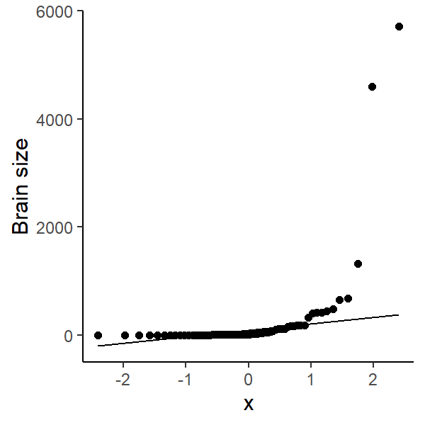

The residuals of the model should be also normally distributed 

<div class="figure" style="text-align: center">
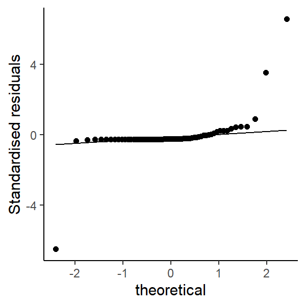
<p class="caption">(\#fig:standard)Looks like distribution of brain size is skewed to the right. What does this mean biologically?</p>
</div>

***

### What happens when the data is not normal?

* Collect more data, increase sample size for each level of $x$. Could be a sampling bias or sample size is too low
* Use a non-parametric test 
     * e.g. Spearman's Rank Correlation
* Ignore it (with good reason). Linear regressions are robust to skewness
* Some data are never normal
     * e.g. counts - should use Poisson distribution
     * Fit another statistical model with more appropriate error structures
* Transform the data

### Applying a transformation

* Some transformations:
     * Log or natural log
     * Square root or cube root
* Note: `log(0)` or `log(-1)` is undefined so you could make data positive and greater than 0 before you log transform them. 
* More sophisticated transformations not covered in this module

### Transforming brain size

* Let's try some transformations on the data
* What is the transformation doing? 
* Which would you choose?

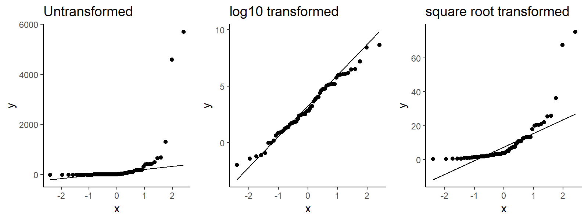


### Re-run the model with transformed data

<div class="figure" style="text-align: center">
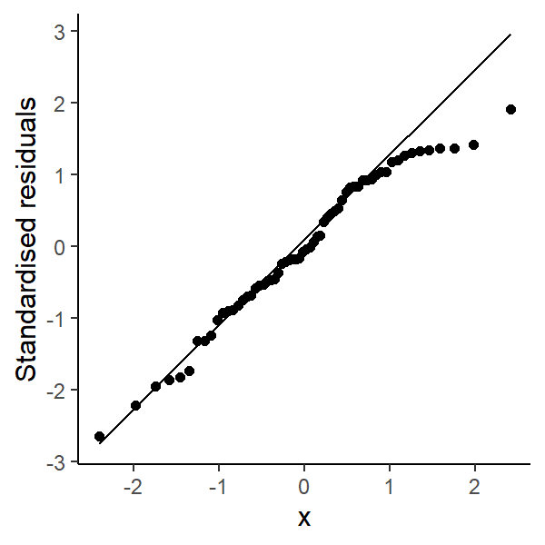
<p class="caption">(\#fig:new-graph)That looks better!</p>
</div>

If you transform data, then the model estimates refer to the transformed units. Remember to transform them back to their correct units.

## 2. Homogeneity of Variance

> Population Y values and error terms ($\varepsilon_i$) have the same variance for each level of the predictor variable ($x_i$)

* Related to the assumptions of Normality but more important!
* Look at patterns in standardised residuals:
     * Quantile plot
     * Relationship with fitted values (predicted Y values from line)

Causes:

* small sample size
* outliers
* non-normally distributed variables

Fixes:  

* Have properly designed experiments  
* Collect enough data  
* Deal with it like as normality

> Homoscedasticity is the statistical term for homogeneity of variance. The opposite is called *Heteroscedasticity*. 

**Question** - What would you expect to see in a bar plot showing means and standard deviation for the assumption of homogeneity of variance to be met?


Look at this graph - does it show homoscedasticity or heteroscedasticity?
<div class="figure" style="text-align: center">

<p class="caption">(\#fig:homo)Bar plot of mean of two groups (A & B). Error bars indicate standard deviation</p>
</div>

Here, you can see that group `B` has a higher standard deviation than group `A`. So, we would conclude that there is heteroscedasticity. We do not want heteroscedasticity because it would bias the calculations of variance if we were to do an ANOVA. Remember that ANOVA is a test of variance.

The same concept applies for scatter plots. Look at this plot - does it show homoscedasticity or heteroscedasticity?
<div class="figure" style="text-align: center">
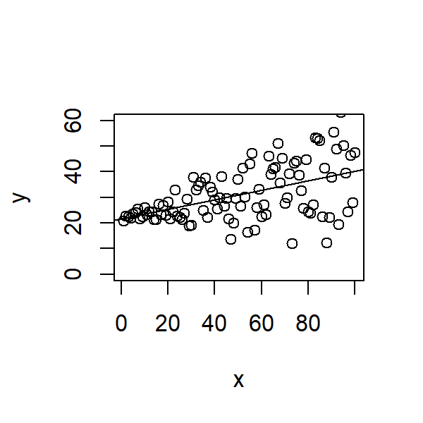
<p class="caption">(\#fig:scatter)A scatter plot and a fitted model</p>
</div>

Here, you can see that as the value of `x` increases so does the scatter around the trend line in `y`. It is sometimes referred to as a shotgun pattern or cone/triangle pattern. It's common in time series data because your observations are not independent of each other, the value of one observation is dependent on what happens earlier in time. In other words, your response variable can be modelled based on the standard deviation.

**Question** - What would you expect to see in a scatter plot for the assumption of homogeneity of variance to be met?


You can assess this for a linear model from the (standardised or non-standardised) residual plot vs fitted values. Here's the residual plot using the above data. Can you see the unequal variance?

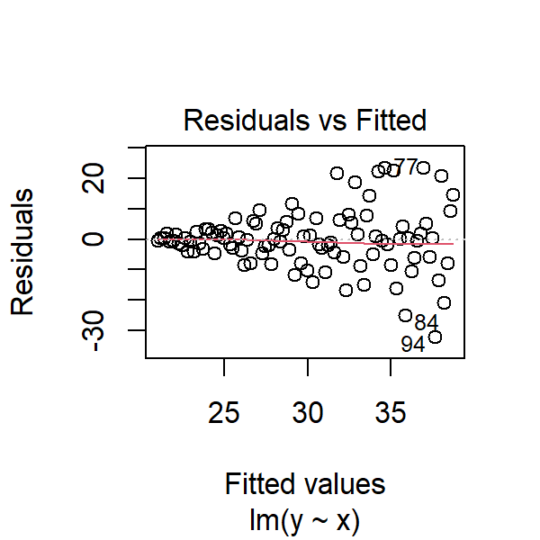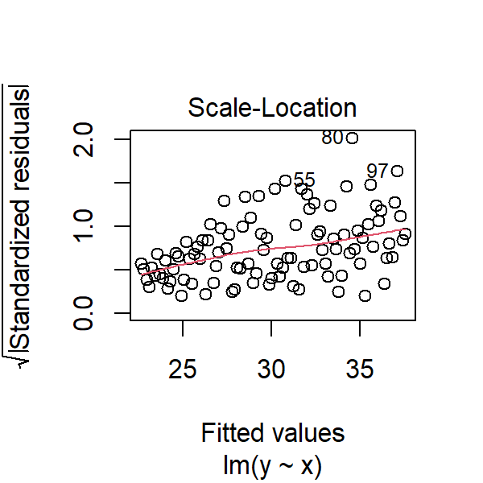

One way of dealing with heteroscedasticity is to use weighted least squares regression where the parameters are fitted to a single observation based on its residual to correct for variation in the residuals (that scatter). But that is beyond the scope of this module.


### Should expect a **normal distribution** of standardised residuals 

<div class="figure" style="text-align: center">
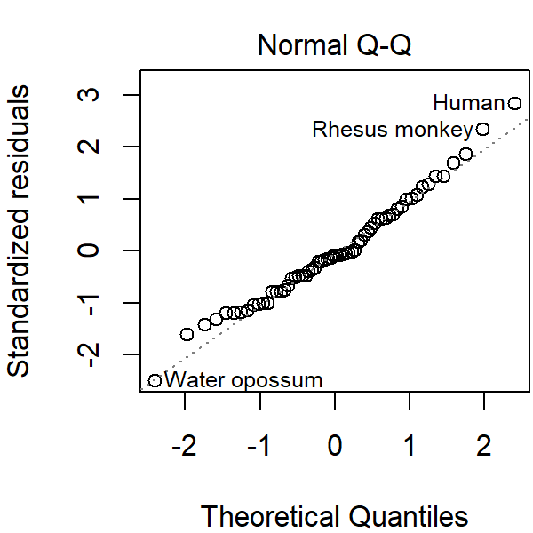
<p class="caption">(\#fig:qqnormresid)data falls along line = good</p>
</div>

### Are there trends in the residual vs fitted values?

Expect no relationship between standardised (or non-standardised) residuals and fitted values of model

* straight line = good
* no humps or valleys


## 3. Independence

> Population Y values and error terms ($\varepsilon_i$) are independent

* They do not influence each other (not autocorrelated)
* Often because of inappropriate experimental design
    * time series
    * pseudo-replication
    * repeated measurements
* Increases Type I error


### Dealing with independence

Best thing is to choose a different model  
Consider using random effects models or choosing better variables (i.e. good experimental design)

## 4. Fixed X

> The predictor variable ($x_i$) is fixed. i.e. a known constant

Called Type I model or fixed effects model  

* Often broken in biological stats
* Predictor variables can be random
    * Called Type II (random effects model)
* Hypothesis testing of Type I applies to Type II

*** 


## Other regression diagnostics

* How well does the model fit the data?
     * Coefficient of determination $R^2$
* Is a simple linear regression appropriate?
    * e.g. polynomial or curvilinear model
* Are there effects of outliers in the model?

### Outliers, leverage and influence

> Outliers are abnormal or unusual observations relative to the rest of the data that can cause biases during analysis

* Outliers can be checked before applying a model. How?
* Sometimes caused by experimental error but sometimes significantly different data points are not outliers
    * Natural variation
* Leverage = how much x influences y
* Influence = how much x influences the slope of the line (Cook's Distance)

If outliers are caused by experimental error or bias, you could justify excluding it from data.  
**But _never_ delete observations to force a better model fit**


### Outliers in the mammal dataset

<div class="figure" style="text-align: center">
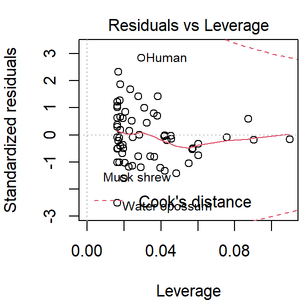
<p class="caption">(\#fig:outliers)Looks like humans, water opossums & musk shrew have high influence on the regression</p>
</div>

***

## Putting it all together

These assumptions can be checked by looking at the residual plots. R shows residual plots using the function `plot(lm())`.

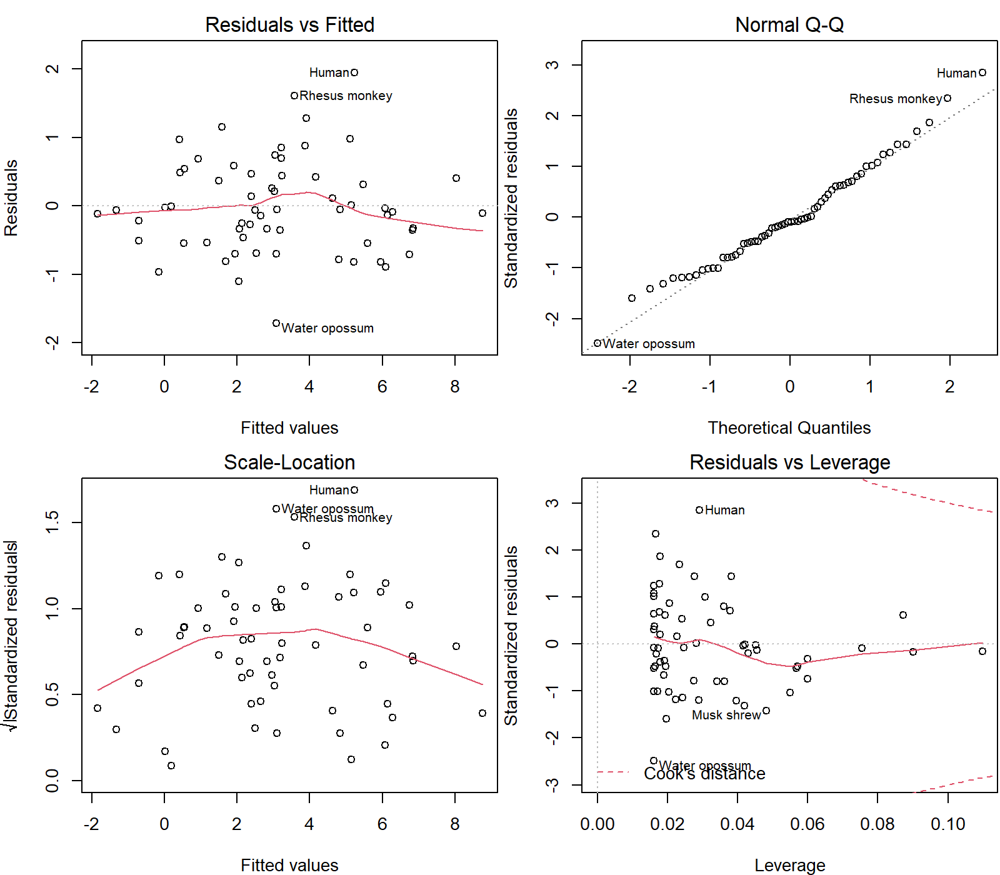

Let's evaluate the residual plot, starting from the top left:

* Are the residuals vs fitted values equal (i.e. a straight line)? If there are humps or valleys, the model may not be appropriate for the data.
* Are the standardised residuals normally distributed? Linear models assume that residuals are normally distributed. If not, your model is inappropriate for your data or your data is skewed in some way.
* Is there a pattern to your $\sqrt{\mbox{Standardised residuals}}$? Linear models assume equal variance so there should be no pattern in your residuals.
* Are there any outlier data points that have strong leverage in the model? E.g. potential outliers or influential data points.

***

## ANCOVA

Remember Analysis of Covariance deals with the effect of two predictor variable, a continuous and categorical variable, on a continuous response variable. Like an ANOVA adjusted for the effect of an additional continuous covariate.  
Follows all the assumptions above *plus two extra ones*: 

### 1. Covariate values cover a similar range across groups

Data from groups should overlap across the range of the continuous variable

<div class="figure">
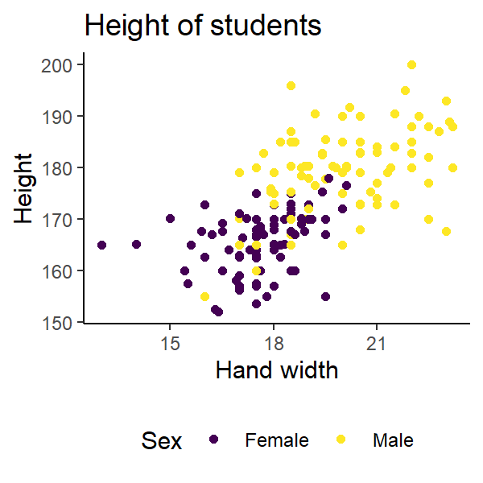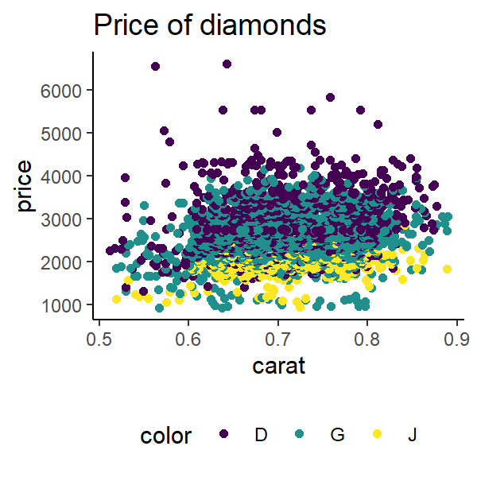
<p class="caption">(\#fig:ancova)Which of these violates ANCOVA assumptions?</p>
</div>


If the first assumption is not met, ANCOVA fails to separate the effects of the two predictors on the response variable.
  
Extending regression models beyond the range of data could be *extrapolation* and lead to incorrect conclusions.

### 2. Regression slopes are similar across groups

Like a fixed or additive linear regression.  
If the second assumption is not met, you can still fit an “ANCOVA-like” model to the data with different slopes for different groups (i.e. a mixed or random model). Then it's not a true ANCOVA in the classic sense.

***

## Take home messages

* Always check assumptions
* Interpret model in a biological context
    * Biological data is messy: good model can have low R2
    * Outliers aren’t always mistakes
    * Statistical significance $\neq$ biological significance
* Is the model appropriate for the question?
* Can my experiment actually test my hypothesis?
* **_Never_ delete observations to force a better model fit or fit assumptions**

