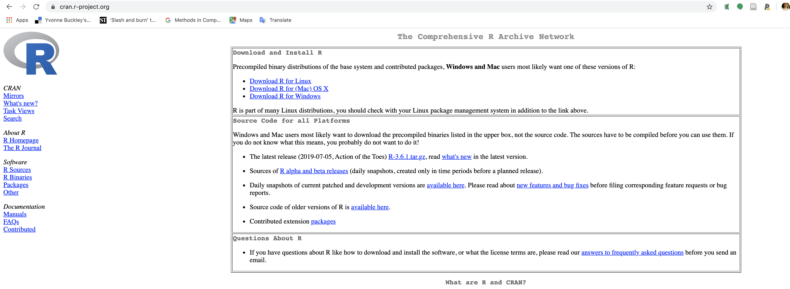
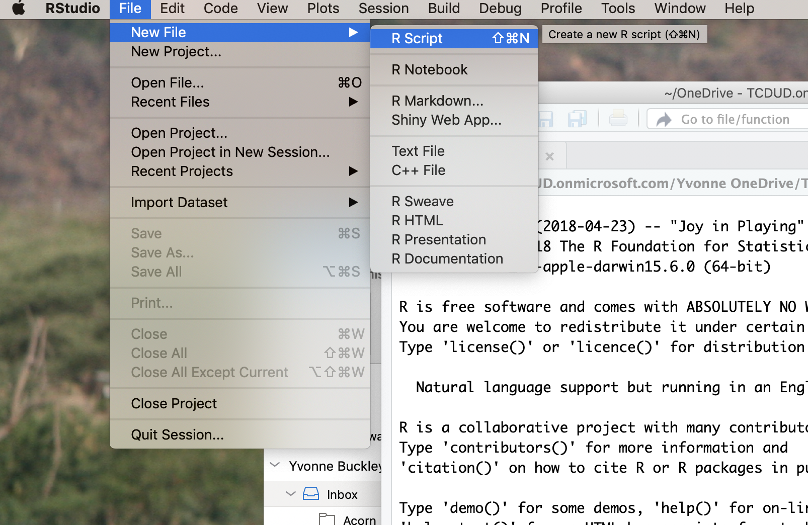

```{r setup, include=FALSE}
knitr::opts_chunk$set(echo = TRUE)
knitr::opts_chunk$set(comment=NA, collapse = TRUE)
```
***

# Welcome to Statistics and Computation for Biologists

Training to become a scientist can be broken down into two parts. First, there is content to learn - these are technical details or "how to" which come from textbooks, lectures or resources on the Internet.  

Second, is learning how to define problems and how to solve them. This is true for statistics & computation. You can practice this in these drop in sessions and in your other modules. For example, R not working? Work out why, what's wrong and what to change to make it work.    

In this module we aim to give you the tools and knowledge to solve your own data science problems. These skills will be important in your later studies or even your career. 


Use the following checklist to make sure you are prepared for this semester:

* Do you have R and RStudio installed on your computer?
* Is your R up to date?
* Do you know how to set up scripts and directories in RStudio?
* Are your folders organised in a logical and sensible way?

If you've answered no to any of the above questions, then continue on. Some of you may already have R and RStudio installed from previous modules - that's great! Check that your version and packages are all up to date (For packages - Under the Packages tab, click Update, For RStudio - Under Help menu at the top, click check for updates).

Regardless, you should work through this handout to make sure you are comfortable with the basics of R. Use this as a reference throughout semester as we will be revisiting these concepts.

***

# Installing R and RStudio {.tabset}

R and RStudio are different software. R is a computer programming language and statistical environment. RStudio is a user interface which has some useful features that makes using R easier. If R is a retro text-based game (the ones where you chose your adventure with just words), then R studio is a graphic based game (like Legend of Zelda). It is possible to use R without RStudio but trust us, RStudio makes everything a lot easier by providing some organisation.

You will need to install R AND R studio **in that order**.  



> Here's a video about installing R https://vimeo.com/203516510 and RStudio https://vimeo.com/203516968

You can follow the instructions below or try the interactive tutorial at https://learnr-examples.shinyapps.io/ex-setup-r/#section-welcome

Here are the instructions for various operating software:

## Windows

For R:

1. Go to https://cran.r-project.org/bin/windows/base/
2. Click "Download R" in the blue box. The version number is not important.
3. Save the file, open it and follow the instructions. You can leave everything as the default option. Make sure you've installed the program somewhere sensible like the Programs folder in the C:/ drive.
4. Open it and check it installed properly

For RStudio:

1. Go to https://rstudio.com/products/rstudio/download/
2. Click download for **RStudio Desktop Open Source Licence**. The FREE option.
3. Install the program somewhere sensible
4. Open it and check it installed properly


## Mac

For R:

1. Go to https://cran.r-project.org/
2. Click "Download R for (Mac) OS X"
3. Save the latest release file (e.g. R-4.0.2.pkg), open it and follow the instructions. You can leave everything as the default option. Make sure you've installed the program somewhere sensible.
4. Open it and check it installed properly

For RStudio:

1. Go to https://rstudio.com/products/rstudio/download/
2. Click download for **RStudio Desktop Open Source Licence**. The FREE option.
3. Install the program somewhere sensible
4. Open it and check it installed properly

## Linux

For R:

1. Go to https://cran.r-project.org/
2. Click "Download R for Linux"
3. Click your version of Linux
4. Copy and paste the relevant installation code
4. Open R and check it installed properly

For RStudio:

1. Go to https://rstudio.com/products/rstudio/download/
2. Click download for **RStudio Desktop Open Source Licence**. The FREE option.
3. Run the relevant code
4. Open it and check it installed properly

See https://linuxconfig.org/rstudio-on-ubuntu-18-04-bionic-beaver-linux for a guide


## Chromebook

There are a few options:

* The easiest option is to run Linux on your computer, then you can install R and RStudio. Try the instructions on https://blog.sellorm.com/2018/12/20/installing-r-and-rstudio-on-a-chromebook/ or https://github.com/jennybc/operation-chromebook#links-re-r-and-rstudio 
* Use RStudio Server
* Use RStudio Cloud https://rstudio.cloud/ (in beta so it may not work)

Sorry chromebook users, if your chromebook version is very old then it may not be possible to install R.

***

# Why R?

R is just one of *many* programming languages but R is specially designed for doing statistics. Hence it is widely taught in statistic classes. There are other statistics programs (even Excel can do basic statistical tests) but these are normally "point-and-click" programs where you click a button and magic happens. The advantage of R is that it is an open source software where you can *see* how your data is being manipulated. Which means R is transparent, you can check whether the statistics is done correctly and is easier to see how statistical theory is being applied. It's no longer magic but *science*.


# Why RStudio?

If you open R itself you'll see that it's pretty bare bones. Most annoyingly you have to remember what information is stored in its memory. RStudio is a intermediate program that acts as a mediator between you and R:  
user -> input -> RStudio -> R -> RStudio -> output -> user  

If you open RStudio you'll see several windows that organise how information is passed to R and how output from R is presented:


* Left: The big window is the **console**. This is the interface with R and is the same as using R on its own. (don't worry about "terminal")
* Top right: This window has three tabs: "environment" - shows you what information is stored in R's memory, "history" - shows your code history & "connections" - don't worry about this one.
* Bottom right: This has several tabs. The most important being "files" - showing you where RStudio is looking at on your computer & "plot" - shows you any plots you make in R.

You can customise the layout and colour scheme of RStudio in Options.  
There are other user interfaces for R but RStudio has a lot of support.

## RStudio scripts

The greatest advantage of RStudio is that it allows you to write **scripts**. These are files ending in `.R` that are created and opened by RStudio. R itself cannot open, read or create scripts. Scripts are text documents of code that you can save on your computer and open later. They provide a guide to what you want to enter to R and saves you from **having to type out code over and over again**. Before RStudio, we had to save our code in notepad or similar then copy and paste it into R (believe me it was a pain). Now we can do the same but in one click. Importantly, scripts allow **reproducibility** and helps with problem solving.  

Let's demonstrate the power of RStudio and scripts...but first an introduction to directories.

***

# File housekeeping

It's important for your computer files to be *organised* so that you can find your files later. Where possible don't save your files to a "downloads" folder or your "desktop" - these should not be permanent file locations (OK for temporary ones).

In computer science, most operating software are organised in to **drives**, **directories**, **folders** & **files**. Using Windows as example:
C:/ is a drive. Within the drive there are folders (e.g. Documents). Folders are groups of files (e.g. my_document.doc). Directories are the cataloguing system describing where files and folders are stored. Directories take the form of an address like "C:/documents/folder/file" which tells a program to look in this location.

> We recommend that in your Documents folder you should have a folder for this module which contains folders for each of the practicals (5 folders). The practical folders should contain the relevant files for the practical. For example:    
> Documents (folder) -> Biostats (folder) -> Practical 1 (folder) -> Script (file)  

The concept of folders and files comes from the days before computers where information was written on paper and stored in filing cabinets.   

Directories are really important concepts in computer science. We use directories without realising it every time we use a computer.

## Working directories

RStudio works off directories. There is a default directory which shows up on the "Files" tab. This is called the **Working Directory**. You can change this by default under Tools -> Global Options but you can also change this temporarily under Session -> Set working directory.


This is the same as entering `setwd(<insert directory address here>)`. It is good practice to keep similar files in the same folder. Otherwise you will need to specify the full address when you call a file that exists in another folder and it can get confusing if your files are all over the place (see below).  

You can check what working directory R is using by typing `getwd()`. Note that if you run this from the console you might get a different answer because the default working directory of RStudio might be different to the working directory of a script. The working directory of a script is the folder the script is saved in.  

When we type directory addresses in R we can shorten the address used *relative* to the working directory. Otherwise we would have to type in the WHOLE address starting from the disk drive (usually C:/).  

For example:  
If my working directory was "C:/My Documents" and I had a file in my documents folder called "file.csv" that I wanted to load into R, then I do not need to type out "C:/My Documents/file.csv" but could use the short version "file.csv" because R automatically fills in the beginning of the address as it checks its working directory. Note directories are not case sensitive.  

```
C:
  -> my documents (within drive C - the working directory)
      -> file we want (within my documents)
```

If my working directory was "G:/Folder" and my file was in "C:/my documents", then the short version "file.csv" *would not work* because R is using the address "G:/folder/file.csv". And this address does not exist. It's like writing the working directory first then adding on the short address after.

```
C:
  -> my documents (within drive C)
      -> file we want (within my documents)
G:
  -> folder (within drive G - the working directory)
```


> Think of directories and addresses like postal addresses - if your address is incorrect the postman (R) wouldn't know where to go to pick up your parcel (file)

Since addresses are relative, we can also get files stored in sub folders (folders within folders) separated by `/`. Note that R can understand `/` but does not understand `\` for computer reasons we do not need to get into. If you really need to use `\` in an address you need to type it twice - e.g. `C:\\folder\\file`. Note that if you copied the address of a directory directly from the address bar in Windows Explorer then it will use `\` so you need to replace them with `/`.

```
C:
  -> my documents (within drive C - the working directory)
      -> folder (within my documents)
          -> file (within folder)
```

Following the above example:  
If my working directory was "C:/My Documents" and I had a file in a folder within my documents folder, then the full address is "C:/My Documents/folder/file.csv" and short address I could use in R is  "folder/file.csv" because R is already looking in "C:/My Documents". This works for any number of sub-folders within the same working directory.
```
C:
  -> my documents (within drive C - the working directory)
      -> folder 1(within my documents)
          -> folder 2 (within folder 1)
              -> file (within folder 2)
```
E.g. "folder1/folder2/folder3/file.csv" where folder 3 is within folder 2 which is within folder 1 which is within the working directory. But you wouldn't have that many subfolders right?

Now for a more complicated example. 
Imagine we had a folder (parent folder) with two sub-folders A & B and we have set our working directory to folder A like this- `setwd("C:/parent folder/folder A")`. BUT we wanted to access a file stored in folder B (called file.csv). Like so:

```
C:
  -> parent folder (within drive C)
      -> folder A (within parent - the working directory)
          -> other files (within folder A)
      -> folder B (also within parent)
          -> file we want (within folder B)
```

The short address "folder B/file.csv" would **NOT** work because the address R is using is "C:/parent folder/folder A/folder B/file.csv" which does not exist - folder B is not within folder A.  
Instead we have two options:

1. To use the full address "C:/parent folder/folder B/file.csv"
2. To use the relative address and tell R to move up one directory before it starts looking for a file called "file.csv". In computing, this is denoted `..`. So the short address becomes "../folder B/file.csv". Use `..` each time you want to go up a directory level.e.g. "../../../file" goes up three directory levels before looking for the file.

That's about as complicated as it gets for working directories and if you can't import data into R - **check what the working directory in R is and what the address of the file is**.

*** 

# Creating a script

Scripts are files of code that can be directly run in RStudio (.R files). You can create a new script under File -> New file -> Script (Ctrl+Shift+N) or click the white square with a green and white plus sign in the top left corner.  
Save it to your working directory and give it an informative name (e.g. "Dropin1")



Let's add some code to this script by learning how to import data into R.

> **Run code from your script rather than directly from the console**, that way you have a record of what you've done and it makes it easy to spot any mistakes you might have made. Put your cursor on the line you want to run then press Ctrl+Enter or click Run.


***

# Loading data {.tabset}

To use data stored in other files, the data must be **loaded** or **read** into R. The function used to load data into R depends on the file type. Files names or directories are designated as character strings (`""`).

The function used to import data depends on the file type. `read.delim()` for deliminated data (hence delim) or `read.csv()` for csv files are two common ways. `read.table()` also works for tables. See `help("read.table")` for the general inputs. The two most important inputs to be aware of are:

* `header`: Use `header = FALSE` (default) if your data doesn't have headers, `header = TRUE` to force R to recognise headers
* `sep`: Tells R to recognise how individual observations are separated (hence sep). `sep = ""` or `sep = " "` if it's tab separated data (with white spaces between data - `""` is a general indicator for any whitespace, `" "` is specifically 1 space) or `sep = ","` for comma separated values. If the data didn't import properly it could be because the wrong read function or the wrong separator was used - try another one.

## .txt

Text files (.txt) tend to be delimited, meaning information is separated by a space of fixed width. e.g. 1 2 3 4 5 6 (separated by 1 space). This is loaded using `read.delim()`. Try loading the file "small_sleep.txt":
```{r}
small_sleep <- read.delim("small_sleep.txt")
small_sleep
```

***

## .csv

If data is separated by a comma, it's called a comma separated value file (.csv). e.g. 1,2,3,4,5,6. Note that .txt files can also be comma separated. The function to read csv is `read.csv()`. Try loading the file "mammal_sleep.csv":

```{r}
mammal_sleep <- read.csv("mammal_sleep.csv")
```

***

## Copying data

For quick and dirty data entry, or for copying code from the Internet, you can load data from the clipboard after highlighting data and copying it. But it is always better to save a data file as a .csv file and importing into R so you always have a copy of the raw data you used.


For PC: 
```
myclip_data <- read.csv("clipboard") # also works with read.delim
```

For Mac: 
```
myclip_data <- read.csv(pipe("pbpaste")) # also works with read.delim
```

Web browsers might display whitespace differently so try a different separator depending on what web browser you are using.

### Try it yourself

For whichever operating system you have, highlight and copy this data and load this data into R using you new R script. Make sure you are using the correct `read` function:

```{r echo=FALSE}
print(mammal_sleep[ 1:10, 1:2])
```
Species,BodyWt,BrainWt,NonDreaming,Dreaming,TotalSleep,LifeSpan,Gestation,Predation,Exposure,Danger
Africanelephant,6654,5712,NA,NA,3.3,38.6,645,3,5,3
Africangiantpouchedrat,1,6.6,6.3,2,8.3,4.5,42,3,1,3
ArcticFox,3.385,44.5,NA,NA,12.5,14,60,1,1,1
Arcticgroundsquirrel,0.92,5.7,NA,NA,16.5,NA,25,5,2,3
Asianelephant,2547,4603,2.1,1.8,3.9,69,624,3,5,4
Baboon,10.55,179.5,9.1,0.7,9.8,27,180,4,4,4
Bigbrownbat,0.023,0.3,15.8,3.9,19.7,19,35,1,1,1
Braziliantapir,160,169,5.2,1,6.2,30.4,392,4,5,4
Cat,3.3,25.6,10.9,3.6,14.5,28,63,1,2,1

***


# Checking the data

> **Always** check that your data loaded properly. Sometimes strings are loaded as factors instead of characters or vice versa. Sometimes the columns are not recognised because the separator character is incorrect. There are always simple solutions to these problems (e.g. a small typo) and you should be able to fix them.


For bigger datasets it is easier to view a subset of the data or to use the `View()` function:
```{r}
head(mammal_sleep, n = 6) # View the first 6 rows (6 is default, can be changed)
```
```
View(mammal_sleep)
```

## Data structure

`str()` is a handy function for checking the structure of your dataset. Let's check the mammal sleep dataset.

```{r}
str(mammal_sleep)
```
* The first line tells us that `mammal_sleep` is a data frame. Which is how R stores observations in rows and columns. Other types are lists and matrices. It also tells us there are 62 observations - meaning the number of rows of data - and 11 variables - meaning the number of columns
* In the first column of `str()`, are the names of the columns of the dataset listed with an `$` are . So the first column is called `Species`
* The second column shows what *type* of variable the data are: character (`chr`) for letters, numeric (`num`) for continuous numbers and integer (`int`) for discrete numbers. Another type you will encounter are `Factors` and `levels`  - these are categorical variables.
* The third column shows the first couple of observations in each column

## Summarising data

`summary()` shows some summary statistics for the specific variable

```{r}
summary(mammal_sleep) # for all columns
summary(mammal_sleep$BodyWt) # summary statistics for body weight
```

***

# Tips

* Coding is like learning a language. There is grammar, syntax and terminology to learn. 
* The secret to being a coding whiz is practice, practice, practice. Try using R at every opportunity. If you don't use it, you lose it.
* It's OK to google everything. No matter how many years you've been using R you will forget something basic.
* A lot of programming is logic. If you can't describe what you want to achieve in words, then you can't code it. Sometimes the solution means changing your way of thinking about a problem.
* A lot of errors come from spelling or syntax mistakes. It doesn't mean you don't know it, check your code carefully for typos. Missing brackets or quotation marks are common mistakes.
* Often, copying and pasting your error message into google comes up with the solution
* Trial and error is a big part of programming. If it doesn't work the first time, tweak it and try it again. Getting a function to work might be as simple as adding or removing one of the defined parameters.  

# Finding help

All R code comes with help files. You can access them from the "Help" tab in RStudio. If you want help on a specific function, then you can type in `help(<insert function name here>)`. If you don't know your exact query, you can search using `??<insert term here>` - e.g. `??mean`.  

The Internet is really really great for R help. Websites like StackExchange are help forums for programming. Most likely your question has already been answered on StackExchange. The trick is knowing what to type into Google.  

Learning to problem solve independently is not something you learn by reading or something you can be taught. It is a skill you have to learn by *doing*, which means having a go yourself before seeking help from others. Make asking for help your last option. You'll see on StackExchange people *describe* what they want to achieve, what they have done so far, identified what the problem is and provide some reproducible code to help someone else understand their problem. It's really hard to fix someone's coding problem without context.

***

# Final checklist

* Have you installed R?
* Have you installed RStudio?
* Are all your versions and packages up to date?
* Do you know how to create and save an R script?
* Do you know how to set your working directory?
* Can you import data into R?
* Can you run a line of code?
* Can you use a function?

## Recap quiz

What is the working directory in computing?
```{r, class.source = 'fold-hide', eval = FALSE}
Working directories are the location (folder) on your computer that the program is looking in by default. All file address are relative to the working directory
```

What is the difference between the function `getwd()` and `setwd()`?
```{r, class.source = 'fold-hide', eval = FALSE}
getwd() tells you what R thinks the working directory is, setwd() tells R what you want the working directory to be
```

***

# `learnr` tutorials

In addition to the Drop ins, the lectures and the practicals, there are optional tutorials about stats that you can run directly from RStudio in your own time. They are there to supplement your learning.  

You can install these tutorials by following the instructions [here](/project/biostats-tutorials).