# Introduction 

These are course notes about statistical modelling in `R` for Statistics and Computation.

***

## Try it yourself

You can try out the examples and code yourself. I recommend creating an `R` script or Rmarkdown document for your own notes. Datasets used here are from the package `MASS` which comes with `R`. To use any data in `MASS`, `library(MASS)` needs to be loaded first.

## Revision questions

There are some questions for you to answer throughout the chapters. The answers are at the end of the book in Chapter \@ref(answers). Some questions don't have answers but you should think about them. 

## Downloading notes

These notes can be downloaded as a single HTML file without the LaTeX math equations (File -> Save as) or as a PDF.

## Other resources
  
* Seeing Theory. Chapter 6. https://seeing-theory.brown.edu/regression-analysis/index.html
* Statistics: an introduction using R. Michael J. Crawley. Wiley Press. Chapters 7 - 11.
* Experimental Design and Data Analysis for Biologists. Gerry P. Quinn & Michael J. Keough. Cambridge Press. Chapters 5, 6, 8, 12.
* R for Data Science (For more advanced R). https://r4ds.had.co.nz/index.html
* https://learningstatisticswithr.com/book/index.html
* [An interactive visual explanation of hierarchical Models](http://mfviz.com/hierarchical-models/)

<!--chapter:end:index.rmd-->

# Simple linear models {#simple}


***

## Overall lecture aims

* Identify the structure of general linear models
* Describe how linear models are parametrized
* Understand how to use linear models
* Understand how to interpret and evaluate linear models

Recommended reading:
Chapter 5.5 Getting Started with R

### By the end of this lecture you should:
 
* Describe the structure of a general linear model
* Understand how a simple linear model is parametrised
* Understand what the parameters of a linear model represent
* Parametrise a simple linear model from given information
* Interpret a simple linear model in a graphical format

In R:

* Use built-in R datasets and R libraries
* Conduct a simple linear model

***

## Height and girth of trees

Imagine we measured the height and girth of trees to test the hypothesis that thicker trees are taller.  


How should test our hypothesis? We could assign trees to categories like "thick" or "thin" trees and do a t-test. What does our t-test say?


```

	Welch Two Sample t-test

data:  Height by Thickness
t = 1.6339, df = 28.168, p-value = 0.1134
alternative hypothesis: true difference in means is not equal to 0
95 percent confidence interval:
 -0.9240387  8.2181563
sample estimates:
mean in group Thick  mean in group Thin 
           78.00000            74.35294 
```

### **But** this isn't the best way
* How did we define "thick" or "thin"?
* We lost information using groups - tree girth is not categorical data, it's continuous
* This increases unexplained variance = *bad!*
* When might you want to group data?

***

## Linear regression

> models the linear relationship between 2 continuous variables

* Continuous response variable (Y)
* Continuous predictor variable (X)

<div class="figure" style="text-align: center">

<p class="caption">(\#fig:regression-model)Fit a line</p>
</div>

### What does linear mean?

* By definition, all predictor parameters should not be divided by each other
* No parameter is an exponent
* No parameter is multiplied or divided by another

Not a linear model:  
$H_a = \frac{a \times H \times T}{1 + a \times H \times T}$ e.g. Holling’s Type II predation equation  
$y = \frac{\beta_1 x}{\beta_2 x}$ e.g. enzyme rate of reactions

### Why do we use a linear model?

* Quantify a relationship
  - E.g. relationship between drug concentration and time
* Predict what will happen
  - E.g. growth at different time points
* Explain as much about the response variable as possible
* Partition variation
  - E.g. Phenotypic variation = genetic variation + environmental variation

***

## Structure of a general linear model

> $$Y = intercept + slope \times X$$

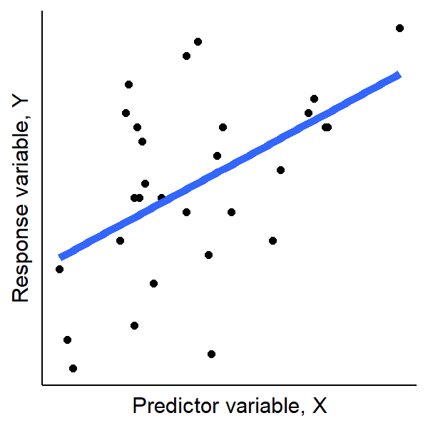

Intercepts and slopes can be mathematically represented by any symbol or letter but conventionally the equation is written as:

$$y_i = \beta_0 + \beta_1 \times x_i + \varepsilon_i$$

Where $i$ refers to individual data points.

### Variables of a linear model

Variables are $y_i$ and $x_i$  
$y_i$ = response variable, what you are interested in, e.g. height  
$x_i$ = predictor variable, what you are manipulating, e.g. girth


### Parameters of a linear model

Parameters are what we don't know and we need to work out (*parametrise*). They are $\beta_0$ and $\beta_1$.   
$\beta_0$ = population intercept, value of y when x is 0, constant  
$\beta_1$ = population slope, unit change in y with a unit change in x  
$\varepsilon_i$ = the residual of the model (how much the line gets wrong for each data point or what is left over), also called **random error**  

***

## Ordinary least squares regression

Ordinary least squares regression (OLS) is the technique used to parametrise the linear model by finding the 'best fitting' line.

> The aim is to make the sum of the squared residuals, $\sum{\varepsilon_i^2}$, as small as possible 

Meaning calculating the difference between each point and the line, squaring that difference and adding it all up (Figure \@ref(fig:residuals)).  
Residuals are squared to make all values positive - remember points can fall above and below the best fit line.

<div class="figure" style="text-align: center">
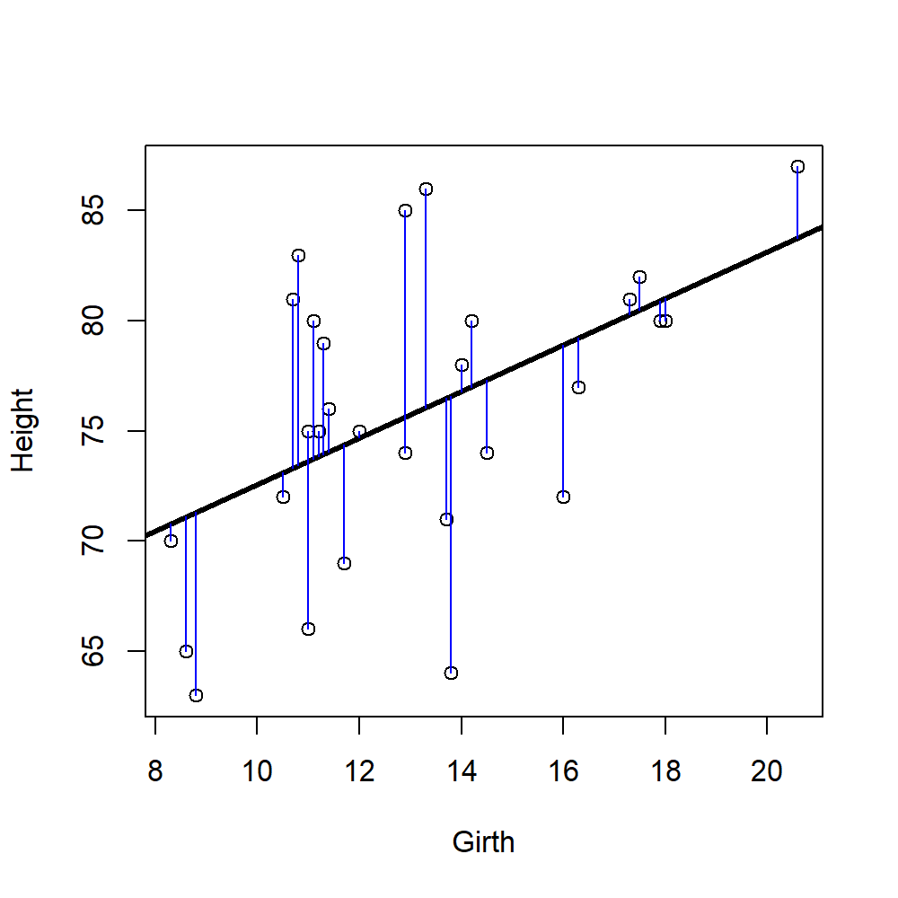
<p class="caption">(\#fig:residuals)Residuals (blue lines) are the difference between the data point and the predicted line (black line)</p>
</div>


### Finding the intercept

* Why not extrapolate to 0?
* We know $\bar{y}$ and $\bar{x}$ - the means of x and y
* We can rearrange the linear equation to $\beta_0 = \bar{y} - \beta_1 \bar{x}$ where $\beta_1$ is the estimated slope
* But `R` will do all this for you!

***

## Halfway there! Revision time!
Test your understanding so far by answering the questions below.  

1. What types of variables are used in simple linear regression?
2. What is the method for parameterising linear models called?
3. What is random error in linear regression?

***

## What does a linear model tell us?

> 1. What will Y be, given a new value of X?
> 2. Does the population slope $\beta_1$ differ to 0?

### Back to trees

The function `lm()` in `R` stands for linear model. It will do the OLS calculations for us. The function takes data in the form `lm(Y ~ X, data)`. Use `summary()` on your `lm` to get more information.


```

Call:
lm(formula = Height ~ Girth, data = trees)

Coefficients:
(Intercept)        Girth  
     62.031        1.054  
```

Here the `(Intercept)` is the value of the intercept, $\beta_0$ and `Girth` is the slope of the model, $\beta_1$.  
We then put these numbers in our linear model equation to get the **parametrised linear model**

$Y = \beta_0 + \beta_1 \times X$  
becomes $Height =$ 62.031  + 1.054 $\times Girth$

<div class="figure" style="text-align: center">

<p class="caption">(\#fig:tree-plot-2)Does the above equation match this line?</p>
</div>

### Calculating a new value of Y

We can use the parametrised equation to work out the height of a tree for any value of girth. If a tree is 10cm thick, what is its predicted height?

$Height =$ 62.031  + 1.054 $\times Girth$
$Height =$ 62.031  + 1.054 $\times 10$  
$Height =$ 72.571 cm

### Does the population slope $\beta_1$ differ to 0?

Typically we are more interested in the value of the slope than the intercept. We want to know if the slope of the fitted line is statistically different to 0 because that represents our hypotheses:

> Null hypothesis (in orange, Figure \@ref(fig:tree-slopes)):
> $$H_0: \beta_1 = 0$$
> Alternative hypothesis (Figure \@ref(fig:regression-slopes)):
> $$H_1: \beta_1 \neq 0$$

<div class="figure" style="text-align: center">
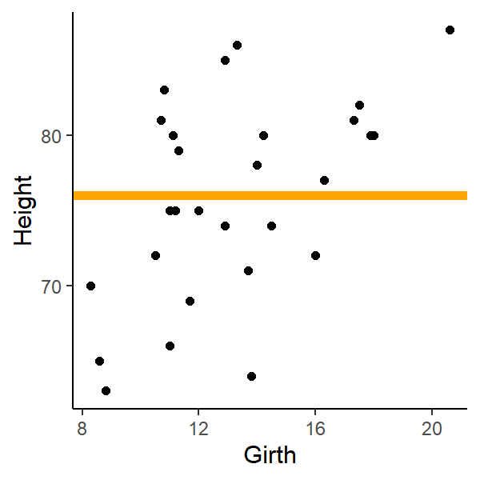
<p class="caption">(\#fig:tree-slopes)Hypotheses of linear models</p>
</div>

<div class="figure" style="text-align: center">

<p class="caption">(\#fig:regression-slopes)Regression lines can have positive (blue) or negative (red) slopes, either are H1</p>
</div>

#### Testing linear model parameters in R

R will conduct a statistical test on the model parameters for us. You can see it using `summary(lm())`


```

Call:
lm(formula = Height ~ Girth, data = trees)

Residuals:
     Min       1Q   Median       3Q      Max 
-12.5816  -2.7686   0.3163   2.4728   9.9456 

Coefficients:
            Estimate Std. Error t value Pr(>|t|)    
(Intercept)  62.0313     4.3833  14.152 1.49e-14 ***
Girth         1.0544     0.3222   3.272  0.00276 ** 
---
Signif. codes:  0 '***' 0.001 '**' 0.01 '*' 0.05 '.' 0.1 ' ' 1

Residual standard error: 5.538 on 29 degrees of freedom
Multiple R-squared:  0.2697,	Adjusted R-squared:  0.2445 
F-statistic: 10.71 on 1 and 29 DF,  p-value: 0.002758
```

* The P values above test whether our slope is significantly different to 0 
* Tested like a single parameter t-test (why?)
  - What are the degrees of freedom?
  
**Based on the R output above, does our estimated slope for Girth differ to 0 and what can we conclude about our hypothesis?**


## Probability distribution functions (PDF)

> Linear models need a descriptor of how response variables (or errors) should be distributed

**Probability distributions**

* E.g. Gaussian/normal distribution
* Grouped by "family"
* Other types exist – same principles apply, called generalised linear models (GLM). GLMs are touched on in Chapter \@ref(GLM)


<div class="figure" style="text-align: center">

<p class="caption">(\#fig:normal)a normal distribution with mean = 0 and sd  = 1</p>
</div>


### Linear models in the Gaussian family

> Same principles, different names

* Linear regression
  * continuous response
  * one or more continuous predictors
* Analysis of Variance (ANOVA)
  * continuous response
  * categorical predictors
* Analysis of Covariance (ANCOVA)
  * continuous response
  * A mix of continuous and categorical predictors
  * Special case with special assumptions

#### You have seen these statistical tests in previous lectures


```

	Welch Two Sample t-test

data:  Height by Sex
t = -12.924, df = 192.7, p-value < 2.2e-16
alternative hypothesis: true difference in means is not equal to 0
95 percent confidence interval:
 -15.14454 -11.13420
sample estimates:
mean in group Female   mean in group Male 
            165.6867             178.8260 
```


|          |  Df|   Sum Sq| Mean Sq| F value|Pr(>F) |
|:---------|---:|--------:|-------:|-------:|:------|
|Sex       |   1|  8974.12| 8974.12|  165.11|<0.001 |
|Residuals | 206| 11196.29|   54.35|      NA|NA     |

A one-way ANOVA is mathematically identical to a t-test


> In this module, don’t focus on memorising what kind of test fits what kinds of data

They are all variants on general linear models anyway...

* We are interested in **slopes** and (to a lesser extent) intercepts
* Understand how these models relate to your *hypotheses & experimental design*

***

## Revision time!
Test your understanding so far by answering the questions below.

4. What is the function in R to conduct a linear regression?
5. How do you find a predicted value of a response for a given predictor value using a parameterised linear model?
6. What is the probability distribution function of linear regression?

<!--chapter:end:01-regression-fundamentals.Rmd-->

# Multiple regression {#multiple}


***

## Overall lecture aims

* Identify the structure of general linear models
* Describe how linear models are parametrized
* Understand how to use linear models
* Understand how to interpret and evaluate linear models

Recommended reading:
Chapter 5.5 Getting Started with R

### By the end of this lecture you should:

* Understand the parameters of a linear model with multiple predictor variables
* Parametrise and use a multiple regression model to predict values from the R output of a linear regression
* Interpret and complete ANOVA tables with multiple predictor variables
* Understand an interaction between two predictor variables 
* Conduct a multiple regression in R with 2 continuous or categorical predictor variables or a combination

***

## Previously, we parametrised slopes and intercepts of simple linear models

With one continuous response variable and one continuous predictor variable

$$Y = \beta_0 + \beta_1 X$$

where the parameters $\beta_0$  = intercept and $\beta_1$ = slope

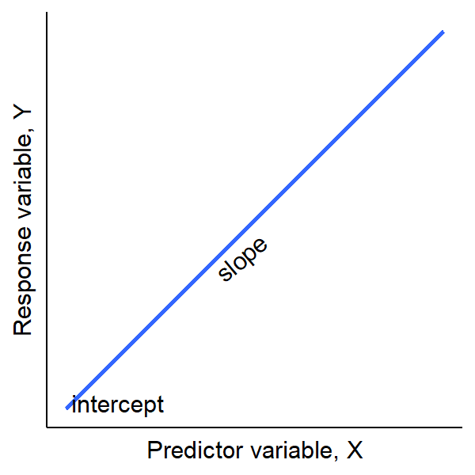

So far these parameters have been *fixed*...

## Parameters of a linear model can be **random** or **fixed**

* Important to consider when designing experiments – you decide!
* Changes the hypotheses & interpretation of results
* Fixed:
  Constant across all groupings (how observations are related – e.g. populations of individuals)
* Random:
 Vary across groupings, or represent a random sample from a larger population

### Fixed slopes linear model

* All groups (Frequency of exercise in this example) have the same slope
* Response of groups to predictor variable x is consistent across groups
* Cannot extrapolate beyond groups
* *Thus can only draw conclusions for these groups*

<div class="figure" style="text-align: center">
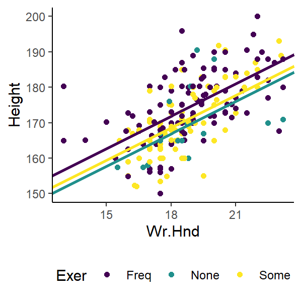
<p class="caption">(\#fig:fixed-slopes-model)Height of students of various frequencies of exercise and hand width</p>
</div>

### Random slopes linear model

* All groups have different slopes
* Response of groups to predictor variable x varies among groups
* Can extrapolate beyond observed groups
* Identity of group is not the main question
* *Thus can generalise to other groups outside study*

<div class="figure" style="text-align: center">

<p class="caption">(\#fig:random-slopes-model)Each group has a different slope</p>
</div>

### Distinguishing between Fixed or random is important

> Changes the way Analysis of Variance (ANOVA) is calculated

* Changes formula for Mean Sum of Squares
* Changes numerator/denominator of F ratio
* Thus changes interpretation
* Called Type I (fixed), II (random) or III (mixed)

***

## t-tests, simple linear models, ANOVA

* Predictor variables can be categorical (called factors in R), like exercise in Figures \@ref(fig:fixed-slopes-model) & \@ref(fig:random-slopes-model)
* Can have two or more sub-categories (called levels in R)
  * E.g. sex: male/female, level of drug: low/medium/high  

Typically, the relationship between a continuous response variable & categorical predictors is analysed using a special case of statistical models: One-way Analysis of Variance (ANOVA)  

Confusingly, ANOVA can refer to how data are spread around a single mean (*variance*) and also a way of comparing means (via how similar their variances are) for experimental designs with a predictor variable with any number of levels.

## Fixed one-way ANOVA with 2 or more levels

* level = subsets within categories
  * e.g. male/female, low/medium/high
* We are testing means for each level
* What is the null hypothesis?

> $H_0:$ All levels come from the same population (have the same mean)

### Pulse rate and exercise

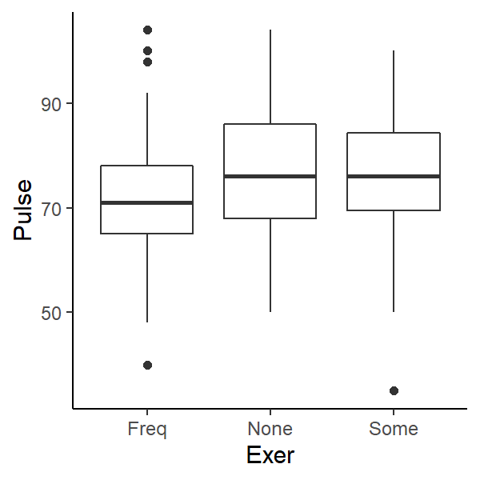

We can do an ANOVA and get the following output:


```
Analysis of Variance Table

Response: Pulse
           Df  Sum Sq Mean Sq F value  Pr(>F)  
Exer        2   900.5  450.23  3.3783 0.03618 *
Residuals 189 25188.2  133.27                  
---
Signif. codes:  0 '***' 0.001 '**' 0.01 '*' 0.05 '.' 0.1 ' ' 1
```

> Conclusions: We can reject the null hypothesis that there is no difference in mean pulse rate of students with different amount of exercise

Report the degrees of freedom (df), the F ratio and the P value like
$$F_{2,189} = 3.38, P = 0.036$$
Where 2 is the df of the groups (`Exer`) and 189 is the df of the residual error (`Residuals`).

## The ANOVA table

|  Source of variation  | SS | df | MS | F | P |
|:---------------------:|:--:|:--:|:--:|:-:|---|
| Variance among groups | SSR | number of levels - 1 | $MSR = \frac{SSR}{df}$ | $\frac{MSR}{MSE}$ |   |
| Variance within group | SSE | number of observations - 2 | $MSE = \frac{SSE}{df}$|   |   |
|        Total error   | SSY | total number of observations - 1 |    |   |   |

### Calculating group means

Check `summary()` to see group means


```

Call:
lm(formula = Pulse ~ Exer, data = survey)

Residuals:
    Min      1Q  Median      3Q     Max 
-41.188  -7.968  -0.188   7.812  32.032 

Coefficients:
            Estimate Std. Error t value Pr(>|t|)    
(Intercept)   71.968      1.184  60.763   <2e-16 ***
ExerNone       4.796      3.040   1.578    0.116    
ExerSome       4.219      1.752   2.408    0.017 *  
---
Signif. codes:  0 '***' 0.001 '**' 0.01 '*' 0.05 '.' 0.1 ' ' 1

Residual standard error: 11.54 on 189 degrees of freedom
  (45 observations deleted due to missingness)
Multiple R-squared:  0.03452,	Adjusted R-squared:  0.0243 
F-statistic: 3.378 on 2 and 189 DF,  p-value: 0.03618
```

* Groups are calculated in alphabetical order - Here "Frequent" group is calculated first
* `Estimate` column shows the **difference in means** - see below
* P values test differences in **pairs of means** BUT should we be doing multiple comparisons? (no)

Model coefficients:  

```
(Intercept)    ExerNone    ExerSome 
  71.968421    4.796285    4.219079 
```

R-calculated means: 

```
    Freq     None     Some 
71.96842 76.76471 76.18750 
```

Manually calculated means for "None" group: 
71.9684211 + 4.7962848 = 76.7647059

Manually calculated means for "Some" group: 
71.9684211 + 4.2190789 = 76.1875

## ANOVA and hypothesis testing

**Important to remember:**

* ANOVA is a test of means (analysis of variance about the mean)
* F-ratio tells you that there is a difference in the means between pairs of groups but NOT which pairs are different
* Need post-hoc tests like Tukey’s Honest Significant Differences (not covered in this lecture) to see *which pairs* are significantly different

***

## Recap time!

Test your understanding so far by answering the questions below.

1. What is the significance of fixed and random variables for drawing conclusions?
2. What is the function to conduct an Analysis of Variance in R?
3. How many groups were in the categorical predictor variable in this one-way analysis of variance? $F_{5,24} = 14.23, P < 0.001$

***

## Multiple regression

We can include more than 1 predictor variable in our models

> Multiple regression: Linear models with two or more predictor variables

* Models the effect of multiple predictors on response
* Two-way ANOVAs etc. are special cases of multiple regression
* If 3 categorical predictors, then three-way ANOVA etc…
* With more predictor variables, the model becomes complex
  * And potentially less informative/difficult to interpret
  * Remember the trade-off between generality & complexity
  * Keep it simple
  
### Height and hand width

Imagine we asked the class *is there a relationship between your height and the width of your hand?*  
The linear model is:

$$ height  = \beta_0 + \beta_1 hand \space width + \varepsilon_i$$

<div class="figure" style="text-align: center">

<p class="caption">(\#fig:hand-height)The relationship between hand width and height of students</p>
</div>

Good, but let's ask is it also important to consider the sex of the student?

<div class="figure" style="text-align: center">

<p class="caption">(\#fig:hand-height-sex)The relationship between hand width and height of male (yellow) or female (purple) students</p>
</div>

> Does including information about sex improve our ability to detect/understand patterns?

The linear model now has two predictor variables and is written as:

$$ height  = \beta_{0_{sex}} + \beta_1 hand \space width + \varepsilon_i$$
Notice that the intercept parameter ($\beta_{0_{sex}}$) now specifies that it is dependent on the sex of the student.  

Since Sex is a categorical predictor with 2 levels, this model now describes two lines - one for each level of the predictor (male/female)

#### Does student height vary with hand width and between sexes?

* Continuous response
* Categorical predictor
* Continuous predictor (also called covariate)
* Can be analysed using multiple linear models
* Two types:
  * Additive model (**Fixed slopes model**)
  * Interactive model (**Random slopes model**)
  
Analysis of Covariance is a special case with unique assumptions (not considered here), else called a general linear model

### Fixed slopes (additive model)

* No interaction term
* Same slope
* Intercept for each sex
* in `R`: `lm(Y ~ A + B, data)` where A & B are the two predictor variables

> H0: There is no effect of A or B on the response variable
> H1: There is an effect of A or B on the response variable

<div class="figure" style="text-align: center">

<p class="caption">(\#fig:same-slope)the lines are parallel to each other</p>
</div>

```
(Intercept)      Wr.Hnd     SexMale 
 137.686951    1.594446    9.489814 
```

Parametrised slope for females:  
*Female height* = 137.687 + 1.594 *hand width*

Parametrised slope for males:  
*Male height* = (137.687 + 9.49) + 1.594 *hand width*

> Remember R shows the difference between parameter estimates so you need to extract the correct values

### Random slopes (interactive model)

The random slopes model has in interaction term. In R this is coded `lm(Height ~ Wr.Hnd * Sex, survey)`.

The linear model is now:

$$ height  = \beta_{0_{sex}} + \beta_{1_{sex}} hand \space width + \varepsilon_i$$

<div class="figure" style="text-align: center">
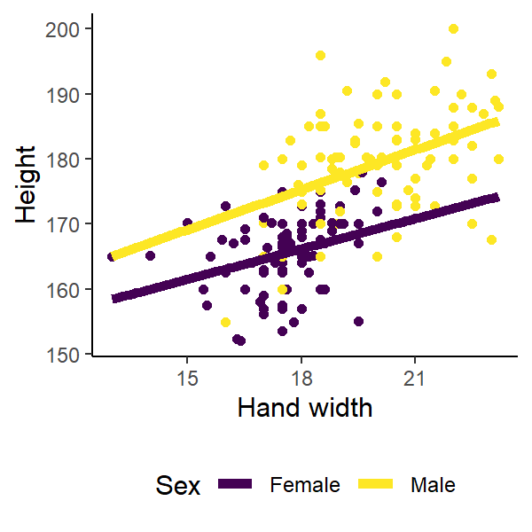
<p class="caption">(\#fig:random-slopes)The lines have different slopes and intercepts</p>
</div>

```
   (Intercept)         Wr.Hnd        SexMale Wr.Hnd:SexMale 
   147.4497131      1.0385045     -7.1567184      0.9020249 
```

To parametrise the model we now need to calculate different values for slopes. In the coefficient list, `Wr.Hnd:SexMale` is the **difference in the value of the slope relative to the slope for female** `Wr.Hnd`. Remember: female is alphabetically before male so R calculates the variances for females first, then males.

Parametrised slope for females:  
*Female height* = 147.45 + 1.039 *hand width*

Parametrised slope for males:  
*Male height* = (147.45 -7.157) + (1.039 + 0.902) *hand width*

> H0: There is no effect of A or B or their interaction on the response variable
> H1: There is an effect of A or B or their interaction on the response variable

***

### The multiple regression ANOVA table

> Variance of predictors (SS) is partitioned out from total SS in order it is entered in to R


|           |  Df|  Sum Sq| Mean Sq| F value|Pr(>F) |
|:----------|---:|-------:|-------:|-------:|:------|
|Wr.Hnd     |   1| 7298.70| 7298.70|  150.13|<0.001 |
|Sex        |   1| 2912.37| 2912.37|   59.91|<0.001 |
|Wr.Hnd:Sex |   1|   90.07|   90.07|    1.85|0.175  |
|Residuals  | 203| 9869.12|   48.62|      NA|NA     |

### The ANOVA table for 2 predictors and their interaction

|  Source of variation  | SS | df | MS | F | P |
|:---------------------:|:--:|:--:|:--:|:-:|---|
| Factor A | SSR of A | number of levels of A - 1 | |  |   |
| Factor B | SSR of B | number of levels of B - 1 ||   |   |
| Factor A x B | SSR of A & B | df of A x df of B ||   |   |
| Within error | SSE | levels of A x levels of B X (number of observations - 1) | |   |   |
|  Total error   | SSY | (levels of A x levels of B X number of observations) - 1 |    |   |   |

### Interpreting the ANOVA table

> P(Interaction term) > 0.05, thus the effect of hand width on
student height is not dependent of the sex of the student


|           |  Df|  Sum Sq| Mean Sq| F value|Pr(>F) |
|:----------|---:|-------:|-------:|-------:|:------|
|Wr.Hnd     |   1| 7298.70| 7298.70|  150.13|<0.001 |
|Sex        |   1| 2912.37| 2912.37|   59.91|<0.001 |
|Wr.Hnd:Sex |   1|   90.07|   90.07|    1.85|0.175  |
|Residuals  | 203| 9869.12|   48.62|      NA|NA     |

### The interaction term A:B

* Measures the dependence of the level of one factor on the level of the other factors
* If interaction term is not significant:
  * effect of one factor on other is additive (independent of each other)
* If significant:
  * indicates synergistic or antagonistic effects between factors
  * Should be main conclusion of analysis

***

## The fundamentals of Linear regression

That's the basics of linear regression!  
They are widely used in biological statistics so you'll likely come across them when reading scientific studies.  

The same concepts apply for any number or combination of predictor variables. Two, three, four predictor variables and so forth...it just becomes more complex to parameterise.  

Remember, the aim is to quantify how much variation in the response variable is attributable to each predictor variable - minimise those residuals!

Common statistical analyses you should be able to do by applying the concepts in these lectures:
1 continuous response variable &:

* 1 continuous predictor variable - simple linear regression
* 2 continuous predictor variables (with/without their interaction) - multiple regression
* 1 categorical predictor variable - One-way ANOVA
* 1 continuous predictor variable & 1 categorical predictor variable (with/without their interaction) - ANCOVA/multiple regression
* 2 categorical predictor variables (with/without their interaction) - Two-way ANOVA

***

## Recap time!

Test your understanding so far by answering the questions below.

4. What is the difference between an additive and interactive linear model? 
5. What is the function to conduct an interactive multiple regression model in R?
6. A multiple regression of crab shell width (response) with crab body depth (continuous predictor) for two species (categorical predictor: B or O) and their interaction had the following coefficients:  


|            |          x|
|:-----------|----------:|
|(Intercept) |  2.6942643|
|BD          |  2.5449206|
|spO         | -1.2531624|
|BD:spO      | -0.1756934|

  
What is the predicted shell length (mm) of a species O crab with a body depth of 15mm?


<!--chapter:end:02-multiple-regression.Rmd-->

# Assumptions {#assumptions}


## Overall lecture aims

* Identify the structure of general linear models
* Describe how linear models are parametrized
* Understand how to use linear models
* Understand how to interpret and evaluate linear models

### By the end of this lecture you should:
 
* Know how the coefficient of determination is calculated and its interpretation
* Understand the assumptions of linear regression
* Be able to evaluate the appropriateness of a linear model to data based on residual plots
* Be able to identify generalised linear models appropriate for data 
* Create residual plots in R

***

## By now you should be comfortable with building and interpreting basic linear models in R 

> but how do we know whether our model is a "good" one?

We need to evaluate our model. There are a few things we should consider:

1. How much variation in the data is explained by the model?
2. Are linear models appropriate for our hypotheses?

***

## What does a linear model tell us?

1. What will a new value of Y be, given a new value of X?
2. Does the population slope $\beta_1$ differ to 0?
3. **How much variation in Y can be explained its linear relationship with X?**
  * Coefficient of determination ($R^2$)
  * Partitioning variance (F ratio)
  
## How much variation in Y can be explained its linear relationship with X?

$$ \frac{Var_{\text{explained by the line}}}{Var_{\text{not explained by the line}}} = Ratio$$
Interpreting ratios:  
Ratio $> 1$ = Line explains more than residual  
Ratio $\leq 1$ = Line explains very little (null hypothesis)  

> We need to know the total amount of variation and all possible sources of variation (like the F-ratio & ANOVA)

### What is or isn't explained by the line?

#### Isn't: Sum of Squares of the Error (SSY)

The bit not explained by the null (total variation in the data). Remember, the null is $\bar{y}$ = the mean of Y.

$$SSY = y_i - \bar{y}$$

<div class="figure" style="text-align: center">
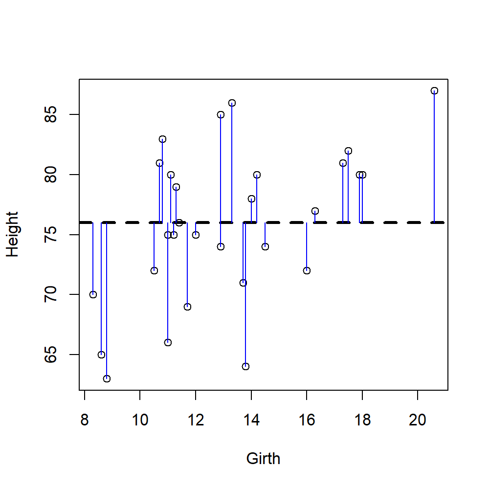
<p class="caption">(\#fig:SSY)Black line is the mean of Y. Blue lines are the difference between the mean and a single observation = SSY</p>
</div>

#### Isn't: Sum of Squares of the Residual (SSE)
The bit not explained by the line

$$SSE = y_i - \hat{y_i}$$

<div class="figure" style="text-align: center">

<p class="caption">(\#fig:SSE)Residuals (blue lines) are the difference between the data point and the predicted line (black line)</p>
</div>


#### Isn't: Sum of Squares of the Regression (SSR)
How well the line estimates the mean of Y

$$SSR = \hat{y_i} - \bar{y}$$

<div class="figure" style="text-align: center">
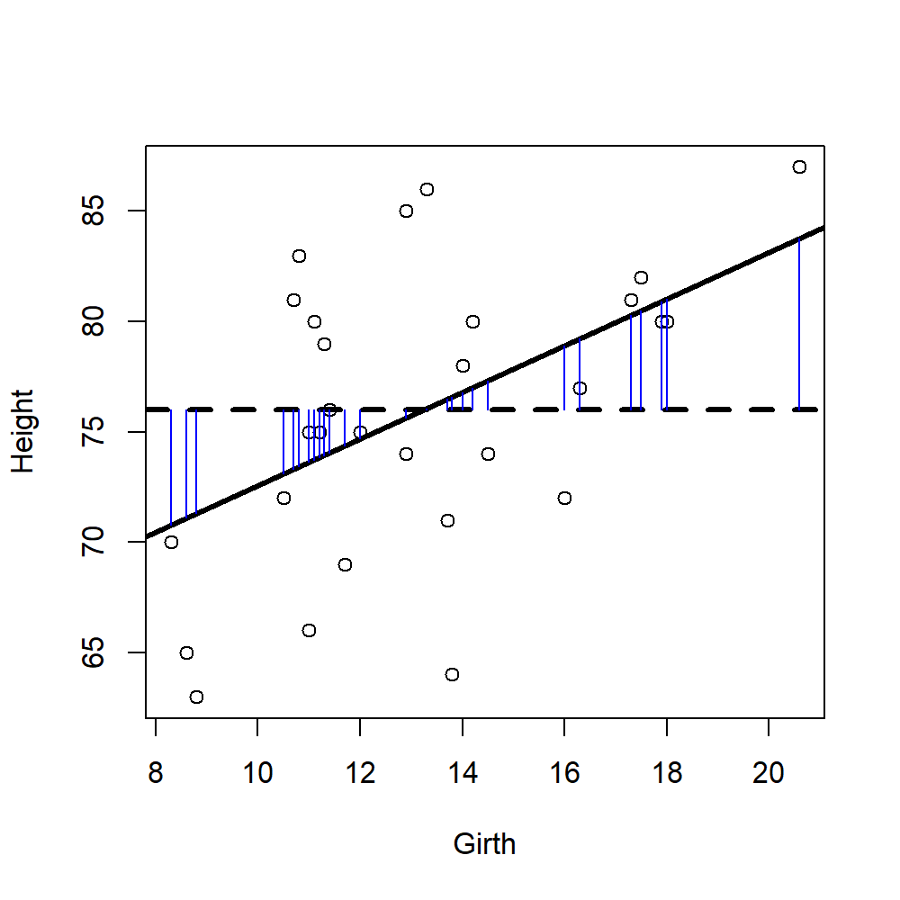
<p class="caption">(\#fig:SSR)Residuals (blue lines) are the difference between the null hypothesis (mean of observations, dashed lines) and the predicted line (black line)</p>
</div>


> Notice that since SSY is all variation in the data:  
> SSY = SSE + SSR

## So which bits do we use to evaluate model "fit"?

$$ \frac{Var_{\text{explained by the line}}}{Var_{\text{not explained by the line}}} = Ratio$$
We want the number above the line (nominator) to be larger than the number below the line (denominator), otherwise we cannot be confident that our results are different to randomly generated numbers.

Interpreting ratios:  
Ratio $> 1$  = Line explains more than residual  
Ratio $\leq 1$ = Line explains very little (null hypothesis)  

In other words, we want to know how much variation is captured by the model relative to the total variation in our data.

**Question 1** - What is the error that tells us how much variation the line is (H1) explaining relative to our null hypothesis (H0)?  
**Question 2** - What is the error that tells us the total variation in our data?

So, after answering the above, we can evaluate how much variation the model explains by:

$$\frac{SSR}{SSY} = R^2$$

**Question 3** - Why can't we use SSE as the denominator?

## Coefficient of determination $R^2$

> This is the proportion of variation that your model (your line) explains

1 = no deviance from line (good)  
0 = strong deviance from line (not good)  

It is related to correlation coefficients (r). Basically, $R^2 = r^2$

<div class="figure" style="text-align: center">
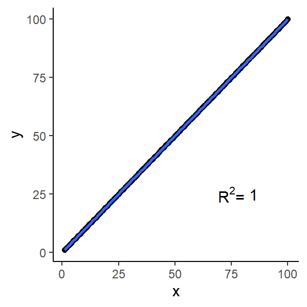
<p class="caption">(\#fig:fit)Which fits better?</p>
</div>

R will calculate $R^2$ for you. Going back the tree height and girth example, the $R^2$ is 0.27 (Multiple R-squared).


```

Call:
lm(formula = Height ~ Girth, data = trees)

Residuals:
     Min       1Q   Median       3Q      Max 
-12.5816  -2.7686   0.3163   2.4728   9.9456 

Coefficients:
            Estimate Std. Error t value Pr(>|t|)    
(Intercept)  62.0313     4.3833  14.152 1.49e-14 ***
Girth         1.0544     0.3222   3.272  0.00276 ** 
---
Signif. codes:  0 '***' 0.001 '**' 0.01 '*' 0.05 '.' 0.1 ' ' 1

Residual standard error: 5.538 on 29 degrees of freedom
Multiple R-squared:  0.2697,	Adjusted R-squared:  0.2445 
F-statistic: 10.71 on 1 and 29 DF,  p-value: 0.002758
```

> Conclusion: the model (your fitted line) explains 27 % of total variation in data

*But...*

* Biological data is messy, thus low $R^2$ may be biologically acceptable
* Low $R^2$ does not always mean a bad model
* Consider multiple regression to explain more variance
    * but adding more parameters is not always better. Why?


*** 

## But there are other things to check that are more important!

> We make assumptions of the error structure in linear regression ($\varepsilon$)

Remember:  
$$Y_i = \beta_0 + \beta_1 \times X_i + \varepsilon_i$$

* Does not change our estimates of $\beta_0$ or $\beta_1$
* Affects our confidence intervals of the estimate and thus hypothesis testing
* Because $\varepsilon_i$ is random, our assumptions also apply to the response variable $y_i$


<center> Did you know you could make memes in R? </center>  

***

## Assumptions of linear regression

Linear models assume that the relationship between the response and predictor is *linear*. In addition to this main condition, there are 4 assumptions of linear regression:

1. Normality
2. Homogeneity of Variance
3. Independence
4. Fixed X

>**ALWAYS** check these assumptions every time you fit a model. No exceptions! No excuses!

### Residual plots

In R, we can evaluate models from **residual plots**:

```
Model <- lm(Y ~ X, data) # build a model
plot(Model) # show residual plots
```
There are 4 plots called. In order:

1. Residuals vs fitted values
    * bits left over vs what the model predicted
2. Standardised residual quantile-quantile plot
    * what is the spread of the residuals?
3. Scale-Location
   * like plot 1 but shown differently
4. Residuals vs Leverage
   * are there any influential data points?
    

### Mammal brain and body size

Let's look at these assumptions in detail using the relationship between brain mass and body mass for different mammals. The dataset is called `mammals` in the  `MASS` package.  
<div class="figure" style="text-align: center">
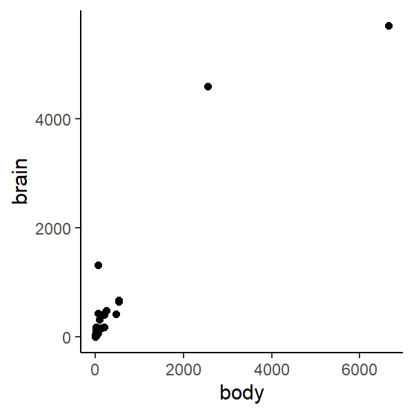
<p class="caption">(\#fig:mammal-brains)The relationship between mammal body size and brain size</p>
</div>


## 1. Normality

> Population Y values and error terms ($\varepsilon_i$) are normally distributed for each level of the predictor variable ($x_i$)
  
The distribution of the response variable, Y, should be normally distributed (not skewed). We can graphically check this using a histogram of brain size.

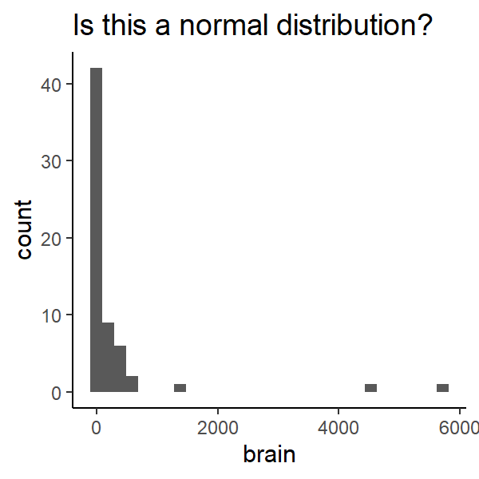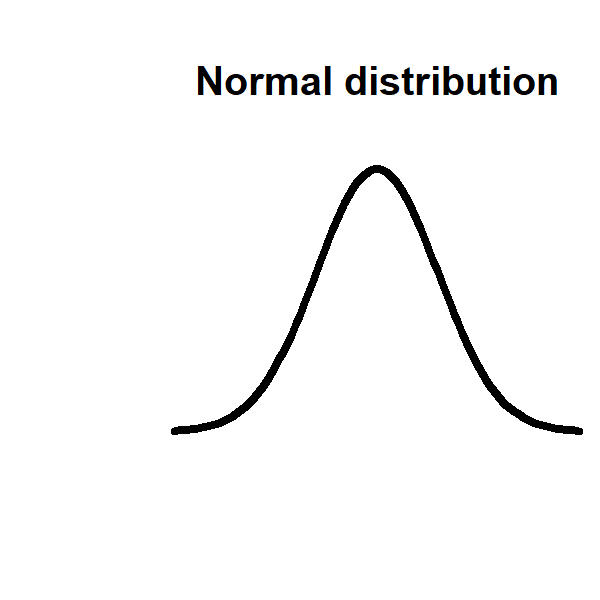


### Quantile-Quantile plots

* We can also visualise the spread of data with a quantile-quantile plot. Quantile-Quantile (Q-Q) plots are useful alternatives to visualising distributions to density plots or histograms. They are easier to assess distribution and normality with than histograms.
* The linear line is the expected relationship following a normal distribution.
    * Do our points follow the line?
    * What does it mean when the points don't follow the line?

#### Q-Q plot of single variables

We can see whether a single variable has a normal distribution - specifically that the distribution is symmetrical or not skewed.

```
qqnorm(chickwts$weight) ## the weight of chicks fed different diets (built in dataset)
```

Here, the quantiles of our observations are plotted against the theoretical quantiles if our observations followed a normal distribution.  

**Question 4** - What would you expect to see if our observations followed a normal distribution?  

We can add a reference line to the above to help us evaluate how linear the Q-Q plot is. We can make the line red and thicker for fun.
```
qqnorm(chickwts$weight) ## the weight of chicks fed different diets (built in dataset)
qqline(chickwts$weight, col = "red", lwd = 2)
```
Do the observations follow a normal distribution?  

Compare the above with the histogram and density plots
```
plot(density(chickwts$weight), col = "purple") ## density plot, purple for fun
hist(chickwts$weight, col = "yellow") ## histogram, yellow for fun
```
Would you also conclude that the distribution of chick weights is normal?  

For comparison look at the Q-Q plots of a gamma distribution (distinctly not normal)
```
qqnorm(rgamma(100, 3, 5))
qqline(rgamma(100, 3, 5)) ## You should be able to see the skewness in the data. Compare with hist()
```

#### What happens with data that is not continuous? 

Q-Q plots also work with visualising data that is not continuous.
```
qqnorm(Loblolly$age) ## the ages of pine trees, can also try rbinom(100, 10, 0.5)
qqline(Loblolly$age)
```

**Question 5** - What is the main difference between the Q-Q plots of the continuous and discrete data?

Why do you think that is?  
You can also see it using `hist()`

#### Q-Q plots of residuals for assessing normality
Q-Q plots permit comparison of two probability distributions when one distribution is the expected and the other is the observed distribution, then we can evaluate how well our observations follow our expected distribution. Using Q-Q plots we can assess skewness or identify outliers or influential points.

Q-Q plots are automatically generated when calling plot on a linear model (`lm`). It's the second graph called (defined using which). You can also make one using `qqplot()`
```
plot(lm(Height ~ Girth, trees), which = 2)
```
Does that look normal to you?

### Another use of Q-Q plots
We can also compare the distribution of two variables. If they are distributed equally then they should fall along the straight line
```
qqplot(trees$Height, trees$Girth)
```
Compare with:
```
par(mfrow = c(2,1))
hist(trees$Height)
hist(trees$Girth)
```

***

Let's try this with the `mammals` dataset

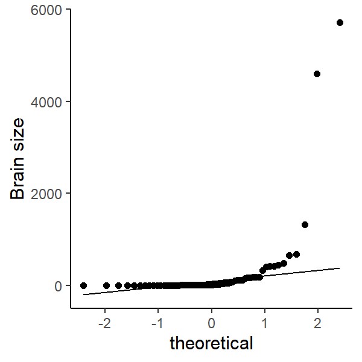

The residuals of the model should be also normally distributed 

<div class="figure" style="text-align: center">

<p class="caption">(\#fig:standard)Looks like distribution of brain size is skewed to the right. What does this mean biologically?</p>
</div>

***

### What happens when the data is not normal?

* Collect more data, increase sample size for each level of $x$. Could be a sampling bias or sample size is too low
* Use a non-parametric test 
     * e.g. Spearman's Rank Correlation
* Ignore it (with good reason). Linear regressions are robust to skewness
* Some data are never normal
     * e.g. counts - should use Poisson distribution
     * Fit another statistical model with more appropriate error structures
* Transform the data

### Applying a transformation

* Some transformations:
     * Log or natural log
     * Square root or cube root
* Note: `log(0)` or `log(-1)` is undefined so you could make data positive and greater than 0 before you log transform them. 
* More sophisticated transformations not covered in this module

### Transforming brain size

* Let's try some transformations on the data
* What is the transformation doing? 
* Which would you choose?

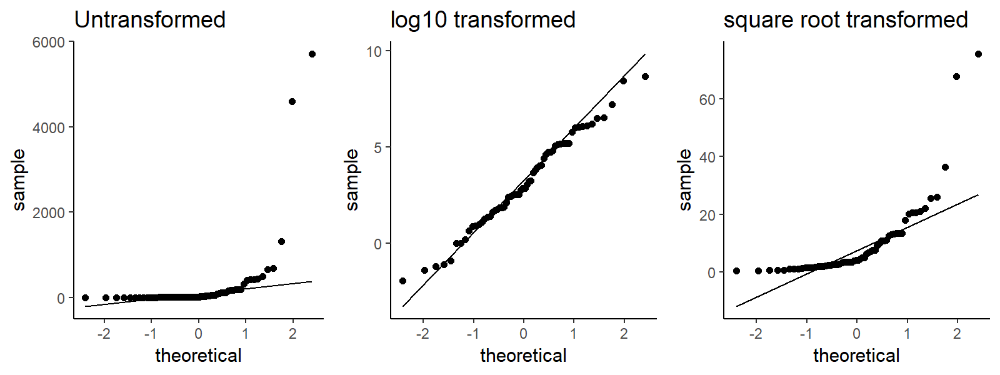


### Re-run the model with transformed data

<div class="figure" style="text-align: center">

<p class="caption">(\#fig:new-graph)That looks better!</p>
</div>

If you transform data, then the model estimates refer to the transformed units. Remember to transform them back to their correct units.

## 2. Homogeneity of Variance

> Population Y values and error terms ($\varepsilon_i$) have the same variance for each level of the predictor variable ($x_i$)

* Related to the assumptions of Normality but more important!
* Look at patterns in standardised residuals:
     * Quantile plot
     * Relationship with fitted values (predicted Y values from line)

Causes:

* small sample size
* outliers
* non-normally distributed variables

Fixes:  

* Have properly designed experiments  
* Collect enough data  
* Deal with it like as normality

> Homoscedasticity is the statistical term for homogeneity of variance. The opposite is called *Heteroscedasticity*. 

**Question 6** - What would you expect to see in a bar plot showing means and standard deviation for the assumption of homogeneity of variance to be met?

Look at this graph - does it show homoscedasticity or heteroscedasticity?
<div class="figure" style="text-align: center">

<p class="caption">(\#fig:homo)Bar plot of mean of two groups (A and B). Error bars indicate standard deviation</p>
</div>

Here, you can see that group `B` has a higher standard deviation than group `A`. So, we would conclude that there is heteroscedasticity. We do not want heteroscedasticity because it would bias the calculations of variance if we were to do an ANOVA. Remember that ANOVA is a test of variance.

The same concept applies for scatter plots. Look at this plot - does it show homoscedasticity or heteroscedasticity?
<div class="figure" style="text-align: center">

<p class="caption">(\#fig:scatter)A scatter plot and a fitted model</p>
</div>

Here, you can see that as the value of `x` increases so does the scatter around the trend line in `y`. It is sometimes referred to as a shotgun pattern or cone/triangle pattern. It's common in time series data because your observations are not independent of each other, the value of one observation is dependent on what happens earlier in time. In other words, your response variable can be modelled based on the standard deviation.

**Question 7** - What would you expect to see in a scatter plot for the assumption of homogeneity of variance to be met?

You can assess this for a linear model from the (standardised or non-standardised) residual plot vs fitted values. Here's the residual plot using the above data. Can you see the unequal variance?


One way of dealing with heteroscedasticity is to use weighted least squares regression where the parameters are fitted to a single observation based on its residual to correct for variation in the residuals (that scatter). But that is beyond the scope of this module.


### Should expect a **normal distribution** of standardised residuals 

<div class="figure" style="text-align: center">

<p class="caption">(\#fig:qqnormresid)data falls along line = good</p>
</div>

### Are there trends in the residual vs fitted values?

Expect no relationship between standardised (or non-standardised) residuals and fitted values of model

* straight line = good
* no humps or valleys


## 3. Independence

> Population Y values and error terms ($\varepsilon_i$) are independent

* They do not influence each other (not autocorrelated)
* Often because of inappropriate experimental design
    * time series
    * pseudo-replication
    * repeated measurements
* Increases Type I error


### Dealing with independence

Best thing is to choose a different model  
Consider using random effects models or choosing better variables (i.e. good experimental design)

## 4. Fixed X

> The predictor variable ($x_i$) is fixed. i.e. a known constant

Called Type I model or fixed effects model  

* Often broken in biological stats
* Predictor variables can be random
    * Called Type II (random effects model)
* Hypothesis testing of Type I applies to Type II

*** 


## Other regression diagnostics

* How well does the model fit the data?
     * Coefficient of determination $R^2$
* Is a simple linear regression appropriate?
    * e.g. polynomial or curvilinear model
* Are there effects of outliers in the model?

### Outliers, leverage and influence

> Outliers are abnormal or unusual observations relative to the rest of the data that can cause biases during analysis

* Outliers can be checked before applying a model. How?
* Sometimes caused by experimental error but sometimes significantly different data points are not outliers
    * Natural variation
* Leverage = how much x influences y
* Influence = how much x influences the slope of the line (Cook's Distance)

If outliers are caused by experimental error or bias, you could justify excluding it from data.  
**But _never_ delete observations to force a better model fit**


### Outliers in the mammal dataset

<div class="figure" style="text-align: center">

<p class="caption">(\#fig:outliers)Looks like humans, water opossums and musk shrew have high influence on the regression</p>
</div>

***

## Putting it all together

These assumptions can be checked by looking at the residual plots. R shows residual plots using the function `plot(lm())`.


Let's evaluate the residual plot, starting from the top left:

* Are the residuals vs fitted values equal (i.e. a straight line)? If there are humps or valleys, the model may not be appropriate for the data.
* Are the standardised residuals normally distributed? Linear models assume that residuals are normally distributed. If not, your model is inappropriate for your data or your data is skewed in some way.
* Is there a pattern to your $\sqrt{\mbox{Standardised residuals}}$? Linear models assume equal variance so there should be no pattern in your residuals.
* Are there any outlier data points that have strong leverage in the model? E.g. potential outliers or influential data points.

***

## ANCOVA

Remember Analysis of Covariance deals with the effect of two predictor variable, a continuous and categorical variable, on a continuous response variable. Like an ANOVA adjusted for the effect of an additional continuous covariate.  
Follows all the assumptions above *plus two extra ones*: 

### 1. Covariate values cover a similar range across groups

Data from groups should overlap across the range of the continuous variable

<div class="figure">

<p class="caption">(\#fig:ancova)Which of these violates ANCOVA assumptions?</p>
</div>


If the first assumption is not met, ANCOVA fails to separate the effects of the two predictors on the response variable.
  
Extending regression models beyond the range of data could be *extrapolation* and lead to incorrect conclusions.

### 2. Regression slopes are similar across groups

Like a fixed or additive linear regression.  
If the second assumption is not met, you can still fit an “ANCOVA-like” model to the data with different slopes for different groups (i.e. a mixed or random model). Then it's not a true ANCOVA in the classic sense.

***

## Take home messages

* Always check assumptions
* Interpret model in a biological context
    * Biological data is messy: good model can have low R^2^
    * Outliers aren’t always mistakes
    * Statistical significance $\neq$ biological significance
* Is the model appropriate for the question?
* Can my experiment actually test my hypothesis?
* **_Never_ delete observations to force a better model fit or fit assumptions**
   * This violates research integrity


<!--chapter:end:03-assumptions.Rmd-->

# Generalised linear models {#GLM}


***

## Overall lecture aims

* Identify the structure of general linear models
* Describe how linear models are parametrized
* Understand how to use linear models
* Understand how to interpret and evaluate linear models

### By the end of this lecture you should:
 
* Conduct and interpret a generalised linear model in R

***

## Some data are never normal

* Non-linear data - e.g. exponential growth of bacteria, human populations
* Counts or proportions, number of cells in petri dish, proportion of animals that survive
* Categorical data

Simple linear regressions aren't the most appropriate for these data and may give distorted results.  
*But* we can use linear regression to analyse these data if we relax our assumptions a bit...called "general linear models"

> *General linear models*, or just linear models (LM), refer to linear regression of data following a normal probability distribution, fixed or random. If we do a linear regression on based on a non-normal probability distribution that's called a _general**ised** linear model_ (usually abbreviated to GLM).  

There are many types but we will briefly describe two common probability distributions:  

* Binomial regression - for binomial data following a binomial distribution
    * yes/no
    * alive/dead
* Poisson regression - for count or contingency table data following a Poisson distribution

In `R` GLMs are done using `glm(Y ~ X, data, family = <insert here>)`. `family` refers to the underlying probability distribution. Using `family = gaussian` is the same as `lm()` for a normal distribution. So:

* `poisson` for a Poisson distribution
* `binomial` for a binomial distribution

But the model outputs are interpreted differently to normal distributions because they *link* the relationship between the predictor and the response differently.

***

## Poisson regression

* Uses a log linear link function where the response variable (counts) is on a log scale
* Interpretation is similar to lm with estimates for the intercept, slopes and differences in estimates among groups
    * Estimates are the **log of the expected count** as a function of the predictor variables
    * Cannot have negative or 0 values because log(0) does not work - must deal with them. How?
* Test overall effects of predictors by comparing models with different predictors representing null and alternative hypotheses
* See later lectures about Chi-Squared tests ($\chi^2$).

### Number of Oystercatchers (wetland birds) in South Africa
Data is `waders` from `MASS`. I have manipulated the data so it is suitable for analysis - code below.


```r
# create data set of oystercatcher counts (column 1) and site labels
waders <- data.frame(Oystercatcher = MASS::waders[,1],
                     site = letters[1:15])
# poisson regression
summary(glm(Oystercatcher + 1 ~ site, waders, family = poisson))
```

```

Call:
glm(formula = Oystercatcher + 1 ~ site, family = poisson, data = waders)

Deviance Residuals: 
 [1]  0  0  0  0  0  0  0  0  0  0  0  0  0  0  0

Coefficients:
            Estimate Std. Error z value Pr(>|z|)    
(Intercept)   2.5649     0.2774   9.248  < 2e-16 ***
siteb         2.0402     0.2948   6.920 4.51e-12 ***
sitec         2.7233     0.2863   9.512  < 2e-16 ***
sited        -2.5649     1.0377  -2.472   0.0134 *  
sitee         1.7918     0.2996   5.981 2.22e-09 ***
sitef         0.4308     0.3563   1.209   0.2266    
siteg         4.3665     0.2791  15.645  < 2e-16 ***
siteh         1.9124     0.2971   6.436 1.23e-10 ***
sitei         4.1058     0.2796  14.683  < 2e-16 ***
sitej         1.8539     0.2983   6.215 5.12e-10 ***
sitek         3.5984     0.2811  12.800  < 2e-16 ***
sitel         1.7918     0.2996   5.981 2.22e-09 ***
sitem         0.5705     0.3470   1.644   0.1001    
siten        -2.5649     1.0377  -2.472   0.0134 *  
siteo        -2.5649     1.0377  -2.472   0.0134 *  
---
Signif. codes:  0 '***' 0.001 '**' 0.01 '*' 0.05 '.' 0.1 ' ' 1

(Dispersion parameter for poisson family taken to be 1)

    Null deviance: 5.3666e+03  on 14  degrees of freedom
Residual deviance: 1.6653e-14  on  0  degrees of freedom
AIC: 114.06

Number of Fisher Scoring iterations: 3
```

**Question 1** - Why did I add 1 to the variable Oystercatcher in the poisson regression?

**Question 2** - What is the link function for a poisson regression?

**Question 3** - What is the expected number of Oystercatchers at site k?

***

## Binomial (logistic) regression

* Uses a logit link function so the response variable is the **log odds** 
* Estimates are log odds and the probability of an event
    * Intercept is log odds of first group
    * Estimates for other groups are the ratio of log odds
    * Transform from log odds to odds using `exp()`

**Question 4** - What is the function to conduct an Poisson regression in R?

### Melanoma tumor thickness and survival
Data is `Melanoma` from `MASS`. I have manipulated the data so it is suitable for analysis - code below.

```r
Melanoma <- MASS::Melanoma
Melanoma <- subset(Melanoma, Melanoma$status != 3) # remove observations of other causes of death
Melanoma$status <- Melanoma$status - 1 # create binary variables: 0 = died, 1 = alive

# binary regression
model <- glm(status ~ thickness, Melanoma, family = binomial)
summary(model)
```

```

Call:
glm(formula = status ~ thickness, family = binomial, data = Melanoma)

Deviance Residuals: 
    Min       1Q   Median       3Q      Max  
-1.8588  -1.2162   0.6729   0.7485   1.8844  

Coefficients:
            Estimate Std. Error z value Pr(>|z|)    
(Intercept)  1.61134    0.25496   6.320 2.62e-10 ***
thickness   -0.24853    0.06354  -3.911 9.18e-05 ***
---
Signif. codes:  0 '***' 0.001 '**' 0.01 '*' 0.05 '.' 0.1 ' ' 1

(Dispersion parameter for binomial family taken to be 1)

    Null deviance: 232.84  on 190  degrees of freedom
Residual deviance: 213.45  on 189  degrees of freedom
AIC: 217.45

Number of Fisher Scoring iterations: 4
```

```r
plot(status ~ thickness, Melanoma, pch = 19) # plot
# plot binomial regression in blue
newdat <- data.frame(thickness=seq(min(Melanoma$thickness), max(Melanoma$thickness),len=100))
newdat$status <- predict(model, newdata=newdat, type="response")
lines(status ~ thickness, newdat, col="blue", lwd=2)
```

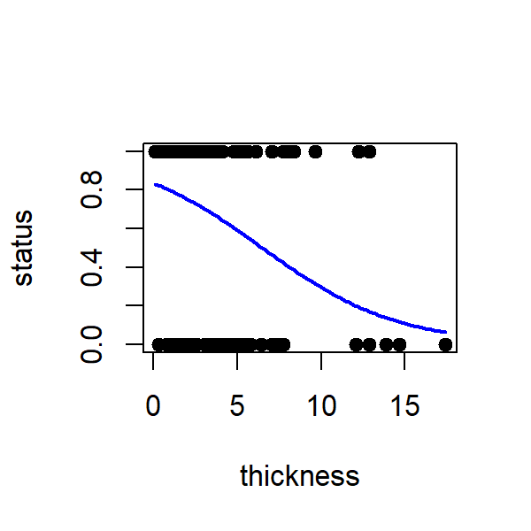

**Question 5** - Is there a relationship between Melanoma tumour thickness (mm) and whether a patient survives?

**Question 6** - What does the coefficient estimate of `-0.24853` for the variable `thickness` represent?

**Question 7** - What is the probability of survival with a tumour 5 mm thick?

> Wear sunscreen!

***

<!--chapter:end:04-GLM.Rmd-->

# Answers {#answers}

## Chapter 2

**Question 1** - What types of variables are used in simple linear regression?

Both the response and predictor variable should be continuous. (Categorical predictor variables are also allowed as we will see in later lectures)


**Question 2** - What is the method for parameterising linear models called?

Ordinary least squares regression. The aim is to minimise the sum of squared residuals.


**Question 3** - What is random error in linear regression?

The variation in data that cannot be explained by the linear model. i.e. the difference between the predicted value of the model and the observations: the residuals. Denoted $\varepsilon$.


**Question 4** - What is the function in R to conduct a linear regression?

The function is `lm()`.


**Question 5** - How do you find a predicted value of a response for a given predictor value using a parameterised linear model?

Substitute the value of the predictor in the parameterised linear model and solve it.

```
if Y = 10 * X + 6 and X = 2:
   Y = 10 * 2 + 6 = 20 + 6
   Y = 26 
```

**Question 6** - What is the probability distribution function of linear regression?

The normal distribution. Also called Gaussian.


***

## Chapter 3

**Question 1** - What is the significance of fixed and random variables for drawing conclusions?

It changes the inferred conclusion. In fixed models, the identities of the groupings are the main level of inference whereas in random models we consider the identity of the group to be randomly selected from a wider pool of candidates. Thus we can generalise our findings beyond our selected groups in random models but are limited to the groups we selected in fixed models. 

For example, if we counted the population of 5 towns in Ireland and analysed the data using a fixed model, then we could only state our conclusion for those 5 towns and cannot draw conclusions for the whole of Ireland.

With a random model, we consider those 5 towns to be representative of the whole of Ireland, we are not interested in those 5 towns in particular, thus we can generalise our conclusions to the whole of Ireland. E.g. those 5 towns were randomly selected from all the candidate towns to survey.


**Question 2** - What is the function to conduct an Analysis of Variance in R?

Either `summary(aov())` or `anova(lm())` will do a Type I ANOVA. Type II and Type III models require additional packages.


**Question 3** - How many groups were in the categorical predictor variable in this one-way analysis of variance? $F_{5,24} = 14.23, P < 0.001$

6 groups. The degree of freedom for group is 5 and this is calculated from the number of groups - 1. So 5 + 1 = 6.


**Question 4** - What is the difference between an additive and interactive linear model? 

An additive model does not describe an interaction between the two predictor variables. An interactive model describes that the effect of one predictor variable on the response variable is dependent on the second predictor variable.


**Question 5** - What is the function to conduct an interactive multiple regression model in R?

`lm(Y ~ A * B, data)` where `A` & `B` are the two predictor variables. `*` denotes the interaction.


**Question 6** - A multiple regression of crab shell width (response) with crab body depth (continuous predictor) for two species (categorical predictor: B or O) and their interaction had the following coefficients:  


|            |          x|
|:-----------|----------:|
|(Intercept) |  2.6942643|
|BD          |  2.5449206|
|spO         | -1.2531624|
|BD:spO      | -0.1756934|

  
What is the predicted shell length (mm) of a species O crab with a body depth of 15mm?


Answer: 36.97951 mm

Because B is alphabetically before O, the first parameter coefficients refer to species B. 
The intercept for species O is `2.6942643-1.2531624 = 1.441102`  
The slope for species O is  `2.5449206-0.1756934 = 2.369227`  
Thus the whole model for species O is:  
  `shell length = 2.369227 * body depth + 1.441102`

Using a value of 15 for body depth:
```
  shell length = 2.369227 * 15 + 1.441102
               = 36.97951 mm
```

***

## Chapter 4

**Question 1** - What is the error that tells us how much variation the line is (H1) explaining relative to our null hypothesis (H0)? 

SSR - Sum of squares of the regression.


**Question 2** - What is the error that tells us the total variation in our data?

SSY - Sum of squares of the error. Sometimes called SST - total sum of squares


**Question 3** - Why can't we use SSE as the denominator?

SSE depends on the total variation of Y. We could have more variation simply by having more data but the ratio values are the same. So using sum of squares does not tell us about how much variation is explained by our model in a way that is unbiased. 


**Question 4** - What would you expect to see if our observations followed a normal distribution?

Observations to fall along a straight line at approx a 45 degree angle


**Question 5** - What is the main difference between the Q-Q plots of the continuous and discrete data?

You can see the discrete nature of the observations in the clustered groupings in the QQ plot - the staircase pattern


**Question 6** - What would you expect to see in a bar plot showing means and standard deviation for the assumption of homogeneity of variance to be met?

We want the variation across our grouped observations to be similar so the error bars of standard deviation should also be similar.


**Question 7** - What would you expect to see in a scatter plot for the assumption of homogeneity of variance to be met?

We want the variation across our grouped observations to be similar so the spread of observations along they axis (vertically) across the values of x (horizontally) should be similar.


***

## Chapter 5

**Question 1** - Why did I add 1 to the variable Oystercatcher in the poisson regression?

1 is a dummy variable to remove 0s from the counts - or `log(0)` will mess up the estimation of parameters


**Question 2** - What is the link function for a poisson regression?

(natural) log link


**Question 4** - What is the expected number of Oystercatchers at site k?

474 oystercatchers

Remember in linear regression (and by extension GLMs) the Intercept estimate is the estimated coefficient for the first site (site a) and the rest are the difference between site a and the respective site. So for site k you need to add the estimated coefficients together.

Coefficient for k:  `2.5649 + 3.5984 = 6.1633`  
But remember this is log counts so you need to transform it back to regular counts:  
  `exp(6.1633) = 474.993`
Then remember we added a dummy variable so you need to subtract that from our estimate:  
  `474.993 - 1 = 473.993` which rounded to the nearest whole number (as counts are discrete variables) is 474!


**Question 4** - What is the function to conduct an Poisson regression in R?

`glm(Y ~ X, data, family = poisson)`


**Question 5** - Is there a relationship between Melanoma tumour thickness (mm) and whether a patient survives?

Yes. The thicker the tumour, the greater the odds of death. The P value of the slope of the binomial regression is significantly different from 0. P < 0.001.


**Question 6** - What does the coefficient estimate of `-0.24853` for the variable `thickness` represent?

The estimate represents the log odds of survival as a function of tumour thickness. In other words, we expect the log odds of survival to decrease by 0.25 for a 1 mm increase in tumour thickness. 

We can transform log odds to odds by taking the exponential:  
`exp(-0.24853) = 0.7799465`. `1 - 0.7799465 = 0.22`  
So for every 1 mm increase in tumour thickness we expect the odds of survival to decrease by 22 %


**Question 7** - What is the probability of survival with a tumour 5 mm thick?

The logit formula is `logit = p/(1-p)` and the regression equation is `logit(p) = 1.61134 - 0.24853 * thickness`
so `logit(p) =  1.61134 - 0.24853 * 5 = 0.36869`

and to turn logit p into probability (p):
```
p = exp(logit(p))/(1 + exp(logit(p)))
  = exp(0.36869)/(1 + exp(0.36869))
  = 0.5911424
```
The probability of surviving is 59 %


<!--chapter:end:05-answers.Rmd-->

