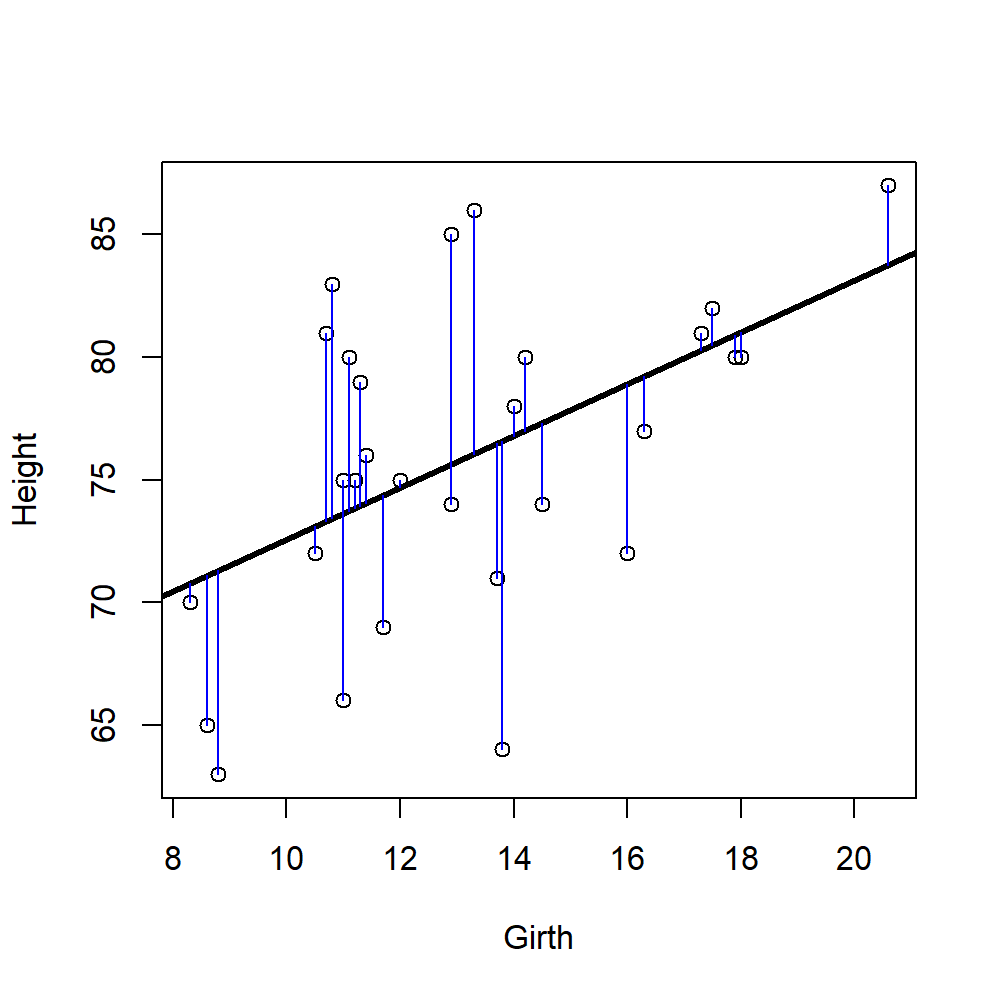

# Simple linear models {#simple}


***

## Overall lecture aims

* Identify the structure of general linear models
* Describe how linear models are parametrized
* Understand how to use linear models
* Understand how to interpret and evaluate linear models

Recommended reading:
Chapter 5.5 Getting Started with R

### By the end of this lecture you should:
 
* Describe the structure of a general linear model
* Understand how a simple linear model is parametrised
* Understand what the parameters of a linear model represent
* Parametrise a simple linear model from given information
* Interpret a simple linear model in a graphical format

In R:

* Use built-in R datasets and R libraries
* Conduct a simple linear model

***

## Height and girth of trees

Imagine we measured the height and girth of trees to test the hypothesis that thicker trees are taller.  


How should test our hypothesis? We could assign trees to categories like "thick" or "thin" trees and do a t-test. What does our t-test say?


```

	Welch Two Sample t-test

data:  Height by Thickness
t = 1.6339, df = 28.168, p-value = 0.1134
alternative hypothesis: true difference in means between group Thick and group Thin is not equal to 0
95 percent confidence interval:
 -0.9240387  8.2181563
sample estimates:
mean in group Thick  mean in group Thin 
           78.00000            74.35294 
```

### **But** this isn't the best way
* How did we define "thick" or "thin"?
* We lost information using groups - tree girth is not categorical data, it's continuous
* This increases unexplained variance = *bad!*
* When might you want to group data?

***

## Linear regression

> models the linear relationship between 2 continuous variables

* Continuous response variable (Y)
* Continuous predictor variable (X)

<div class="figure" style="text-align: center">

<p class="caption">(\#fig:regression-model)Fit a line</p>
</div>

### What does linear mean?

* By definition, all predictor parameters should not be divided by each other
* No parameter is an exponent
* No parameter is multiplied or divided by another

Not a linear model:  
$H_a = \frac{a \times H \times T}{1 + a \times H \times T}$ e.g. Holling’s Type II predation equation  
$y = \frac{\beta_1 x}{\beta_2 x}$ e.g. enzyme rate of reactions

### Why do we use a linear model?

* Quantify a relationship
  - E.g. relationship between drug concentration and time
* Predict what will happen
  - E.g. growth at different time points
* Explain as much about the response variable as possible
* Partition variation
  - E.g. Phenotypic variation = genetic variation + environmental variation

***

## Structure of a general linear model

> $$Y = intercept + slope \times X$$


Intercepts and slopes can be mathematically represented by any symbol or letter but conventionally the equation is written as:

$$y_i = \beta_0 + \beta_1 \times x_i + \varepsilon_i$$

Where $i$ refers to individual data points.

### Variables of a linear model

Variables are $y_i$ and $x_i$  
$y_i$ = response variable, what you are interested in, e.g. height  
$x_i$ = predictor variable, what you are manipulating, e.g. girth


### Parameters of a linear model

Parameters are what we don't know and we need to work out (*parametrise*). They are $\beta_0$ and $\beta_1$.   
$\beta_0$ = population intercept, value of y when x is 0, constant  
$\beta_1$ = population slope, unit change in y with a unit change in x  
$\varepsilon_i$ = the residual of the model (how much the line gets wrong for each data point or what is left over), also called **random error**  

***

## Ordinary least squares regression

Ordinary least squares regression (OLS) is the technique used to parametrise the linear model by finding the 'best fitting' line.

> The aim is to make the sum of the squared residuals, $\sum{\varepsilon_i^2}$, as small as possible 

Meaning calculating the difference between each point and the line, squaring that difference and adding it all up (Figure \@ref(fig:residuals)).  
Residuals are squared to make all values positive - remember points can fall above and below the best fit line.

<div class="figure" style="text-align: center">

<p class="caption">(\#fig:residuals)Residuals (blue lines) are the difference between the data point and the predicted line (black line)</p>
</div>


### Finding the intercept

* Why not extrapolate to 0?
* We know $\bar{y}$ and $\bar{x}$ - the means of x and y
* We can rearrange the linear equation to $\beta_0 = \bar{y} - \beta_1 \bar{x}$ where $\beta_1$ is the estimated slope
* But `R` will do all this for you!

***

## Halfway there! Revision time!
Test your understanding so far by answering the questions below.  

1. What types of variables are used in simple linear regression?
2. What is the method for parameterising linear models called?
3. What is random error in linear regression?

***

## What does a linear model tell us?

> 1. What will Y be, given a new value of X?
> 2. Does the population slope $\beta_1$ differ to 0?

### Back to trees

The function `lm()` in `R` stands for linear model. It will do the OLS calculations for us. The function takes data in the form `lm(Y ~ X, data)`. Use `summary()` on your `lm` to get more information.


```

Call:
lm(formula = Height ~ Girth, data = trees)

Coefficients:
(Intercept)        Girth  
     62.031        1.054  
```

Here the `(Intercept)` is the value of the intercept, $\beta_0$ and `Girth` is the slope of the model, $\beta_1$.  
We then put these numbers in our linear model equation to get the **parametrised linear model**

$Y = \beta_0 + \beta_1 \times X$  
becomes $Height =$ 62.031  + 1.054 $\times Girth$

<div class="figure" style="text-align: center">

<p class="caption">(\#fig:tree-plot-2)Does the above equation match this line?</p>
</div>

### Calculating a new value of Y

We can use the parametrised equation to work out the height of a tree for any value of girth. If a tree is 10cm thick, what is its predicted height?

$Height =$ 62.031  + 1.054 $\times Girth$
$Height =$ 62.031  + 1.054 $\times 10$  
$Height =$ 72.571 cm

### Does the population slope $\beta_1$ differ to 0?

Typically we are more interested in the value of the slope than the intercept. We want to know if the slope of the fitted line is statistically different to 0 because that represents our hypotheses:

> Null hypothesis (in orange, Figure \@ref(fig:tree-slopes)):
> $$H_0: \beta_1 = 0$$
> Alternative hypothesis (Figure \@ref(fig:regression-slopes)):
> $$H_1: \beta_1 \neq 0$$

<div class="figure" style="text-align: center">

<p class="caption">(\#fig:tree-slopes)Hypotheses of linear models</p>
</div>

<div class="figure" style="text-align: center">

<p class="caption">(\#fig:regression-slopes)Regression lines can have positive (blue) or negative (red) slopes, either are H1</p>
</div>

#### Testing linear model parameters in R

R will conduct a statistical test on the model parameters for us. You can see it using `summary(lm())`


```

Call:
lm(formula = Height ~ Girth, data = trees)

Residuals:
     Min       1Q   Median       3Q      Max 
-12.5816  -2.7686   0.3163   2.4728   9.9456 

Coefficients:
            Estimate Std. Error t value Pr(>|t|)    
(Intercept)  62.0313     4.3833  14.152 1.49e-14 ***
Girth         1.0544     0.3222   3.272  0.00276 ** 
---
Signif. codes:  0 '***' 0.001 '**' 0.01 '*' 0.05 '.' 0.1 ' ' 1

Residual standard error: 5.538 on 29 degrees of freedom
Multiple R-squared:  0.2697,	Adjusted R-squared:  0.2445 
F-statistic: 10.71 on 1 and 29 DF,  p-value: 0.002758
```

* The P values above test whether our slope is significantly different to 0 
* Tested like a single parameter t-test (why?)
  - What are the degrees of freedom?
  
**Based on the R output above, does our estimated slope for Girth differ to 0 and what can we conclude about our hypothesis?**


## Probability distribution functions (PDF)

> Linear models need a descriptor of how response variables (or errors) should be distributed

**Probability distributions**

* E.g. Gaussian/normal distribution
* Grouped by "family"
* Other types exist – same principles apply, called generalised linear models (GLM). GLMs are touched on in Chapter \@ref(GLM)


<div class="figure" style="text-align: center">

<p class="caption">(\#fig:normal)a normal distribution with mean = 0 and sd  = 1</p>
</div>


### Linear models in the Gaussian family

> Same principles, different names

* Linear regression
  * continuous response
  * one or more continuous predictors
* Analysis of Variance (ANOVA)
  * continuous response
  * categorical predictors
* Analysis of Covariance (ANCOVA)
  * continuous response
  * A mix of continuous and categorical predictors
  * Special case with special assumptions

#### You have seen these statistical tests in previous lectures


```

	Welch Two Sample t-test

data:  Height by Sex
t = -12.924, df = 192.7, p-value < 2.2e-16
alternative hypothesis: true difference in means between group Female and group Male is not equal to 0
95 percent confidence interval:
 -15.14454 -11.13420
sample estimates:
mean in group Female   mean in group Male 
            165.6867             178.8260 
```


|          |  Df|   Sum Sq| Mean Sq| F value|Pr(>F) |
|:---------|---:|--------:|-------:|-------:|:------|
|Sex       |   1|  8974.12| 8974.12|  165.11|<0.001 |
|Residuals | 206| 11196.29|   54.35|      NA|NA     |

A one-way ANOVA is mathematically identical to a t-test


> In this module, don’t focus on memorising what kind of test fits what kinds of data

They are all variants on general linear models anyway...

* We are interested in **slopes** and (to a lesser extent) intercepts
* Understand how these models relate to your *hypotheses & experimental design*

***

## Revision time!
Test your understanding so far by answering the questions below.

4. What is the function in R to conduct a linear regression?
5. How do you find a predicted value of a response for a given predictor value using a parameterised linear model?
6. What is the probability distribution function of linear regression?
